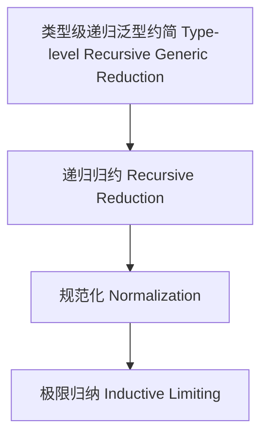

# 42-类型级递归泛型约简（Type-Level Recursive Generic Reduction in Haskell）

## 定义 Definition

- **中文**：类型级递归泛型约简是指在类型系统层面对递归泛型结构和表达式进行类型级别归约、规范化与极限归纳的机制。
- **English**: Type-level recursive generic reduction refers to mechanisms at the type system level for reducing, normalizing, and inductively limiting recursive generic structures and expressions in Haskell.

## Haskell 语法与实现 Syntax & Implementation

```haskell
{-# LANGUAGE TypeFamilies, DataKinds, TypeOperators #-}

-- 递归泛型约简示例：类型级列表归约为单一值

type family Foldr (f :: k -> l -> l) (z :: l) (xs :: [k]) :: l where
  Foldr f z '[] = z
  Foldr f z (x ': xs) = f x (Foldr f z xs)
```

## 约简机制 Reduction Mechanism

- 类型级递归归约、规范化、极限归纳
- 支持类型安全的递归泛型表达式归约

## 形式化证明 Formal Reasoning

- **归约一致性证明**：Foldr f z xs = f x1 (f x2 (... (f xn z)...))
- **Proof of reduction consistency**: Foldr f z xs = f x1 (f x2 (... (f xn z)...))

### 证明示例 Proof Example

- 对 `Foldr` 递归归纳，基础与归纳步均成立

## 工程应用 Engineering Application

- 类型安全的递归泛型归约、自动化推理、泛型库
- Type-safe recursive generic reduction, automated reasoning, generic libraries

## 结构图 Structure Diagram



## 本地跳转 Local References

- [类型级递归泛型算法 Type-Level Recursive Generic Algorithm](../72-Type-Level-Recursive-Generic-Algorithm/01-Type-Level-Recursive-Generic-Algorithm-in-Haskell.md)
- [类型级递归泛型归纳 Type-Level Recursive Generic Induction](../82-Type-Level-Recursive-Generic-Induction/01-Type-Level-Recursive-Generic-Induction-in-Haskell.md)
- [类型安全 Type Safety](../14-Type-Safety/01-Type-Safety-in-Haskell.md)
