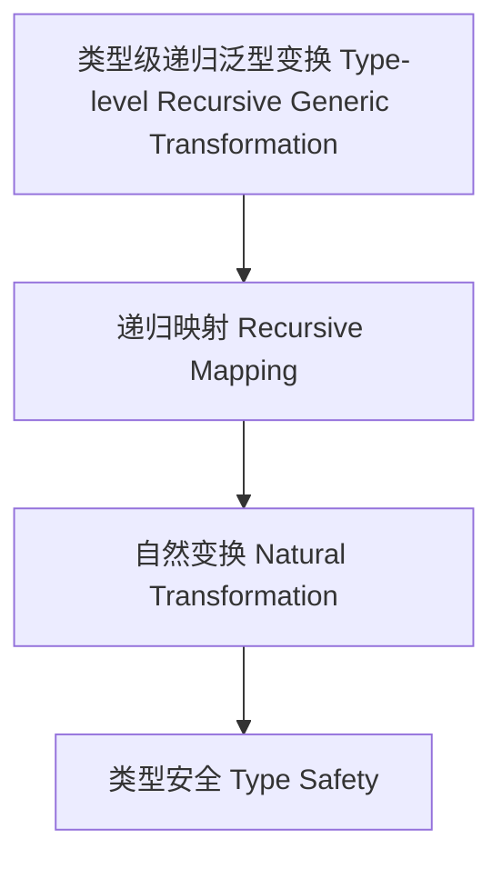

# 45-类型级递归泛型变换（Type-Level Recursive Generic Transformation in Haskell）

## 定义 Definition

- **中文**：类型级递归泛型变换是指在类型系统层面对递归泛型结构进行类型级别的变换、映射与提升的机制。
- **English**: Type-level recursive generic transformation refers to mechanisms at the type system level for transforming, mapping, and promoting recursive generic structures in Haskell.

## Haskell 语法与实现 Syntax & Implementation

```haskell
{-# LANGUAGE TypeFamilies, DataKinds, TypeOperators #-}

-- 递归泛型变换示例：类型级列表元素提升

type family Promote (xs :: [k]) (f :: k -> l) :: [l] where
  Promote '[] f = '[]
  Promote (x ': xs) f = f x ': Promote xs f

-- 类型级自然变换示例

type family NatTrans (f :: k -> l) (g :: k -> l) (xs :: [k]) :: Bool where
  NatTrans f g '[] = 'True
  NatTrans f g (x ': xs) = (f x == g x) && NatTrans f g xs
```

## 变换机制 Transformation Mechanism

- 类型级递归变换、映射、提升
- 范畴论自然变换

## 形式化证明 Formal Reasoning

- **变换一致性证明**：Promote xs id = xs
- **Proof of transformation consistency**: Promote xs id = xs

### 证明示例 Proof Example

- 对 `Promote xs id` 递归归纳，基础与归纳步均成立

## 工程应用 Engineering Application

- 类型安全的递归泛型变换、自动化推理、泛型库
- Type-safe recursive generic transformation, automated reasoning, generic libraries

## 结构图 Structure Diagram



## 本地跳转 Local References

- [类型级递归泛型算法 Type-Level Recursive Generic Algorithm](../72-Type-Level-Recursive-Generic-Algorithm/01-Type-Level-Recursive-Generic-Algorithm-in-Haskell.md)
- [类型级递归泛型范畴 Type-Level Recursive Generic Category](../81-Type-Level-Recursive-Generic-Category/01-Type-Level-Recursive-Generic-Category-in-Haskell.md)
- [类型安全 Type Safety](../14-Type-Safety/01-Type-Safety-in-Haskell.md)
