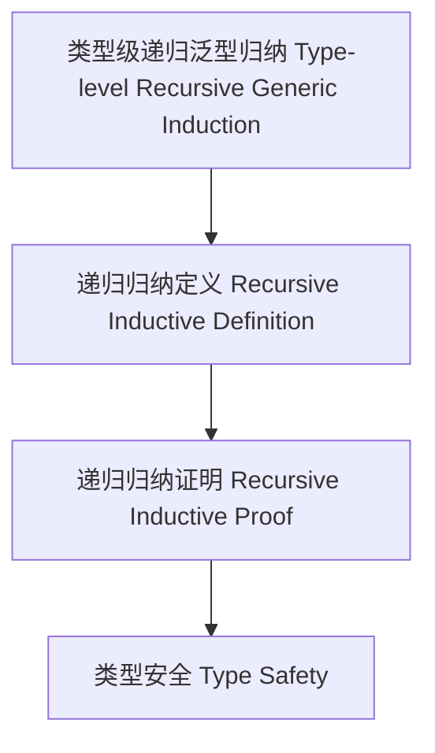

# 52-类型级递归泛型归纳（Type-Level Recursive Generic Induction in Haskell）

## 定义 Definition

- **中文**：类型级递归泛型归纳是指在类型系统层面对泛型类型和算法进行递归归纳定义与归纳证明的机制，支持类型安全的泛型编程与自动化推理。
- **English**: Type-level recursive generic induction refers to mechanisms at the type system level for recursively and inductively defining and proving properties of generic types and algorithms, supporting type-safe generic programming and automated reasoning in Haskell.

## Haskell 语法与实现 Syntax & Implementation

```haskell
{-# LANGUAGE TypeFamilies, DataKinds, TypeOperators, GADTs #-}

-- 类型级递归泛型归纳示例：类型级列表长度的递归归纳

type family Length (xs :: [k]) :: Nat where
  Length '[] = 0
  Length (x ': xs) = 1 + Length xs
```

## 递归泛型归纳机制 Recursive Generic Induction Mechanism

- 类型族递归定义、类型类递归归纳
- 支持泛型类型和算法的递归归纳定义与证明

## 形式化证明 Formal Reasoning

- **递归泛型归纳正确性证明**：归纳证明 Length xs 总能正确计算列表长度
- **Proof of correctness for recursive generic induction**: Inductive proof that Length xs always computes the correct list length

### 证明示例 Proof Example

- 对 `Length xs`，对 `xs` 递归归纳：
  - 基础：`xs = []`，`Length [] = 0` 成立
  - 归纳：假设 `Length xs` 成立，则 `Length (x:xs) = 1 + Length xs` 也成立

## 工程应用 Engineering Application

- 类型安全的递归泛型算法、自动化推理、泛型库
- Type-safe recursive generic algorithms, automated reasoning, generic libraries

## 结构图 Structure Diagram



## 本地跳转 Local References

- [类型级递归泛型算法 Type-Level Recursive Generic Algorithm](../72-Type-Level-Recursive-Generic-Algorithm/01-Type-Level-Recursive-Generic-Algorithm-in-Haskell.md)
- [类型级递归归纳 Type-Level Recursive Induction](../61-Type-Level-Recursive-Induction/01-Type-Level-Recursive-Induction-in-Haskell.md)
- [类型安全 Type Safety](../14-Type-Safety/01-Type-Safety-in-Haskell.md)
