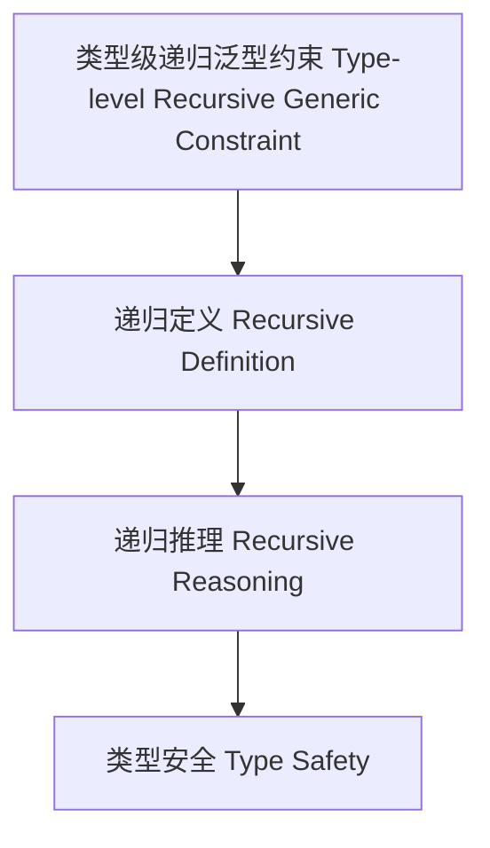

# 55-类型级递归泛型约束（Type-Level Recursive Generic Constraint in Haskell）

## 定义 Definition

- **中文**：类型级递归泛型约束是指在类型系统层面对泛型类型的约束进行递归定义、推理和验证的机制，支持类型安全的泛型编程与自动化推理。
- **English**: Type-level recursive generic constraint refers to mechanisms at the type system level for recursively defining, reasoning, and verifying constraints on generic types, supporting type-safe generic programming and automated reasoning in Haskell.

## Haskell 语法与实现 Syntax & Implementation

```haskell
{-# LANGUAGE TypeFamilies, ConstraintKinds, TypeOperators, UndecidableInstances #-}
import GHC.Exts (Constraint)

-- 类型级递归泛型约束示例：所有元素都可显示

type family AllShow (xs :: [*]) :: Constraint where
  AllShow '[] = ()
  AllShow (x ': xs) = (Show x, AllShow xs)
```

## 递归泛型约束机制 Recursive Generic Constraint Mechanism

- 类型族递归定义、类型类递归约束
- 支持泛型类型约束的递归定义、推理与验证

## 形式化证明 Formal Reasoning

- **递归泛型约束正确性证明**：归纳证明 AllShow xs 能正确表达所有元素都可显示
- **Proof of correctness for recursive generic constraint**: Inductive proof that AllShow xs correctly expresses that all elements are showable

### 证明示例 Proof Example

- 对 `AllShow xs`，对 `xs` 递归归纳：
  - 基础：`xs = []`，AllShow [] = () 成立
  - 归纳：假设 AllShow xs 成立，则 AllShow (x:xs) = (Show x, AllShow xs) 也成立

## 工程应用 Engineering Application

- 类型安全的递归泛型约束、自动化推理、泛型库
- Type-safe recursive generic constraints, automated reasoning, generic libraries

## 结构图 Structure Diagram



## 本地跳转 Local References

- [类型级递归约束 Type-Level Recursive Constraint](../64-Type-Level-Recursive-Constraint/01-Type-Level-Recursive-Constraint-in-Haskell.md)
- [类型级递归类型类 Type-Level Recursive Typeclass](../74-Type-Level-Recursive-Typeclass/01-Type-Level-Recursive-Typeclass-in-Haskell.md)
- [类型安全 Type Safety](../14-Type-Safety/01-Type-Safety-in-Haskell.md)
