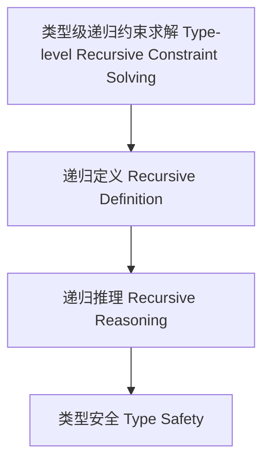

# 57-类型级递归约束求解（Type-Level Recursive Constraint Solving in Haskell）

## 定义 Definition

- **中文**：类型级递归约束求解是指在类型系统层面对递归约束进行自动推导、传播和消解的机制，支持类型安全的自动化推理与泛型编程。
- **English**: Type-level recursive constraint solving refers to mechanisms at the type system level for automatically inferring, propagating, and solving recursive constraints, supporting type-safe automated reasoning and generic programming in Haskell.

## Haskell 语法与实现 Syntax & Implementation

```haskell
{-# LANGUAGE TypeFamilies, ConstraintKinds, TypeOperators, UndecidableInstances #-}
import GHC.Exts (Constraint)

-- 类型级递归约束求解示例：所有元素都可比较

type family AllEq (xs :: [*]) :: Constraint where
  AllEq '[] = ()
  AllEq (x ': xs) = (Eq x, AllEq xs)
```

## 递归约束求解机制 Recursive Constraint Solving Mechanism

- 类型族递归定义、类型类递归约束推理
- 支持递归约束的自动推导、传播与消解

## 形式化证明 Formal Reasoning

- **递归约束求解正确性证明**：归纳证明 AllEq xs 能正确表达所有元素都可比较
- **Proof of correctness for recursive constraint solving**: Inductive proof that AllEq xs correctly expresses that all elements are comparable

### 证明示例 Proof Example

- 对 `AllEq xs`，对 `xs` 递归归纳：
  - 基础：`xs = []`，AllEq [] = () 成立
  - 归纳：假设 AllEq xs 成立，则 AllEq (x:xs) = (Eq x, AllEq xs) 也成立

## 工程应用 Engineering Application

- 类型安全的递归约束求解、自动化推理、泛型库
- Type-safe recursive constraint solving, automated reasoning, generic libraries

## 结构图 Structure Diagram



## 本地跳转 Local References

- [类型级约束求解 Type-Level Constraint Solving](../22-Type-Level-Constraint-Solving/01-Type-Level-Constraint-Solving-in-Haskell.md)
- [类型级递归约束 Type-Level Recursive Constraint](../64-Type-Level-Recursive-Constraint/01-Type-Level-Recursive-Constraint-in-Haskell.md)
- [类型安全 Type Safety](../14-Type-Safety/01-Type-Safety-in-Haskell.md)
