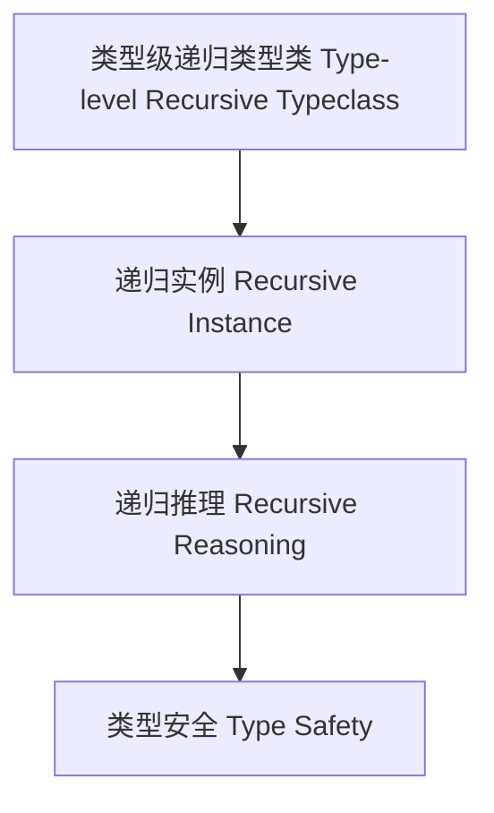

# 59-类型级递归类型类（Type-Level Recursive Typeclass in Haskell）

## 定义 Definition

- **中文**：类型级递归类型类是指在类型系统层面递归定义、推理和验证类型类实例与约束的机制，支持类型安全的泛型编程与自动化推理。
- **English**: Type-level recursive typeclass refers to mechanisms at the type system level for recursively defining, reasoning, and verifying typeclass instances and constraints, supporting type-safe generic programming and automated reasoning in Haskell.

## Haskell 语法与实现 Syntax & Implementation

```haskell
{-# LANGUAGE FlexibleInstances, UndecidableInstances #-}

-- 类型级递归类型类示例：所有元素都可显示
class AllShow xs where
  showAll :: xs -> [String]

instance AllShow () where
  showAll () = []

instance (Show x, AllShow xs) => AllShow (x, xs) where
  showAll (x, xs) = show x : showAll xs
```

## 递归类型类机制 Recursive Typeclass Mechanism

- 类型类递归实例、类型族递归约束
- 支持类型类实例的递归定义、推理与验证

## 形式化证明 Formal Reasoning

- **递归类型类正确性证明**：归纳证明 showAll 能正确显示所有元素
- **Proof of correctness for recursive typeclass**: Inductive proof that showAll correctly displays all elements

### 证明示例 Proof Example

- 对 `AllShow xs`，对 `xs` 递归归纳：
  - 基础：`xs = ()`，showAll () = [] 成立
  - 归纳：递归显示每个元素

## 工程应用 Engineering Application

- 类型安全的递归类型类、自动化推理、泛型库
- Type-safe recursive typeclasses, automated reasoning, generic libraries

## 结构图 Structure Diagram



## 本地跳转 Local References

- [类型类 Type Class](../07-Type-Class/01-Type-Class-in-Haskell.md)
- [类型级递归约束 Type-Level Recursive Constraint](../64-Type-Level-Recursive-Constraint/01-Type-Level-Recursive-Constraint-in-Haskell.md)
- [类型安全 Type Safety](../14-Type-Safety/01-Type-Safety-in-Haskell.md)
