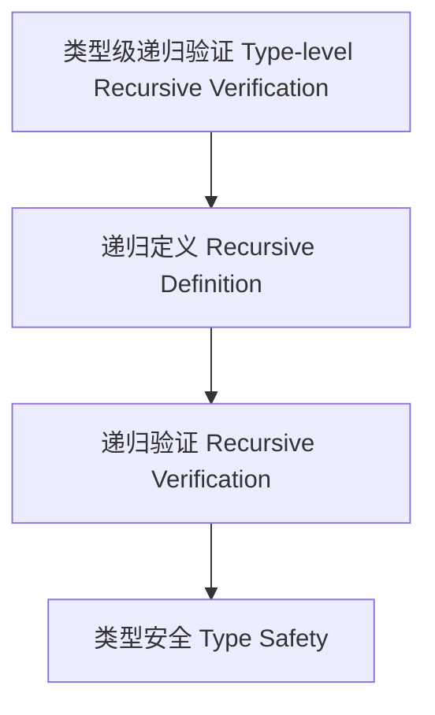

# 类型级递归验证（Type-Level Recursive Verification in Haskell）

## 定义 Definition

- **中文**：类型级递归验证是指在类型系统层面通过递归定义和递归证明自动验证类型属性、约束和算法正确性的机制，提升类型安全和编译期可靠性。
- **English**: Type-level recursive verification refers to mechanisms at the type system level for automatically verifying type properties, constraints, and algorithm correctness via recursive definitions and proofs, enhancing type safety and compile-time reliability in Haskell.

## Haskell 语法与实现 Syntax & Implementation

```haskell
{-# LANGUAGE TypeFamilies, DataKinds, TypeOperators, GADTs #-}

-- 类型级递归验证示例：类型级列表是否全为偶数

type family AllEven (xs :: [Nat]) :: Bool where
  AllEven '[] = 'True
  AllEven (n ': xs) = Even n && AllEven xs

type family Even (n :: Nat) :: Bool where
  Even 0 = 'True
  Even 1 = 'False
  Even n = Even (n - 2)
```

## 递归验证机制 Recursive Verification Mechanism

- 类型族递归验证、类型类递归约束检查
- 支持类型属性、约束和算法的自动递归验证

## 形式化证明 Formal Reasoning

- **递归验证正确性证明**：归纳证明 AllEven xs 能准确判断列表是否全为偶数
- **Proof of correctness for recursive verification**: Inductive proof that AllEven xs correctly determines if all elements are even

### 证明示例 Proof Example

- 对 `AllEven xs`，对 `xs` 归纳：
  - 基础：`xs = []`，`AllEven [] = True` 成立
  - 归纳：递归判断每个元素是否为偶数

## 工程应用 Engineering Application

- 类型安全的递归验证、自动化推理、泛型库
- Type-safe recursive verification, automated reasoning, generic libraries

## 结构图 Structure Diagram



## 本地跳转 Local References

- [类型级递归推理 Type-Level Recursive Reasoning](../58-Type-Level-Recursive-Reasoning/01-Type-Level-Recursive-Reasoning-in-Haskell.md)
- [类型级自动化验证 Type-Level Automated Verification](../49-Type-Level-Automated-Verification/01-Type-Level-Automated-Verification-in-Haskell.md)
- [类型安全 Type Safety](../14-Type-Safety/01-Type-Safety-in-Haskell.md)
