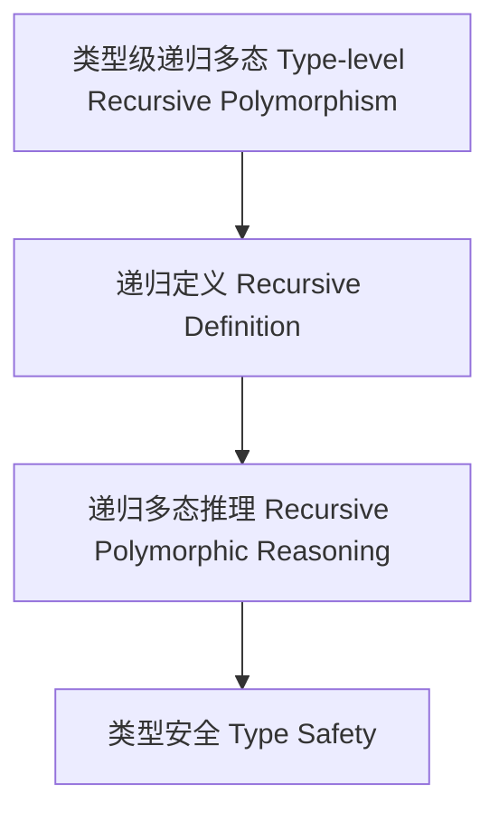

# 62-类型级递归多态（Type-Level Recursive Polymorphism in Haskell）

## 定义 Definition

- **中文**：类型级递归多态是指在类型系统层面对多态类型和算法进行递归定义、递归推理和递归验证的机制，支持类型安全的泛型编程与自动化推理。
- **English**: Type-level recursive polymorphism refers to mechanisms at the type system level for recursively defining, reasoning, and verifying polymorphic types and algorithms, supporting type-safe generic programming and automated reasoning in Haskell.

## Haskell 语法与实现 Syntax & Implementation

```haskell
{-# LANGUAGE TypeFamilies, DataKinds, TypeOperators, GADTs, RankNTypes #-}

-- 类型级递归多态示例：递归多态映射

type family MapPoly (f :: forall a. a -> a) (xs :: [k]) :: [k] where
  MapPoly f '[] = '[]
  MapPoly f (x ': xs) = f x ': MapPoly f xs
```

## 递归多态机制 Recursive Polymorphism Mechanism

- 类型族递归定义、类型类递归多态推理
- 支持多态类型和算法的递归定义、推理与验证

## 形式化证明 Formal Reasoning

- **递归多态正确性证明**：归纳证明 MapPoly f xs 能正确映射所有元素
- **Proof of correctness for recursive polymorphism**: Inductive proof that MapPoly f xs correctly maps all elements

### 证明示例 Proof Example

- 对 `MapPoly f xs`，对 `xs` 递归归纳：
  - 基础：`xs = []`，`MapPoly f [] = []` 成立
  - 归纳：递归映射每个元素

## 工程应用 Engineering Application

- 类型安全的多态泛型库、自动化推理、DSL 框架
- Type-safe polymorphic generic libraries, automated reasoning, DSL frameworks

## 结构图 Structure Diagram



## 本地跳转 Local References

- [类型推断与多态 Type Inference and Polymorphism](../06-Type-Inference-and-Polymorphism/01-Type-Inference-and-Polymorphism-in-Haskell.md)
- [类型级递归推理 Type-Level Recursive Reasoning](../58-Type-Level-Recursive-Reasoning/01-Type-Level-Recursive-Reasoning-in-Haskell.md)
- [类型安全 Type Safety](../14-Type-Safety/01-Type-Safety-in-Haskell.md)
