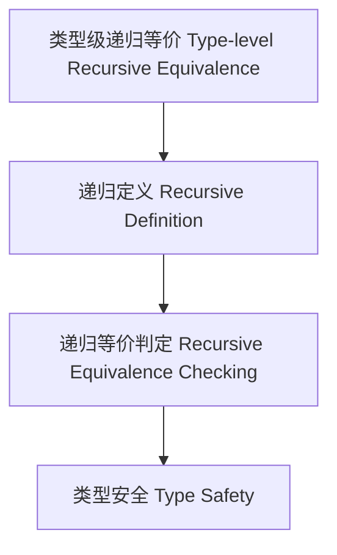

# 63-类型级递归等价（Type-Level Recursive Equivalence in Haskell）

## 定义 Definition

- **中文**：类型级递归等价是指在类型系统层面对类型关系、属性和算法进行递归等价判定与证明的机制，支持类型安全的自动化推理与泛型编程。
- **English**: Type-level recursive equivalence refers to mechanisms at the type system level for recursively determining and proving equivalence of type relations, properties, and algorithms, supporting type-safe automated reasoning and generic programming in Haskell.

## Haskell 语法与实现 Syntax & Implementation

```haskell
{-# LANGUAGE TypeFamilies, DataKinds, TypeOperators, GADTs #-}

-- 类型级递归等价示例：类型级列表等价判定

type family EqList (xs :: [Nat]) (ys :: [Nat]) :: Bool where
  EqList '[] '[] = 'True
  EqList (x ': xs) (y ': ys) = (x == y) && EqList xs ys
  EqList xs ys = 'False
```

## 递归等价机制 Recursive Equivalence Mechanism

- 类型族递归定义、类型类递归等价判定
- 支持类型关系、属性和算法的递归等价判定与证明

## 形式化证明 Formal Reasoning

- **递归等价正确性证明**：归纳证明 EqList xs ys 能准确判定两个列表是否等价
- **Proof of correctness for recursive equivalence**: Inductive proof that EqList xs ys correctly determines if two lists are equivalent

### 证明示例 Proof Example

- 对 `EqList xs ys`，对 `xs` 和 `ys` 递归归纳：
  - 基础：`xs = []`，`ys = []`，EqList [] [] = True
  - 归纳：递归比较每个元素

## 工程应用 Engineering Application

- 类型安全的等价判定、自动化推理、泛型库
- Type-safe equivalence checking, automated reasoning, generic libraries

## 结构图 Structure Diagram



## 本地跳转 Local References

- [类型级等价判定 Type-Level Equality Decision](../32-Type-Level-Equality-Decision/01-Type-Level-Equality-Decision-in-Haskell.md)
- [类型级递归推理 Type-Level Recursive Reasoning](../58-Type-Level-Recursive-Reasoning/01-Type-Level-Recursive-Reasoning-in-Haskell.md)
- [类型安全 Type Safety](../14-Type-Safety/01-Type-Safety-in-Haskell.md)
