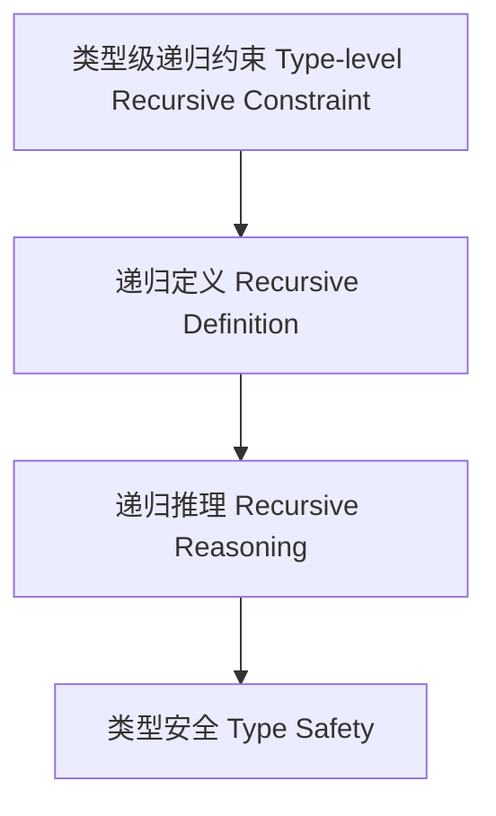

# 类型级递归约束（Type-Level Recursive Constraint in Haskell）

## 定义 Definition

- **中文**：类型级递归约束是指在类型系统层面对类型约束进行递归定义、递归推理和递归验证的机制，支持类型安全的自动化推理与泛型编程。
- **English**: Type-level recursive constraint refers to mechanisms at the type system level for recursively defining, reasoning, and verifying type constraints, supporting type-safe automated reasoning and generic programming in Haskell.

## Haskell 语法与实现 Syntax & Implementation

```haskell
{-# LANGUAGE TypeFamilies, ConstraintKinds, TypeOperators, UndecidableInstances #-}
import GHC.Exts (Constraint)

-- 类型级递归约束示例：所有元素都满足某约束

type family All (c :: k -> Constraint) (xs :: [k]) :: Constraint where
  All c '[] = ()
  All c (x ': xs) = (c x, All c xs)
```

## 递归约束机制 Recursive Constraint Mechanism

- 类型族递归定义、类型类递归约束推理
- 支持类型约束的递归定义、推理与验证

## 形式化证明 Formal Reasoning

- **递归约束正确性证明**：归纳证明 All c xs 能正确表达所有元素都满足约束 c
- **Proof of correctness for recursive constraint**: Inductive proof that All c xs correctly expresses that all elements satisfy constraint c

### 证明示例 Proof Example

- 对 `All c xs`，对 `xs` 归纳：
  - 基础：`xs = []`，All c [] = () 成立
  - 归纳：假设 All c xs 成立，则 All c (x:xs) = (c x, All c xs) 也成立

## 工程应用 Engineering Application

- 类型安全的递归约束、自动化推理、泛型库
- Type-safe recursive constraints, automated reasoning, generic libraries

## 结构图 Structure Diagram



## 本地跳转 Local References

- [类型级约束求解 Type-Level Constraint Solving](../22-Type-Level-Constraint-Solving/01-Type-Level-Constraint-Solving-in-Haskell.md)
- [类型级递归推理 Type-Level Recursive Reasoning](../58-Type-Level-Recursive-Reasoning/01-Type-Level-Recursive-Reasoning-in-Haskell.md)
- [类型安全 Type Safety](../14-Type-Safety/01-Type-Safety-in-Haskell.md)
