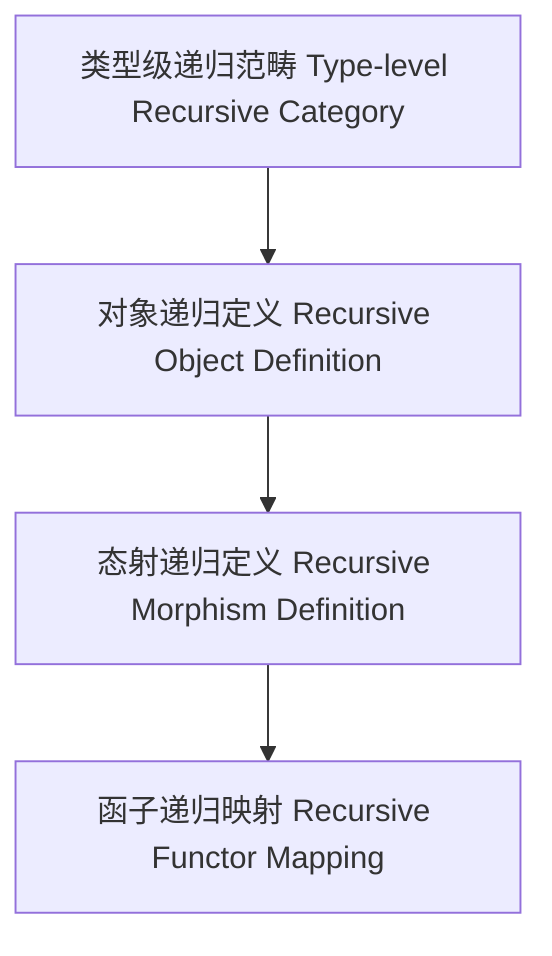

# 66-类型级递归范畴（Type-Level Recursive Category in Haskell）

## 定义 Definition

- **中文**：类型级递归范畴是指在类型系统层面递归建模范畴论结构（如对象、态射、函子、自然变换等）的机制，支持类型安全的抽象建模与自动化推理。
- **English**: Type-level recursive category refers to mechanisms at the type system level for recursively modeling category-theoretic structures (such as objects, morphisms, functors, natural transformations), supporting type-safe abstract modeling and automated reasoning in Haskell.

## Haskell 语法与实现 Syntax & Implementation

```haskell
{-# LANGUAGE TypeFamilies, GADTs, KindSignatures #-}

-- 类型级递归范畴示例：递归定义对象与态射

data Obj = A | B | C

data Hom :: Obj -> Obj -> * where
  Id  :: Hom a a
  F   :: Hom 'A 'B
  G   :: Hom 'B 'C
  Comp :: Hom a b -> Hom b c -> Hom a c

-- 类型级函子

type family FMap (f :: Obj -> Obj) (h :: Hom a b) :: Hom (f a) (f b)
```

## 递归范畴机制 Recursive Category Mechanism

- GADT递归定义、类型族递归映射
- 支持范畴结构的递归建模与推理

## 范畴论映射 Category Theory Mapping

- 对象、态射、函子、自然变换的递归建模
- 递归结构与范畴论中的初始对象、终对象、极限等概念对应

## 形式化证明 Formal Reasoning

- **递归范畴结构正确性证明**：证明递归定义的范畴结构满足范畴公理
- **Proof of correctness for recursive category**: Show that recursively defined category structures satisfy category axioms

### 证明示例 Proof Example

- 对于任意对象 a，Id :: Hom a a 满足恒等律
- 对于任意态射组合，Comp 满足结合律

## 工程应用 Engineering Application

- 类型安全的抽象建模、类型级DSL、泛型库
- Type-safe abstract modeling, type-level DSLs, generic libraries

## 结构图 Structure Diagram



## 本地跳转 Local References

- [类型级范畴论映射 Type-Level Category Theory Mapping](../36-Type-Level-Category-Theory-Mapping/01-Type-Level-Category-Theory-Mapping-in-Haskell.md)
- [类型级递归推理 Type-Level Recursive Reasoning](../58-Type-Level-Recursive-Reasoning/01-Type-Level-Recursive-Reasoning-in-Haskell.md)
- [类型安全 Type Safety](../14-Type-Safety/01-Type-Safety-in-Haskell.md)
