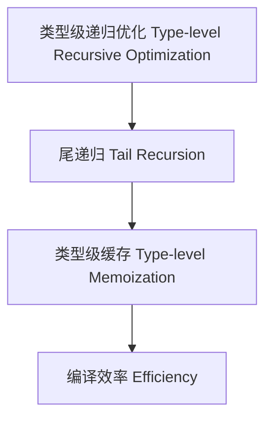

# 67-类型级递归优化（Type-Level Recursive Optimization in Haskell）

## 定义 Definition

- **中文**：类型级递归优化是指在类型系统层面对递归类型族、递归算法等进行优化以提升编译效率和类型推断性能的技术。
- **English**: Type-level recursive optimization refers to techniques at the type system level for optimizing recursive type families and recursive algorithms to improve compilation efficiency and type inference performance in Haskell.

## Haskell 语法与实现 Syntax & Implementation

```haskell
{-# LANGUAGE TypeFamilies, DataKinds, TypeOperators, UndecidableInstances #-}
import GHC.TypeLits

-- 递归优化示例：尾递归类型族

type family AddTR (a :: Nat) (b :: Nat) :: Nat where
  AddTR 0 b = b
  AddTR a b = AddTR (a - 1) (b + 1)
```

## 递归优化机制 Recursive Optimization Mechanism

- 尾递归（Tail Recursion）、类型级缓存（Type-level Memoization）
- 递归深度限制与分治

## 形式化证明 Formal Reasoning

- **递归优化终止性证明**：证明优化后的递归必然终止
- **Proof of termination for optimized recursion**: Show that the optimized recursion always terminates

### 证明示例 Proof Example

- 对 `AddTR a b`，对 `a` 归纳，`a=0` 时终止，`a>0` 时递归参数单调减小

## 工程应用 Engineering Application

- 提升类型推断速度、减少编译资源消耗、支持大规模类型级计算
- Improve type inference speed, reduce compile-time resource usage, support large-scale type-level computation

## 结构图 Structure Diagram



## 本地跳转 Local References

- [类型级递归推理 Type-Level Recursive Reasoning](../58-Type-Level-Recursive-Reasoning/01-Type-Level-Recursive-Reasoning-in-Haskell.md)
- [类型级递归自动化 Type-Level Recursive Automation](../59-Type-Level-Recursive-Automation/01-Type-Level-Recursive-Automation-in-Haskell.md)
- [类型级递归归纳 Type-Level Recursive Induction](../61-Type-Level-Recursive-Induction/01-Type-Level-Recursive-Induction-in-Haskell.md)
