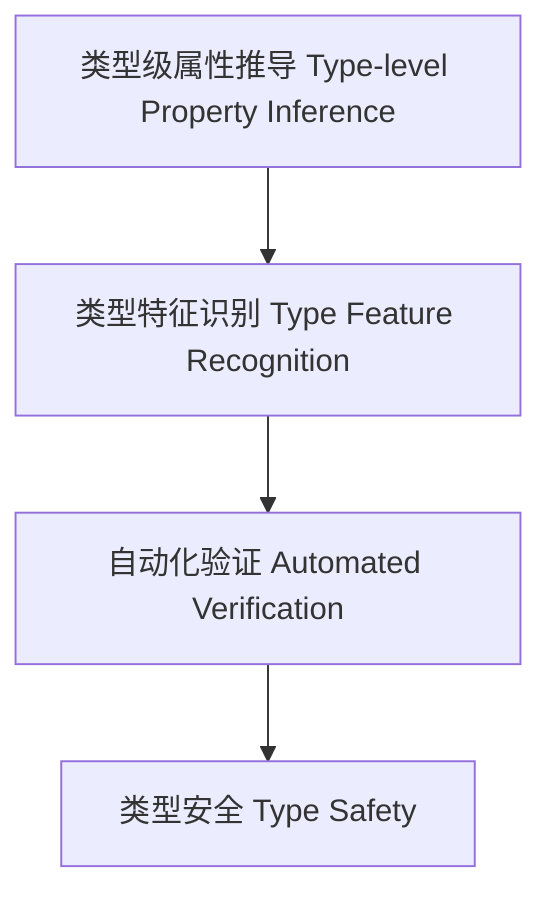

# 89-类型级属性推导（Type-Level Property Inference in Haskell）

## 定义 Definition

- **中文**：类型级属性推导是指在类型系统层面自动推导类型的属性、约束和特征的机制，支持类型安全的泛型编程与自动化验证。
- **English**: Type-level property inference refers to mechanisms at the type system level for automatically inferring properties, constraints, and features of types, supporting type-safe generic programming and automated verification in Haskell.

## Haskell 语法与实现 Syntax & Implementation

```haskell
{-# LANGUAGE TypeFamilies, DataKinds, TypeOperators, GADTs #-}

-- 类型级属性推导示例：判断类型是否为列表

type family IsList (a :: *) :: Bool where
  IsList [a] = 'True
  IsList a   = 'False
```

## 属性推导机制 Property Inference Mechanism

- 类型族递归推导、类型类约束分析
- 支持类型特征自动识别与属性归纳

## 形式化证明 Formal Reasoning

- **属性推导正确性证明**：证明推导机制能准确识别类型属性
- **Proof of correctness for property inference**: Show that the inference mechanism accurately identifies type properties

### 证明示例 Proof Example

- 对 `IsList a`，若 a 为列表类型则为 True，否则为 False

## 工程应用 Engineering Application

- 类型安全的泛型库、自动化验证、DSL 框架
- Type-safe generic libraries, automated verification, DSL frameworks

## 结构图 Structure Diagram



## 本地跳转 Local References

- [类型级自动化 Type-Level Automation](../27-Type-Level-Automation/01-Type-Level-Automation-in-Haskell.md)
- [类型级推理引擎 Type-Level Inference Engine](../38-Type-Level-Inference-Engine/01-Type-Level-Inference-Engine-in-Haskell.md)
- [类型安全 Type Safety](../14-Type-Safety/01-Type-Safety-in-Haskell.md)
