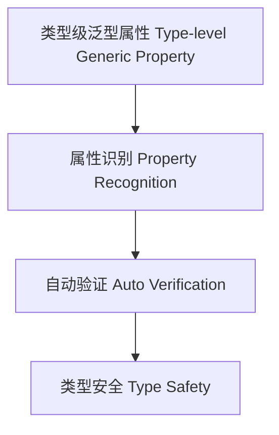

# 79-类型级泛型属性（Type-Level Generic Property in Haskell）

## 定义 Definition

- **中文**：类型级泛型属性是指在类型系统层面对泛型类型及其属性进行抽象、推导和验证的机制，支持类型安全的泛型编程与自动化推理。
- **English**: Type-level generic property refers to mechanisms at the type system level for abstracting, inferring, and verifying properties of generic types, supporting type-safe generic programming and automated reasoning in Haskell.

## Haskell 语法与实现 Syntax & Implementation

```haskell
{-# LANGUAGE TypeFamilies, DataKinds, TypeOperators, GADTs #-}

-- 类型级泛型属性示例：判断类型级列表是否为空

type family IsEmpty (xs :: [k]) :: Bool where
  IsEmpty '[] = 'True
  IsEmpty xs  = 'False
```

## 泛型属性机制 Generic Property Mechanism

- 类型族递归推导、类型类属性分析
- 支持泛型类型属性的自动识别与验证

## 形式化证明 Formal Reasoning

- **泛型属性正确性证明**：归纳证明 IsEmpty xs 能准确判断列表是否为空
- **Proof of correctness for generic property**: Inductive proof that IsEmpty xs correctly determines if a list is empty

### 证明示例 Proof Example

- 对 `IsEmpty xs`，对 `xs` 归纳：
  - 基础：`xs = []`，`IsEmpty [] = True` 成立
  - 归纳：`xs = x:xs'`，`IsEmpty (x:xs') = False` 成立

## 工程应用 Engineering Application

- 类型安全的泛型库、自动化推理、DSL 框架
- Type-safe generic libraries, automated reasoning, DSL frameworks

## 结构图 Structure Diagram



## 本地跳转 Local References

- [类型级泛型 Type-level Generic](../24-Type-Level-Generic/01-Type-Level-Generic-in-Haskell.md)
- [类型级属性推导 Type-Level Property Inference](../42-Type-Level-Property-Inference/01-Type-Level-Property-Inference-in-Haskell.md)
- [类型安全 Type Safety](../14-Type-Safety/01-Type-Safety-in-Haskell.md)
