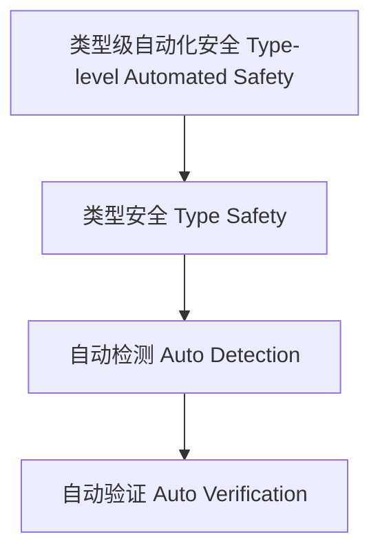

# 80-类型级自动化安全（Type-Level Automated Safety in Haskell）

## 定义 Definition

- **中文**：类型级自动化安全是指在类型系统层面自动检测、验证和保障类型安全的机制，提升编译期的可靠性和程序安全性。
- **English**: Type-level automated safety refers to mechanisms at the type system level for automatically detecting, verifying, and ensuring type safety, improving compile-time reliability and program safety in Haskell.

## Haskell 语法与实现 Syntax & Implementation

```haskell
{-# LANGUAGE TypeFamilies, ConstraintKinds, TypeOperators, UndecidableInstances #-}
import GHC.Exts (Constraint)

-- 类型级自动化安全示例：类型级约束安全验证

type family Safe (c :: Constraint) :: Bool where
  Safe (() :: Constraint) = 'True
  Safe c = 'False
```

## 自动化安全机制 Automated Safety Mechanism

- 类型族递归验证、类型类约束检查
- 支持类型安全属性的自动检测与验证

## 形式化证明 Formal Reasoning

- **自动化安全正确性证明**：证明自动化机制能检测所有类型安全性问题
- **Proof of correctness for automated safety**: Show that the automation mechanism detects all type safety issues

### 证明示例 Proof Example

- 对 `Safe c`，归纳证明 `c` 可解时返回 `True`，否则为 `False`

## 工程应用 Engineering Application

- 类型安全的自动验证、泛型库、DSL 框架
- Type-safe auto verification, generic libraries, DSL frameworks

## 结构图 Structure Diagram



## 本地跳转 Local References

- [类型安全 Type Safety](../14-Type-Safety/01-Type-Safety-in-Haskell.md)
- [类型级安全验证 Type-Level Safety Verification](../44-Type-Level-Safety-Verification/01-Type-Level-Safety-Verification-in-Haskell.md)
- [类型级自动化验证 Type-Level Automated Verification](../49-Type-Level-Automated-Verification/01-Type-Level-Automated-Verification-in-Haskell.md)
