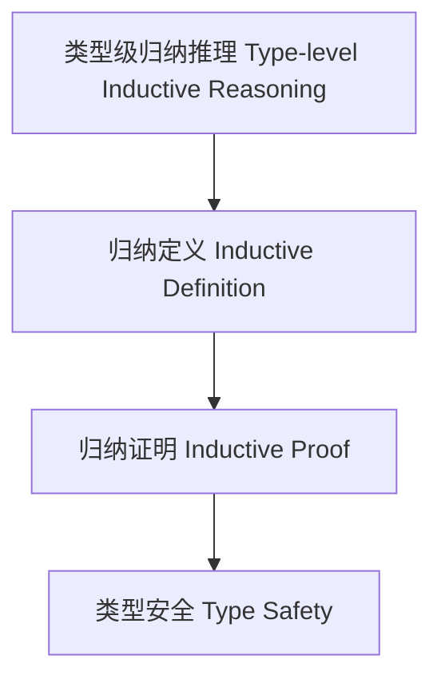

# 81-类型级归纳推理（Type-Level Inductive Reasoning in Haskell）

## 定义 Definition

- **中文**：类型级归纳推理是指在类型系统层面对类型关系、属性和算法进行归纳定义与归纳证明的机制，支持类型安全的自动化推理与泛型编程。
- **English**: Type-level inductive reasoning refers to mechanisms at the type system level for inductively defining and proving type relations, properties, and algorithms, supporting type-safe automated reasoning and generic programming in Haskell.

## Haskell 语法与实现 Syntax & Implementation

```haskell
{-# LANGUAGE TypeFamilies, DataKinds, TypeOperators, GADTs #-}

-- 类型级归纳推理示例：类型级自然数加法的归纳证明

type family Add (a :: Nat) (b :: Nat) :: Nat where
  Add 0 b = b
  Add a b = 1 + Add (a - 1) b
```

## 归纳推理机制 Inductive Reasoning Mechanism

- 类型族递归归纳、类型类属性分析
- 支持类型关系、属性和算法的归纳定义与自动化证明

## 形式化证明 Formal Reasoning

- **归纳推理正确性证明**：归纳证明 Add a b 的终止性和正确性
- **Proof of correctness for inductive reasoning**: Inductive proof of termination and correctness for Add a b

### 证明示例 Proof Example

- 对 `Add a b`，对 `a` 归纳：
  - 基础：`a=0`，`Add 0 b = b` 成立
  - 归纳：假设 `Add (a-1) b` 成立，则 `Add a b = 1 + Add (a-1) b` 也成立

## 工程应用 Engineering Application

- 类型安全的归纳证明、自动化推理、泛型库
- Type-safe inductive proofs, automated reasoning, generic libraries

## 结构图 Structure Diagram



## 本地跳转 Local References

- [类型级归纳与递归 Type-Level Induction & Recursion](../23-Type-Level-Induction/01-Type-Level-Induction-in-Haskell.md)
- [类型级属性归纳 Type-Level Property Induction](../48-Type-Level-Property-Induction/01-Type-Level-Property-Induction-in-Haskell.md)
- [类型安全 Type Safety](../14-Type-Safety/01-Type-Safety-in-Haskell.md)
