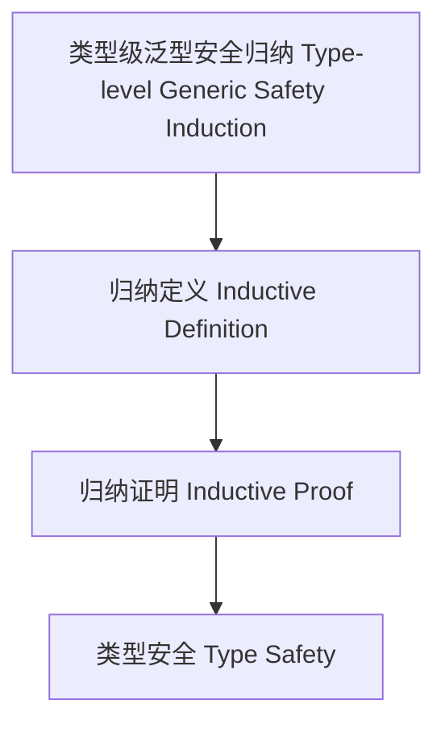

# 82-类型级泛型安全归纳（Type-Level Generic Safety Induction in Haskell）

## 定义 Definition

- **中文**：类型级泛型安全归纳是指在类型系统层面对泛型类型和算法的安全性进行归纳定义和归纳证明的机制，确保泛型编程的类型安全。
- **English**: Type-level generic safety induction refers to mechanisms at the type system level for inductively defining and proving the safety of generic types and algorithms, ensuring type safety in generic programming in Haskell.

## Haskell 语法与实现 Syntax & Implementation

```haskell
{-# LANGUAGE TypeFamilies, DataKinds, GADTs, KindSignatures #-}

-- 类型级泛型安全归纳示例：安全的泛型向量拼接

data Nat = Z | S Nat

data Vec :: * -> Nat -> * where
  VNil  :: Vec a 'Z
  VCons :: a -> Vec a n -> Vec a ('S n)

appendVec :: Vec a n -> Vec a m -> Vec a (Add n m)
appendVec VNil ys = ys
appendVec (VCons x xs) ys = VCons x (appendVec xs ys)
```

## 泛型安全归纳机制 Generic Safety Induction Mechanism

- 利用 GADT、类型族、DataKinds 进行归纳定义与安全性证明
- 支持泛型容器、算法的类型安全归纳

## 形式化证明 Formal Reasoning

- **泛型安全归纳证明**：归纳证明 appendVec 拼接后向量长度等于两向量长度之和，且类型安全
- **Proof of generic safety induction**: Inductive proof that appendVec preserves type safety and length

### 证明示例 Proof Example

- 对 `appendVec`，对第一个向量归纳：
  - 基础：`VNil`，拼接结果为第二个向量，长度正确
  - 归纳：假设 `appendVec xs ys` 成立，则 `appendVec (VCons x xs) ys = VCons x (appendVec xs ys)` 也成立

## 工程应用 Engineering Application

- 类型安全的泛型库、不可变容器、嵌入式系统
- Type-safe generic libraries, immutable containers, embedded systems

## 结构图 Structure Diagram



## 本地跳转 Local References

- [类型级泛型安全 Type-level Generic Safety](../40-Type-Level-Generic-Safety/01-Type-Level-Generic-Safety-in-Haskell.md)
- [类型级泛型归纳 Type-Level Generic Induction](../45-Type-Level-Generic-Induction/01-Type-Level-Generic-Induction-in-Haskell.md)
- [类型安全 Type Safety](../14-Type-Safety/01-Type-Safety-in-Haskell.md)
