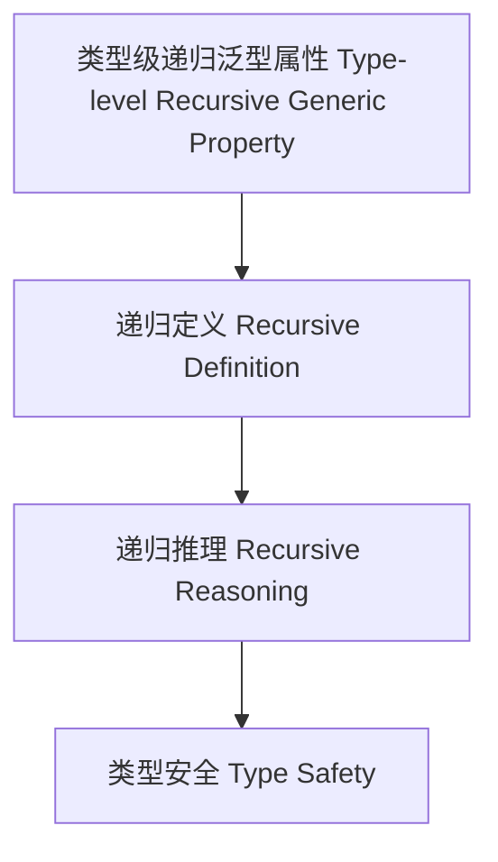

# 类型级递归泛型属性（Type-Level Recursive Generic Property in Haskell）

## 定义 Definition

- **中文**：类型级递归泛型属性是指在类型系统层面对泛型类型属性进行递归定义、推理和验证的机制，支持类型安全的泛型编程与自动化推理。
- **English**: Type-level recursive generic property refers to mechanisms at the type system level for recursively defining, reasoning, and verifying properties of generic types, supporting type-safe generic programming and automated reasoning in Haskell.

## Haskell 语法与实现 Syntax & Implementation

```haskell
{-# LANGUAGE TypeFamilies, DataKinds, TypeOperators, GADTs #-}

-- 类型级递归泛型属性示例：类型级列表是否全为正数

type family AllPositive (xs :: [Nat]) :: Bool where
  AllPositive '[] = 'True
  AllPositive (0 ': xs) = 'False
  AllPositive (n ': xs) = AllPositive xs
```

## 递归泛型属性机制 Recursive Generic Property Mechanism

- 类型族递归定义、类型类递归推理
- 支持泛型类型属性的递归定义、推理与验证

## 形式化证明 Formal Reasoning

- **递归泛型属性正确性证明**：归纳证明 AllPositive xs 能准确判断列表是否全为正数
- **Proof of correctness for recursive generic property**: Inductive proof that AllPositive xs correctly determines if all elements are positive

### 证明示例 Proof Example

- 对 `AllPositive xs`，对 `xs` 递归归纳：
  - 基础：`xs = []`，`AllPositive [] = True` 成立
  - 归纳：若首元素为 0，则为 False；否则递归判断余下元素

## 工程应用 Engineering Application

- 类型安全的递归泛型属性验证、自动化推理、泛型库
- Type-safe recursive generic property verification, automated reasoning, generic libraries

## 结构图 Structure Diagram



## 本地跳转 Local References

- [类型级递归属性 Type-Level Recursive Property](../62-Type-Level-Recursive-Property/01-Type-Level-Recursive-Property-in-Haskell.md)
- [类型级递归泛型算法 Type-Level Recursive Generic Algorithm](../72-Type-Level-Recursive-Generic-Algorithm/01-Type-Level-Recursive-Generic-Algorithm-in-Haskell.md)
- [类型安全 Type Safety](../14-Type-Safety/01-Type-Safety-in-Haskell.md)
