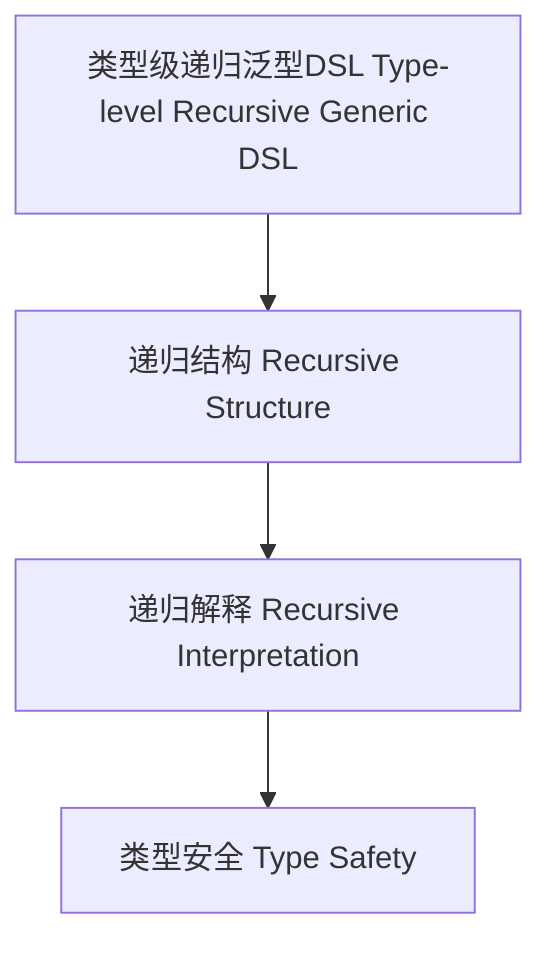

# 类型级递归泛型DSL（Type-Level Recursive Generic DSL in Haskell）

## 定义 Definition

- **中文**：类型级递归泛型DSL是指在类型系统层面对泛型领域特定语言（DSL）结构与语义进行递归定义、推理和验证的机制，支持类型安全的DSL设计与自动化推理。
- **English**: Type-level recursive generic DSL refers to mechanisms at the type system level for recursively defining, reasoning, and verifying the structure and semantics of generic domain-specific languages (DSLs), supporting type-safe DSL design and automated reasoning in Haskell.

## Haskell 语法与实现 Syntax & Implementation

```haskell
{-# LANGUAGE GADTs, DataKinds, KindSignatures, TypeFamilies #-}

-- 类型级递归泛型DSL示例：递归表达式语言

data Expr a where
  LitInt  :: Int  -> Expr Int
  LitBool :: Bool -> Expr Bool
  Add     :: Expr Int -> Expr Int -> Expr Int
  If      :: Expr Bool -> Expr a -> Expr a -> Expr a
  Seq     :: Expr a -> Expr b -> Expr b

-- 递归解释器
interp :: Expr a -> a
interp (LitInt n)   = n
interp (LitBool b)  = b
interp (Add x y)    = interp x + interp y
interp (If c t e)   = if interp c then interp t else interp e
interp (Seq x y)    = let _ = interp x in interp y
```

## 递归泛型DSL机制 Recursive Generic DSL Mechanism

- GADT递归定义、类型族递归推理
- 支持DSL结构与语义的递归定义、推理与验证

## 形式化证明 Formal Reasoning

- **递归泛型DSL正确性证明**：归纳证明递归泛型DSL解释器类型安全
- **Proof of correctness for recursive generic DSL**: Inductive proof that the recursive generic DSL interpreter is type-safe

### 证明示例 Proof Example

- 对 `Expr a` 递归归纳，所有构造器均保证 `interp` 返回类型为 `a`

## 工程应用 Engineering Application

- 类型安全的递归泛型DSL、自动化推理、嵌入式系统
- Type-safe recursive generic DSLs, automated reasoning, embedded systems

## 结构图 Structure Diagram



## 本地跳转 Local References

- [类型级递归DSL Type-Level Recursive DSL](../65-Type-Level-Recursive-DSL/01-Type-Level-Recursive-DSL-in-Haskell.md)
- [类型级递归泛型算法 Type-Level Recursive Generic Algorithm](../72-Type-Level-Recursive-Generic-Algorithm/01-Type-Level-Recursive-Generic-Algorithm-in-Haskell.md)
- [类型安全 Type Safety](../14-Type-Safety/01-Type-Safety-in-Haskell.md)
