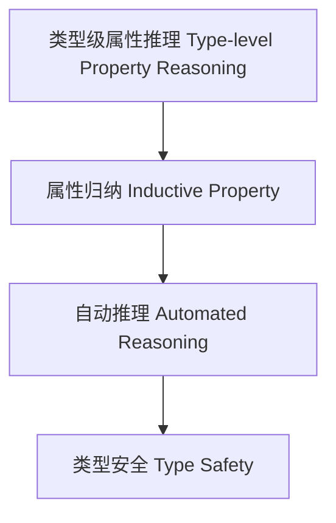

# 76-类型级属性推理（Type-Level Property Reasoning in Haskell）

## 定义 Definition

- **中文**：类型级属性推理是指在类型系统层面对类型属性进行自动化推理、归纳和验证的机制，支持类型安全的泛型编程与自动化证明。
- **English**: Type-level property reasoning refers to mechanisms at the type system level for automated reasoning, induction, and verification of type properties, supporting type-safe generic programming and automated proofs in Haskell.

## Haskell 语法与实现 Syntax & Implementation

```haskell
{-# LANGUAGE TypeFamilies, DataKinds, TypeOperators, GADTs #-}

-- 类型级属性推理示例：类型级列表是否全为正数

type family AllPositive (xs :: [Nat]) :: Bool where
  AllPositive '[] = 'True
  AllPositive (0 ': xs) = 'False
  AllPositive (n ': xs) = AllPositive xs
```

## 属性推理机制 Property Reasoning Mechanism

- 类型族递归推理、类型类属性分析
- 支持类型属性的自动推理与归纳证明

## 形式化证明 Formal Reasoning

- **属性推理正确性证明**：归纳证明 AllPositive xs 能准确判断列表是否全为正数
- **Proof of correctness for property reasoning**: Inductive proof that AllPositive xs correctly determines if all elements are positive

### 证明示例 Proof Example

- 对 `AllPositive xs`，对 `xs` 归纳：
  - 基础：`xs = []`，`AllPositive [] = True` 成立
  - 归纳：若首元素为 0，则为 False；否则递归判断余下元素

## 工程应用 Engineering Application

- 类型安全的属性验证、自动化推理、泛型库
- Type-safe property verification, automated reasoning, generic libraries

## 结构图 Structure Diagram



## 本地跳转 Local References

- [类型级属性归纳 Type-Level Property Induction](../48-Type-Level-Property-Induction/01-Type-Level-Property-Induction-in-Haskell.md)
- [类型级属性自动化 Type-Level Property Automation](../51-Type-Level-Property-Automation/01-Type-Level-Property-Automation-in-Haskell.md)
- [类型安全 Type Safety](../14-Type-Safety/01-Type-Safety-in-Haskell.md)
