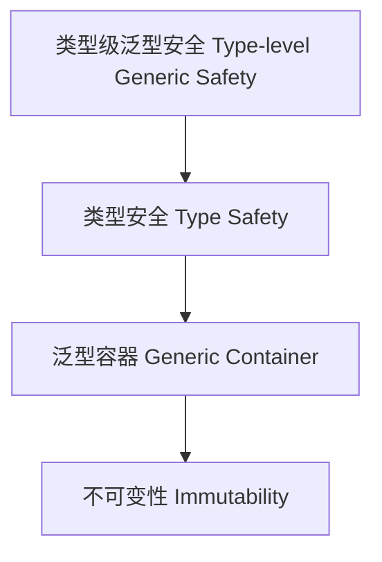

# 91-类型级泛型安全（Type-Level Generic Safety in Haskell）

## 定义 Definition

- **中文**：类型级泛型安全是指在类型系统层面保证泛型编程和类型级算法的类型安全，防止类型错误和不一致。
- **English**: Type-level generic safety refers to ensuring type safety in generic programming and type-level algorithms at the type system level, preventing type errors and inconsistencies in Haskell.

## Haskell 语法与实现 Syntax & Implementation

```haskell
{-# LANGUAGE TypeFamilies, DataKinds, GADTs, KindSignatures #-}

-- 类型级泛型安全示例：安全的泛型容器

data Nat = Z | S Nat

data Vec :: * -> Nat -> * where
  VNil  :: Vec a 'Z
  VCons :: a -> Vec a n -> Vec a ('S n)

-- 泛型安全的映射操作
mapVec :: (a -> b) -> Vec a n -> Vec b n
mapVec _ VNil = VNil
mapVec f (VCons x xs) = VCons (f x) (mapVec f xs)
```

## 泛型安全机制 Generic Safety Mechanism

- 利用 GADT、类型族、DataKinds 保证泛型操作的类型安全
- 支持类型级约束、不可变性、边界检查等

## 形式化证明 Formal Reasoning

- **泛型安全性证明**：归纳证明泛型操作不会破坏类型安全
- **Proof of generic safety**: Inductive proof that generic operations preserve type safety

### 证明示例 Proof Example

- 对 `mapVec`，归纳证明映射后向量长度与原向量一致，且类型安全

## 工程应用 Engineering Application

- 类型安全的泛型库、不可变容器、嵌入式系统
- Type-safe generic libraries, immutable containers, embedded systems

## 结构图 Structure Diagram



## 本地跳转 Local References

- [类型级泛型 Type-level Generic](../24-Type-Level-Generic/01-Type-Level-Generic-in-Haskell.md)
- [类型安全 Type Safety](../14-Type-Safety/01-Type-Safety-in-Haskell.md)
- [类型级数据结构 Type-Level Data Structure](../35-Type-Level-Data-Structure/01-Type-Level-Data-Structure-in-Haskell.md)
