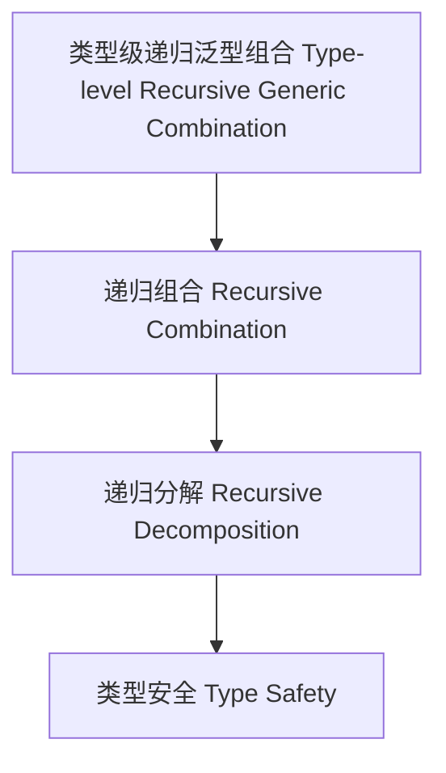

# 类型级递归泛型组合（Type-Level Recursive Generic Combination in Haskell）

## 定义 Definition

- **中文**：类型级递归泛型组合是指在类型系统层面对递归泛型结构、算法等进行类型级别组合、复合与分解的机制。
- **English**: Type-level recursive generic combination refers to mechanisms at the type system level for combining, composing, and decomposing recursive generic structures and algorithms in Haskell.

## Haskell 语法与实现 Syntax & Implementation

```haskell
{-# LANGUAGE TypeFamilies, DataKinds, TypeOperators #-}

-- 递归泛型组合示例：类型级列表拼接与嵌套

type family Concat (xs :: [k]) (ys :: [k]) :: [k] where
  Concat '[] ys = ys
  Concat (x ': xs) ys = x ': Concat xs ys

type family Nest (xs :: [k]) (ys :: [k]) :: [[k]] where
  Nest '[] ys = '[]
  Nest (x ': xs) ys = (x ': ys) ': Nest xs ys
```

## 组合机制 Combination Mechanism

- 类型级递归组合、复合、分解
- 组合律、分配律、嵌套组合

## 形式化证明 Formal Reasoning

- **组合律证明**：Concat (Concat xs ys) zs = Concat xs (Concat ys zs)
- **Proof of associativity**: Concat (Concat xs ys) zs = Concat xs (Concat ys zs)

### 证明示例 Proof Example

- 对 `Concat` 递归归纳，基础与归纳步均成立

## 工程应用 Engineering Application

- 类型安全的递归泛型组合、自动化推理、泛型库
- Type-safe recursive generic combination, automated reasoning, generic libraries

## 结构图 Structure Diagram



## 本地跳转 Local References

- [类型级递归泛型算法 Type-Level Recursive Generic Algorithm](../72-Type-Level-Recursive-Generic-Algorithm/01-Type-Level-Recursive-Generic-Algorithm-in-Haskell.md)
- [类型级递归数据结构 Type-Level Recursive Data Structure](../73-Type-Level-Recursive-Data-Structure/01-Type-Level-Recursive-Data-Structure-in-Haskell.md)
- [类型安全 Type Safety](../14-Type-Safety/01-Type-Safety-in-Haskell.md)
