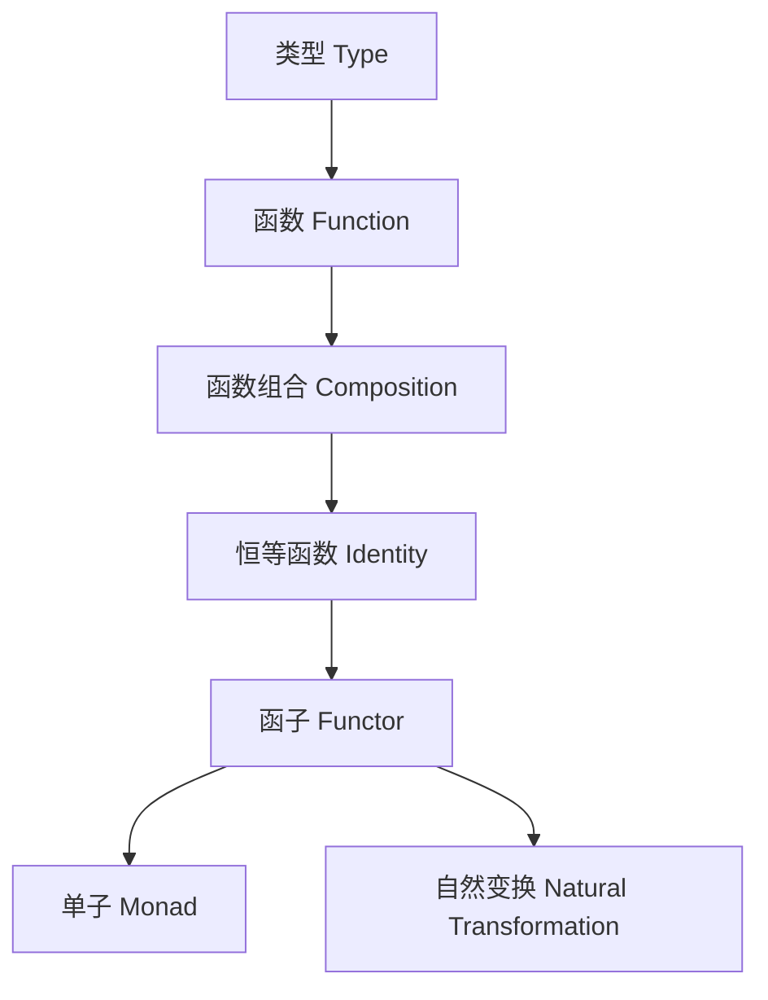

# 范畴论与Haskell类型系统（Category Theory and Haskell Type System）

## 定义 Definition

- **中文**：范畴论是一门研究对象与态射（映射）及其组合规律的数学理论。Haskell的类型系统可被视为一个范畴，其中类型为对象，函数为态射。
- **English**: Category theory is a mathematical theory that studies objects, morphisms (arrows), and their composition. The type system of Haskell can be viewed as a category, where types are objects and functions are morphisms.

## 范畴论核心概念 Core Concepts

- **对象（Object）**：类型（Type）
- **态射（Morphism）**：函数（Function）
- **组合（Composition）**：函数组合（Function composition）
- **恒等态射（Identity）**：恒等函数（Identity function）
- **函子（Functor）**、**单子（Monad）**、**自然变换（Natural Transformation）**

## Haskell类型系统映射 Haskell Type System Mapping

- 类型 <-> 对象，函数 <-> 态射，函数组合 <-> 组合，id <-> 恒等态射
- Haskell Functor/Monad/Applicative/自然变换等类型类与范畴论结构一一对应

### Haskell 代码示例

```haskell
class Functor f where
  fmap :: (a -> b) -> f a -> f b

class Monad m where
  (>>=)  :: m a -> (a -> m b) -> m b
  return :: a -> m a
```

## 结构图 Structure Diagram



## 形式化论证与证明 Formal Reasoning & Proofs

- **范畴公理在Haskell类型系统中的体现**：结合律、恒等律
- **函子/单子/自然变换公理证明**：fmap id = id, fmap (g . f) = fmap g . fmap f, monad三定律等

### 证明示例 Proof Example

- 证明Haskell中函数组合满足结合律，id为恒等元
- 证明Functor/Monad/自然变换的公理在Haskell类型系统下成立

## 工程应用 Engineering Application

- 类型安全抽象、泛型库、DSL、函数式设计模式、跨语言类型系统建模

## 本地跳转 Local References

- [类型理论基础 Type Theory Foundation](../01-Type-Theory/01-Type-Theory-Foundation.md)
- [类型推断与多态 Type Inference and Polymorphism](../06-Type-Inference-and-Polymorphism/01-Type-Inference-and-Polymorphism-in-Haskell.md)
- [类型安全 Type Safety](../14-Type-Safety/01-Type-Safety-in-Haskell.md)
- [函子 Functor](../05-Category-Theory/02-Functor/01-Functor-and-Haskell.md)
- [单子 Monad](../05-Category-Theory/03-Monad/01-Monad-and-Haskell.md)
- [自然变换 Natural Transformation](../05-Category-Theory/04-Natural-Transformation/01-Natural-Transformation-and-Haskell.md)
