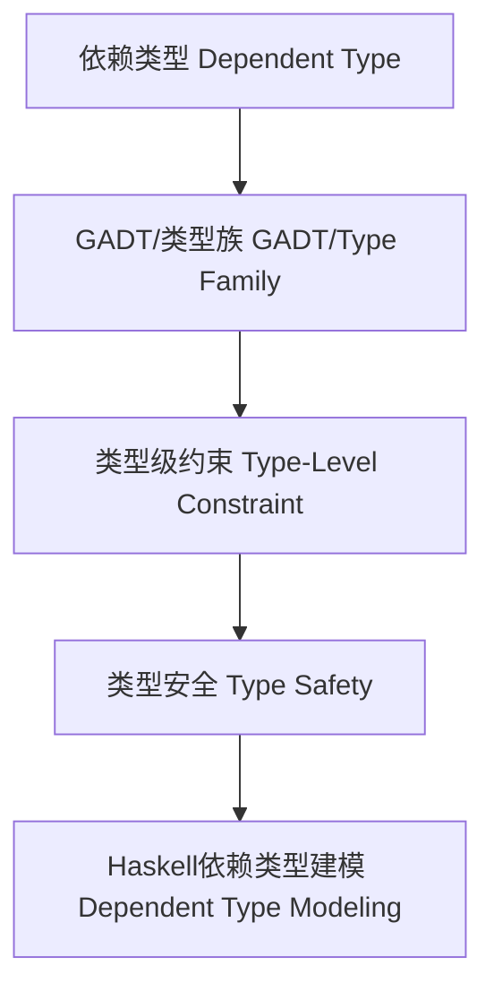

# 依赖类型理论与Haskell实现（Dependent Type Theory in Haskell）

## 定义 Definition

- **中文**：依赖类型理论是一种类型系统，类型可以依赖于值。Haskell通过GADT、类型族等特性部分支持依赖类型，提升类型表达能力和类型安全。
- **English**: Dependent type theory is a type system in which types can depend on values. Haskell partially supports dependent types via GADTs, type families, etc., enhancing type expressiveness and safety.

## 依赖类型系统核心概念 Core Concepts

- **依赖类型（Dependent Type）**：类型依赖于值。
- **GADT与类型族（GADT & Type Family）**：表达依赖关系和类型级运算。
- **依赖类型推理规则（Inference Rules）**：GADT构造、类型族归约、类型级约束。

## Haskell实现与现代语言对比 Haskell & Modern Language Comparison

- Haskell：GADT、类型族、DataKinds、部分依赖类型。
- Idris/Agda/Coq：原生支持依赖类型与证明。
- Scala 3：依赖类型、类型级运算。
- Rust/OCaml：无原生依赖类型。

### Haskell 依赖类型示例

```haskell
{-# LANGUAGE GADTs, TypeFamilies #-}

data Vec a n where
  VNil  :: Vec a 0
  VCons :: a -> Vec a n -> Vec a (n+1)

type family Elem c :: *
type instance Elem [a] = a
```

## 结构图 Structure Diagram



## 形式化论证与证明 Formal Reasoning & Proofs

- **依赖类型安全性证明**：类型级约束在编译期得到保证。
- **表达能力证明**：依赖类型可表达更复杂的类型关系和属性。

### 证明示例 Proof Example

- 证明类型级归纳、类型族约束下的类型安全。
- 证明依赖类型可表达长度、约束、属性等。

## 工程应用 Engineering Application

- 类型安全的不可变数据结构、形式化验证、类型级证明、DSL。

## 本地跳转 Local References

- [类型理论基础 Type Theory Foundation](../01-Type-Theory/01-Type-Theory-Foundation.md)
- [GADT in Haskell](../09-GADT/01-GADT-in-Haskell.md)
- [类型族 Type Family](../11-Type-Family/01-Type-Family-in-Haskell.md)
- [类型安全 Type Safety](../14-Type-Safety/01-Type-Safety-in-Haskell.md)
