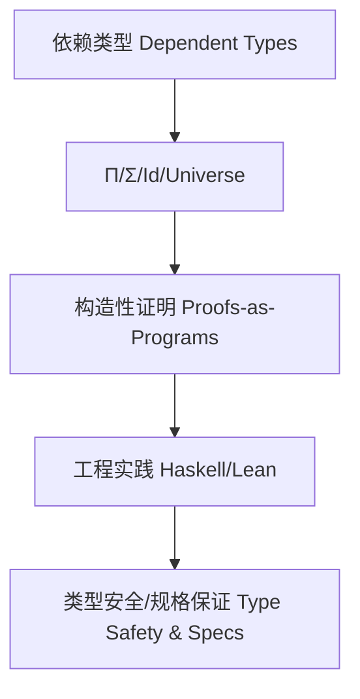

# 依赖类型理论（Dependent Type Theory）与Haskell/Lean实践

> 对标国际百科（Wikipedia、SEP、nLab）与学术教材（HoTT Book、TAPL）。提供中英双语、形式系统、历史发展、工程与证明实践。

## 1. 定义 Definition

- 中文：依赖类型理论是一类类型系统，其类型可依赖于值（terms），从而在类型层面携带精确的规格与不变量，用以在编译期进行验证与构造性证明。
- English: Dependent type theory is a family of type systems in which types may depend on terms, enabling precise specifications and invariants to be carried at the type level for compile-time verification and constructive proofs.

典型代表包括 Martin‑Löf Dependent Type Theory（MLTT）、Calculus of Constructions（CoC）及其扩展（CIC），它们通过 Π‑types（依赖函数类型）、Σ‑types（依赖对类型）、恒等类型（identity types）与宇宙（universes）形成可编程的证明环境。

## 2. 形式系统 Formal System

### 2.1 语法与判断 Syntax and Judgements

- 上下文 Context：Γ ⊢ 用于记录变量、类型与等式假设。
- 判断 Judgements：
  - Γ ⊢ A type（A 是类型）
  - Γ ⊢ a : A（a 的类型为 A）
  - Γ ⊢ A ≡ B（类型相等）与 Γ ⊢ a ≡ b : A（项相等）

### 2.2 关键构造 Key Constructors

- Π‑type（依赖函数）：若 Γ,x:A ⊢ B type，则 Γ ⊢ (Π x:A). B type；λx.a : Πx:A.B；应用 a b : B[x:=b]
- Σ‑type（依赖对）：若 Γ,x:A ⊢ B type，则 Γ ⊢ (Σ x:A). B type；成对 ⟨a,b⟩；投影 fst, snd
- Identity type（恒等/等同性）：Id_A(a,b) 或 a =_A b，携带同一性证据；消去规则支撑替换与传递
- Universes（宇宙层级）：Type₀ : Type₁ : Type₂ : …，避免 Russell 悖论
- W‑type / Inductive types：构造归纳数据与原理性递归/归纳

### 2.3 基本性质 Meta-theory

- Preservation（保持性）与 Progress（进展性）
- Normalization / Canonicity（可归约到规范形，良构闭项具备规范外形）
- Decidability of Type Checking（多为可判定，取决于系统与扩展）

### 2.4 Curry–Howard 同构 Curry–Howard Correspondence

命题即类型（Propositions as types），证明即程序（Proofs as programs），归纳原理对应递归/折叠。

## 3. 与相关理论的关系 Relations

- 与简单类型λ演算（STLC）：依赖类型将类型从常量域提升到项依赖域
- 与范畴论：Π‑type 对应指数对象，Σ‑type 对应纤维积/依赖和，Id‑type 与路径/等价相关（HoTT）
- 与 HoTT/Univalence：同一性被路径同伦替代，Univalence 公理刻画“等价即相等”

## 4. 历史与发展 History & Development

- Martin‑Löf（1970s）提出构造性依赖类型理论，发展出丰富的归纳族与证明原理
- Coquand 等发展 CoC/CIC，成为 Coq 等证明助理内核
- 现代方向：HoTT、Cubical Type Theory、Observational Type Theory、Guarded/Clocked 类型等
- 工程化：Coq/Agda/Idris/Lean 提供交互式证明与程序提取；Haskell 逐步引入 Dependent Haskell 提案

## 5. Haskell/Lean/Rust 对比 Haskell vs. Lean vs. Rust

- Haskell：通过 DataKinds、GADTs、Type Families、Singletons、TypeLits 等模拟大量依赖类型模式；GHC 提案中“Dependent Haskell”在推进中
- Lean/Agda/Coq：原生依赖类型与战术/重写/自动化证明；支持宇宙层级、归纳族与同伦理论
- Rust：无依赖类型，但所有权/借用/生命周期在“资源正确性”上与线性/仿射约束相辅

## 6. Haskell 实践 Haskell Practice

### 6.1 长度索引向量（Length-indexed Vectors）

```haskell
{-# LANGUAGE DataKinds, GADTs, KindSignatures, TypeOperators #-}

data Nat = Z | S Nat

data Vec (n :: Nat) a where
  VNil  :: Vec 'Z a
  VCons :: a -> Vec n a -> Vec ('S n) a

tailVec :: Vec ('S n) a -> Vec n a
tailVec (VCons _ xs) = xs
```

### 6.2 单例与桥接（Singletons Bridge）

```haskell
{-# LANGUAGE GADTs, DataKinds, KindSignatures #-}

data SNat (n :: Nat) where
  SZ :: SNat 'Z
  SS :: SNat n -> SNat ('S n)

replicateVec :: SNat n -> a -> Vec n a
replicateVec SZ     _ = VNil
replicateVec (SS k) x = VCons x (replicateVec k x)
```

### 6.3 类型族进行类型级计算（Type Families as Computation）

```haskell
{-# LANGUAGE TypeFamilies, DataKinds #-}

type family Add n m where
  Add 'Z     m = m
  Add ('S n) m = 'S (Add n m)
```

## 7. 证明模式 Proof Patterns（在 Haskell/Lean 中）

- 归纳证明与程序等价：使用 GADT 见证性质（如有界长度、排序不变）
- 规范化保证：以类型判定非法状态“不可构造”（constructive impossibility）
- Lean/Agda：以 Π/Σ/Id‑types 直接表达命题与证明，终结于 q.e.d.；Haskell 以类型层结构编码为近似

## 8. 工程应用 Engineering Applications

- 类型安全 API 与协议规格（编译期约束会话、版本与能力）
- 编译期验证 DSL（单位/维度、状态机、权限/能力系统）
- 形式化验证与证明驱动开发（程序与证明共演化）
- 编译期资源/布局/性能不变量（与线性/仿射/时序类型结合）

## 9. 结构图 Structure Diagram



## 10. 本地跳转 Local References

- [类型理论基础 Type Theory Foundation](../01-Type-Theory/01-Type-Theory-Foundation.md)
- [GADT in Haskell](../09-GADT/01-GADT-in-Haskell.md)
- [类型族 Type Family](../11-Type-Family/01-Type-Family-in-Haskell.md)
- [类型安全 Type Safety](../14-Type-Safety/01-Type-Safety-in-Haskell.md)

## 11. 参考文献 References

- Wikipedia: Dependent type（百科）
- The Stanford Encyclopedia of Philosophy: Type Theory（学术综述）
- nLab: Dependent type, Π‑type, Σ‑type, Identity type（术语）
- The HoTT Book（Univalent Foundations Program）
- Coq Reference Manual; Agda/Idris/Lean docs
- GHC User's Guide; Dependent Haskell proposals
