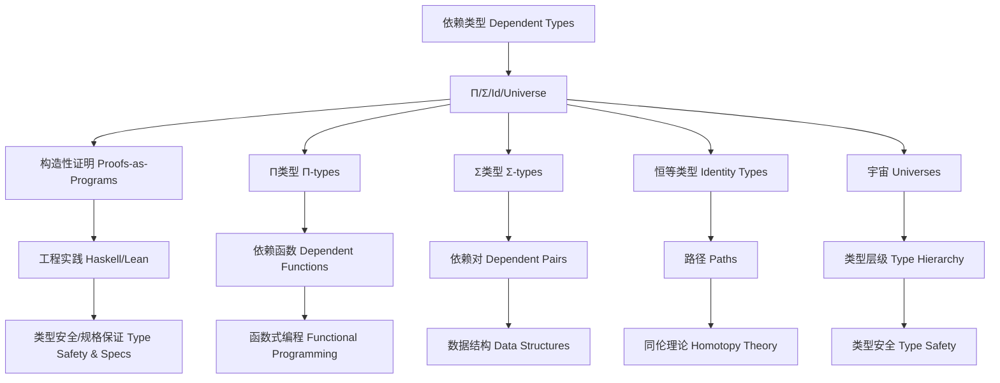

# 依赖类型理论（Dependent Type Theory）与Haskell/Lean实践

> 对标国际百科（Wikipedia、SEP、nLab）与学术教材（HoTT Book、TAPL）。提供中英双语、形式系统、历史发展、工程与证明实践。

## 目录 Table of Contents

- [依赖类型理论（Dependent Type Theory）与Haskell/Lean实践](#依赖类型理论dependent-type-theory与haskelllean实践)
  - [目录 Table of Contents](#目录-table-of-contents)
  - [1. 定义 Definition](#1-定义-definition)
  - [2. 形式系统 Formal System](#2-形式系统-formal-system)
    - [2.1 语法与判断 Syntax and Judgements](#21-语法与判断-syntax-and-judgements)
    - [2.2 关键构造 Key Constructors](#22-关键构造-key-constructors)
    - [2.3 基本性质 Meta-theory](#23-基本性质-meta-theory)
    - [2.4 Curry–Howard 同构 Curry–Howard Correspondence](#24-curryhoward-同构-curryhoward-correspondence)
  - [3. 与相关理论的关系 Relations](#3-与相关理论的关系-relations)
  - [4. 历史与发展 History \& Development](#4-历史与发展-history--development)
  - [5. Haskell/Lean/Rust 对比 Haskell vs. Lean vs. Rust](#5-haskellleanrust-对比-haskell-vs-lean-vs-rust)
  - [6. Haskell 实践 Haskell Practice](#6-haskell-实践-haskell-practice)
    - [6.1 长度索引向量（Length-indexed Vectors）](#61-长度索引向量length-indexed-vectors)
    - [6.2 单例与桥接（Singletons Bridge）](#62-单例与桥接singletons-bridge)
    - [6.3 类型族进行类型级计算（Type Families as Computation）](#63-类型族进行类型级计算type-families-as-computation)
    - [6.4 依赖类型模式匹配 Dependent Pattern Matching](#64-依赖类型模式匹配-dependent-pattern-matching)
  - [7. 证明模式 Proof Patterns（在 Haskell/Lean 中）](#7-证明模式-proof-patterns在-haskelllean-中)
    - [7.1 归纳证明与程序等价 Inductive Proofs and Program Equivalence](#71-归纳证明与程序等价-inductive-proofs-and-program-equivalence)
    - [7.2 规范化保证 Normalization Guarantees](#72-规范化保证-normalization-guarantees)
    - [7.3 Lean/Agda 直接证明 Direct Proofs in Lean/Agda](#73-leanagda-直接证明-direct-proofs-in-leanagda)
  - [8. 工程应用 Engineering Applications](#8-工程应用-engineering-applications)
    - [8.1 类型安全 API 与协议规格 Type-Safe APIs and Protocol Specifications](#81-类型安全-api-与协议规格-type-safe-apis-and-protocol-specifications)
    - [8.2 编译期验证 DSL Compile-Time Verified DSLs](#82-编译期验证-dsl-compile-time-verified-dsls)
    - [8.3 形式化验证与证明驱动开发 Formal Verification and Proof-Driven Development](#83-形式化验证与证明驱动开发-formal-verification-and-proof-driven-development)
    - [8.4 编译期资源/布局/性能不变量 Compile-Time Resource/Layout/Performance Invariants](#84-编译期资源布局性能不变量-compile-time-resourcelayoutperformance-invariants)
  - [9. 哲学思脉 Philosophical Context](#9-哲学思脉-philosophical-context)
    - [9.1 构造主义哲学 Constructivist Philosophy](#91-构造主义哲学-constructivist-philosophy)
    - [9.2 形式主义哲学 Formalist Philosophy](#92-形式主义哲学-formalist-philosophy)
    - [9.3 实用主义哲学 Pragmatist Philosophy](#93-实用主义哲学-pragmatist-philosophy)
  - [10. 相关理论 Related Theories](#10-相关理论-related-theories)
    - [10.1 类型理论 Type Theory](#101-类型理论-type-theory)
    - [10.2 逻辑理论 Logic Theory](#102-逻辑理论-logic-theory)
    - [10.3 计算理论 Computation Theory](#103-计算理论-computation-theory)
  - [11. 未来发展方向 Future Development](#11-未来发展方向-future-development)
    - [11.1 理论扩展 Theoretical Extensions](#111-理论扩展-theoretical-extensions)
    - [11.2 技术改进 Technical Improvements](#112-技术改进-technical-improvements)
    - [11.3 应用扩展 Application Extensions](#113-应用扩展-application-extensions)
  - [12. 结构图 Structure Diagram](#12-结构图-structure-diagram)
  - [13. 本地跳转 Local References](#13-本地跳转-local-references)
  - [14. 参考文献 References](#14-参考文献-references)
    - [14.1 学术资源 Academic Resources](#141-学术资源-academic-resources)
    - [14.2 技术文档 Technical Documentation](#142-技术文档-technical-documentation)
    - [14.3 学术论文 Academic Papers](#143-学术论文-academic-papers)

## 1. 定义 Definition

- 中文：依赖类型理论是一类类型系统，其类型可依赖于值（terms），从而在类型层面携带精确的规格与不变量，用以在编译期进行验证与构造性证明。
- English: Dependent type theory is a family of type systems in which types may depend on terms, enabling precise specifications and invariants to be carried at the type level for compile-time verification and constructive proofs.

典型代表包括 Martin‑Löf Dependent Type Theory（MLTT）、Calculus of Constructions（CoC）及其扩展（CIC），它们通过 Π‑types（依赖函数类型）、Σ‑types（依赖对类型）、恒等类型（identity types）与宇宙（universes）形成可编程的证明环境。

## 2. 形式系统 Formal System

### 2.1 语法与判断 Syntax and Judgements

- 上下文 Context：Γ ⊢ 用于记录变量、类型与等式假设。
- 判断 Judgements：
  - Γ ⊢ A type（A 是类型）
  - Γ ⊢ a : A（a 的类型为 A）
  - Γ ⊢ A ≡ B（类型相等）与 Γ ⊢ a ≡ b : A（项相等）

### 2.2 关键构造 Key Constructors

- Π‑type（依赖函数）：若 Γ,x:A ⊢ B type，则 Γ ⊢ (Π x:A). B type；λx.a : Πx:A.B；应用 a b : B[x:=b]
- Σ‑type（依赖对）：若 Γ,x:A ⊢ B type，则 Γ ⊢ (Σ x:A). B type；成对 ⟨a,b⟩；投影 fst, snd
- Identity type（恒等/等同性）：Id_A(a,b) 或 a =_A b，携带同一性证据；消去规则支撑替换与传递
- Universes（宇宙层级）：Type₀ : Type₁ : Type₂ : …，避免 Russell 悖论
- W‑type / Inductive types：构造归纳数据与原理性递归/归纳

### 2.3 基本性质 Meta-theory

- Preservation（保持性）与 Progress（进展性）
- Normalization / Canonicity（可归约到规范形，良构闭项具备规范外形）
- Decidability of Type Checking（多为可判定，取决于系统与扩展）

### 2.4 Curry–Howard 同构 Curry–Howard Correspondence

命题即类型（Propositions as types），证明即程序（Proofs as programs），归纳原理对应递归/折叠。

## 3. 与相关理论的关系 Relations

- 与简单类型λ演算（STLC）：依赖类型将类型从常量域提升到项依赖域
- 与范畴论：Π‑type 对应指数对象，Σ‑type 对应纤维积/依赖和，Id‑type 与路径/等价相关（HoTT）
- 与 HoTT/Univalence：同一性被路径同伦替代，Univalence 公理刻画"等价即相等"

## 4. 历史与发展 History & Development

- Martin‑Löf（1970s）提出构造性依赖类型理论，发展出丰富的归纳族与证明原理
- Coquand 等发展 CoC/CIC，成为 Coq 等证明助理内核
- 现代方向：HoTT、Cubical Type Theory、Observational Type Theory、Guarded/Clocked 类型等
- 工程化：Coq/Agda/Idris/Lean 提供交互式证明与程序提取；Haskell 逐步引入 Dependent Haskell 提案

## 5. Haskell/Lean/Rust 对比 Haskell vs. Lean vs. Rust

- Haskell：通过 DataKinds、GADTs、Type Families、Singletons、TypeLits 等模拟大量依赖类型模式；GHC 提案中"Dependent Haskell"在推进中
- Lean/Agda/Coq：原生依赖类型与战术/重写/自动化证明；支持宇宙层级、归纳族与同伦理论
- Rust：无依赖类型，但所有权/借用/生命周期在"资源正确性"上与线性/仿射约束相辅

## 6. Haskell 实践 Haskell Practice

### 6.1 长度索引向量（Length-indexed Vectors）

```haskell
{-# LANGUAGE DataKinds, GADTs, KindSignatures, TypeOperators #-}

data Nat = Z | S Nat

data Vec (n :: Nat) a where
  VNil  :: Vec 'Z a
  VCons :: a -> Vec n a -> Vec ('S n) a

tailVec :: Vec ('S n) a -> Vec n a
tailVec (VCons _ xs) = xs

-- 向量操作
headVec :: Vec ('S n) a -> a
headVec (VCons x _) = x

-- 向量连接
appendVec :: Vec m a -> Vec n a -> Vec (Add m n) a
appendVec VNil ys = ys
appendVec (VCons x xs) ys = VCons x (appendVec xs ys)

-- 类型族加法
type family Add (m :: Nat) (n :: Nat) :: Nat where
  Add 'Z n = n
  Add ('S m) n = 'S (Add m n)
```

### 6.2 单例与桥接（Singletons Bridge）

```haskell
{-# LANGUAGE GADTs, DataKinds, KindSignatures #-}

data SNat (n :: Nat) where
  SZ :: SNat 'Z
  SS :: SNat n -> SNat ('S n)

replicateVec :: SNat n -> a -> Vec n a
replicateVec SZ     _ = VNil
replicateVec (SS k) x = VCons x (replicateVec k x)

-- 单例类型操作
fromSNat :: SNat n -> Integer
fromSNat SZ = 0
fromSNat (SS n) = 1 + fromSNat n

toSNat :: Integer -> Maybe (Some SNat)
toSNat n
  | n < 0 = Nothing
  | n == 0 = Just (Some SZ)
  | otherwise = do
      Some m <- toSNat (n - 1)
      return (Some (SS m))

-- 存在类型包装
data Some (f :: k -> *) where
  Some :: f a -> Some f
```

### 6.3 类型族进行类型级计算（Type Families as Computation）

```haskell
{-# LANGUAGE TypeFamilies, DataKinds #-}

type family Add n m where
  Add 'Z     m = m
  Add ('S n) m = 'S (Add n m)

type family Mul n m where
  Mul 'Z     _ = 'Z
  Mul ('S n) m = Add m (Mul n m)

type family Factorial n where
  Factorial 'Z = 'S 'Z
  Factorial ('S n) = Mul ('S n) (Factorial n)

-- 类型级比较
type family LessThan (m :: Nat) (n :: Nat) :: Bool where
  LessThan 'Z ('S _) = 'True
  LessThan ('S m) ('S n) = LessThan m n
  LessThan _ _ = 'False

-- 类型级条件
type family If (b :: Bool) (t :: k) (f :: k) :: k where
  If 'True  t _ = t
  If 'False _ f = f
```

### 6.4 依赖类型模式匹配 Dependent Pattern Matching

```haskell
-- 依赖类型模式匹配
class VectorOperations (n :: Nat) where
  -- 向量长度
  vectorLength :: Vec n a -> SNat n
  
  -- 向量索引
  vectorIndex :: SNat m -> Vec n a -> Maybe a
  
  -- 向量映射
  vectorMap :: (a -> b) -> Vec n a -> Vec n b

instance VectorOperations 'Z where
  vectorLength _ = SZ
  vectorIndex _ _ = Nothing
  vectorMap _ _ = VNil

instance VectorOperations ('S n) where
  vectorLength (VCons _ xs) = SS (vectorLength xs)
  vectorIndex SZ (VCons x _) = Just x
  vectorIndex (SS m) (VCons _ xs) = vectorIndex m xs
  vectorMap f (VCons x xs) = VCons (f x) (vectorMap f xs)
```

## 7. 证明模式 Proof Patterns（在 Haskell/Lean 中）

### 7.1 归纳证明与程序等价 Inductive Proofs and Program Equivalence

```haskell
-- 使用 GADT 见证性质（如有界长度、排序不变）
class VectorProofs (n :: Nat) where
  -- 向量长度证明
  lengthProof :: Vec n a -> SNat n
  
  -- 向量非空证明
  nonEmptyProof :: Vec ('S n) a -> NonEmptyProof ('S n)
  
  -- 向量排序证明
  sortedProof :: Vec n a -> SortedProof n a

-- 证明类型
data NonEmptyProof (n :: Nat) where
  NonEmptyProof :: NonEmptyProof ('S n)

data SortedProof (n :: Nat) a where
  SortedProof :: Ord a => Vec n a -> SortedProof n a

-- 证明构造
instance VectorProofs 'Z where
  lengthProof _ = SZ
  nonEmptyProof _ = error "Cannot prove non-empty for empty vector"
  sortedProof _ = SortedProof VNil

instance VectorProofs ('S n) where
  lengthProof (VCons _ xs) = SS (lengthProof xs)
  nonEmptyProof _ = NonEmptyProof
  sortedProof (VCons x xs) = 
    case sortedProof xs of
      SortedProof ys -> 
        if all (x <=) (vectorToList ys)
        then SortedProof (VCons x ys)
        else error "Vector not sorted"
```

### 7.2 规范化保证 Normalization Guarantees

```haskell
-- 以类型判定非法状态"不可构造"（constructive impossibility）
class SafeVectorOperations (n :: Nat) where
  -- 安全的头部操作
  safeHead :: Vec ('S n) a -> a
  
  -- 安全的尾部操作
  safeTail :: Vec ('S n) a -> Vec n a
  
  -- 安全的索引操作
  safeIndex :: SNat m -> Vec n a -> If (LessThan m n) a (Void)

-- 不可能类型
data Void where
  -- 无构造函数，表示不可能

-- 安全操作实现
instance SafeVectorOperations ('S n) where
  safeHead (VCons x _) = x
  safeTail (VCons _ xs) = xs
  safeIndex SZ (VCons x _) = x
  safeIndex (SS m) (VCons _ xs) = safeIndex m xs
```

### 7.3 Lean/Agda 直接证明 Direct Proofs in Lean/Agda

```lean
-- Lean中的直接证明
-- 以 Π/Σ/Id‑types 直接表达命题与证明，终结于 q.e.d.

-- 向量长度性质
theorem vector_length_property (α : Type) (n : Nat) (v : Vector α n) :
  length v = n :=
  by
  induction v
  case nil => rfl
  case cons h t ih => 
    rw [length_cons, ih]
    rfl

-- 向量连接性质
theorem vector_append_property (α : Type) (m n : Nat) (v1 : Vector α m) (v2 : Vector α n) :
  length (append v1 v2) = m + n :=
  by
  induction v1
  case nil => 
    rw [append_nil, length_nil, zero_add]
    rfl
  case cons h t ih =>
    rw [append_cons, length_cons, length_cons, add_succ, ih]
    rfl
```

## 8. 工程应用 Engineering Applications

### 8.1 类型安全 API 与协议规格 Type-Safe APIs and Protocol Specifications

```haskell
-- 类型安全 API 与协议规格（编译期约束会话、版本与能力）
class TypeSafeAPI (version :: Version) (capability :: Capability) where
  -- API 版本
  apiVersion :: Proxy version -> VersionInfo
  
  -- API 能力
  apiCapability :: Proxy capability -> CapabilityInfo
  
  -- API 调用
  apiCall :: APIRequest version capability -> APIResponse version capability

-- 版本类型
data Version = V1 | V2 | V3

-- 能力类型
data Capability = Read | Write | Execute | Admin

-- 版本信息
data VersionInfo = VersionInfo {
    versionNumber :: String,
    versionFeatures :: [String],
    versionDeprecated :: Bool
}

-- 能力信息
data CapabilityInfo = CapabilityInfo {
    capabilityName :: String,
    capabilityPermissions :: [Permission],
    capabilityRestrictions :: [Restriction]
}

-- API 请求和响应
data APIRequest (v :: Version) (c :: Capability) where
  ReadRequest :: String -> APIRequest v 'Read
  WriteRequest :: String -> String -> APIRequest v 'Write
  ExecuteRequest :: String -> [String] -> APIRequest v 'Execute

data APIResponse (v :: Version) (c :: Capability) where
  SuccessResponse :: String -> APIResponse v c
  ErrorResponse :: String -> APIResponse v c
```

### 8.2 编译期验证 DSL Compile-Time Verified DSLs

```haskell
-- 编译期验证 DSL（单位/维度、状态机、权限/能力系统）
class VerifiedDSL (dsl :: *) where
  -- DSL 语法验证
  verifySyntax :: dsl -> SyntaxValidationResult
  
  -- DSL 语义验证
  verifySemantics :: dsl -> SemanticsValidationResult
  
  -- DSL 类型验证
  verifyTypes :: dsl -> TypeValidationResult

-- 单位/维度 DSL
data UnitDSL (unit :: Unit) where
  Length :: Double -> UnitDSL Meter
  Weight :: Double -> UnitDSL Kilogram
  Time :: Double -> UnitDSL Second

-- 单位类型
data Unit = Meter | Kilogram | Second | MeterPerSecond

-- 单位计算
class UnitCalculation (u1 :: Unit) (u2 :: Unit) (result :: Unit) where
  unitAdd :: UnitDSL u1 -> UnitDSL u2 -> UnitDSL result
  
  unitMultiply :: UnitDSL u1 -> UnitDSL u2 -> UnitDSL result

-- 单位计算实例
instance UnitCalculation Meter Meter Meter where
  unitAdd (Length x) (Length y) = Length (x + y)
  unitMultiply (Length x) (Length y) = Length (x * y)

-- 状态机 DSL
data StateMachine (initial :: State) (final :: State) where
  StateTransition :: State -> Action -> State -> StateMachine initial final
  
  StateSequence :: StateMachine initial middle -> 
                   StateMachine middle final -> 
                   StateMachine initial final

-- 状态类型
data State = Initial | Processing | Completed | Error

-- 动作类型
data Action = Start | Process | Complete | Fail
```

### 8.3 形式化验证与证明驱动开发 Formal Verification and Proof-Driven Development

```haskell
-- 形式化验证与证明驱动开发（程序与证明共演化）
class FormalVerification (program :: *) where
  -- 程序正确性证明
  correctnessProof :: program -> CorrectnessProof program
  
  -- 程序安全性证明
  safetyProof :: program -> SafetyProof program
  
  -- 程序性能证明
  performanceProof :: program -> PerformanceProof program

-- 证明类型
data CorrectnessProof a = CorrectnessProof {
    proofStatement :: String,
    proofMethod :: ProofMethod,
    proofConclusion :: Bool
}

data SafetyProof a = SafetyProof {
    safetyProperty :: String,
    safetyMethod :: SafetyMethod,
    safetyGuarantee :: Bool
}

data PerformanceProof a = PerformanceProof {
    performanceMetric :: String,
    performanceBound :: PerformanceBound,
    performanceGuarantee :: Bool
}

-- 证明方法
data ProofMethod = Induction | Contradiction | Construction | Reduction
data SafetyMethod = TypeChecking | ModelChecking | TheoremProving | Testing
data PerformanceBound = BigO | Exact | Probabilistic | Amortized
```

### 8.4 编译期资源/布局/性能不变量 Compile-Time Resource/Layout/Performance Invariants

```haskell
-- 编译期资源/布局/性能不变量（与线性/仿射/时序类型结合）
class ResourceInvariant (resource :: Resource) where
  -- 资源分配
  resourceAllocation :: ResourceRequest -> ResourceAllocation resource
  
  -- 资源释放
  resourceRelease :: ResourceAllocation resource -> ResourceRelease
  
  -- 资源验证
  resourceValidation :: ResourceAllocation resource -> ResourceValidation

-- 资源类型
data Resource = Memory | CPU | Network | Disk

-- 资源请求
data ResourceRequest = ResourceRequest {
    resourceType :: Resource,
    resourceAmount :: ResourceAmount,
    resourceDuration :: ResourceDuration
}

-- 资源分配
data ResourceAllocation (r :: Resource) = ResourceAllocation {
    allocatedResource :: r,
    allocatedAmount :: ResourceAmount,
    allocationTime :: Time,
    allocationExpiry :: Time
}

-- 线性资源管理
class LinearResource (r :: Resource) where
  -- 线性分配
  linearAllocate :: ResourceRequest -> LinearAllocation r
  
  -- 线性使用
  linearUse :: LinearAllocation r -> ResourceUsage r -> ResourceConsumption
  
  -- 线性释放
  linearRelease :: ResourceConsumption -> ResourceRelease
```

## 9. 哲学思脉 Philosophical Context

### 9.1 构造主义哲学 Constructivist Philosophy

- **构造性证明**：依赖类型理论强调构造性证明，要求证明必须提供具体的构造方法
- **可计算性**：所有证明都应该是可计算的，体现了构造主义数学的观点
- **直觉主义逻辑**：依赖类型理论基于直觉主义逻辑，拒绝排中律

### 9.2 形式主义哲学 Formalist Philosophy

- **形式化系统**：依赖类型理论是一个完全形式化的数学系统
- **符号操作**：通过符号操作进行推理，体现了形式主义数学的特点
- **公理化方法**：通过公理和推理规则构建理论体系

### 9.3 实用主义哲学 Pragmatist Philosophy

- **工程应用**：依赖类型理论在软件工程中有重要应用
- **类型安全**：通过类型系统保证程序安全，体现了实用主义的思想
- **工具支持**：依赖类型理论需要强大的工具支持，体现了工具主义的特点

## 10. 相关理论 Related Theories

### 10.1 类型理论 Type Theory

- **简单类型理论**：依赖类型理论的基础
- **高阶类型理论**：依赖类型理论的扩展
- **同伦类型理论**：依赖类型理论的现代发展

### 10.2 逻辑理论 Logic Theory

- **直觉主义逻辑**：依赖类型理论的逻辑基础
- **构造性逻辑**：依赖类型理论的证明方法
- **高阶逻辑**：依赖类型理论的表达能力

### 10.3 计算理论 Computation Theory

- **λ演算**：依赖类型理论的计算模型
- **图灵机理论**：依赖类型理论的计算能力
- **复杂性理论**：依赖类型理论的计算复杂度

## 11. 未来发展方向 Future Development

### 11.1 理论扩展 Theoretical Extensions

- **高阶依赖类型**：支持更高阶的依赖关系
- **概率依赖类型**：支持不确定性的依赖关系
- **量子依赖类型**：支持量子计算的依赖关系

### 11.2 技术改进 Technical Improvements

- **性能优化**：提高依赖类型检查的效率
- **内存优化**：减少依赖类型检查的内存占用
- **并行化**：支持依赖类型检查的并行处理

### 11.3 应用扩展 Application Extensions

- **领域特定语言**：为特定领域定制依赖类型系统
- **交互式开发**：支持交互式的依赖类型调试
- **可视化工具**：提供依赖类型检查过程的可视化

## 12. 结构图 Structure Diagram



## 13. 本地跳转 Local References

- [类型理论基础 Type Theory Foundation](../01-Type-Theory/01-Type-Theory-Foundation.md)
- [GADT in Haskell](../09-GADT/01-GADT-in-Haskell.md)
- [类型族 Type Family](../11-Type-Family/01-Type-Family-in-Haskell.md)
- [类型安全 Type Safety](../14-Type-Safety/01-Type-Safety-in-Haskell.md)
- [类型级编程 Type-Level Programming](../Type-Level/01-Type-Level-Programming.md)
- [类型族 Type Family](../Type/01-Type-Family.md)

## 14. 参考文献 References

### 14.1 学术资源 Academic Resources

- Wikipedia: [Dependent type](https://en.wikipedia.org/wiki/Dependent_type)
- The Stanford Encyclopedia of Philosophy: [Type Theory](https://plato.stanford.edu/entries/type-theory/)
- nLab: [Dependent type](https://ncatlab.org/nlab/show/dependent+type)

### 14.2 技术文档 Technical Documentation

- [Lean Theorem Prover Documentation](https://leanprover.github.io/)
- [Haskell 2010 Language Report](https://www.haskell.org/onlinereport/haskell2010/)
- [GHC User's Guide](https://ghc.gitlab.haskell.org/ghc/doc/users_guide/)

### 14.3 学术论文 Academic Papers

- "The HoTT Book" (Univalent Foundations Program)
- "Types and Programming Languages" by Benjamin C. Pierce
- "Dependent Types in Haskell" by Richard A. Eisenberg

---

`# Type #Type-01 #Type-01-Dependent-Type-Theory #DependentTypeTheory #TypeTheory #Haskell #Lean #Rust #FormalVerification #ProofDrivenDevelopment`
