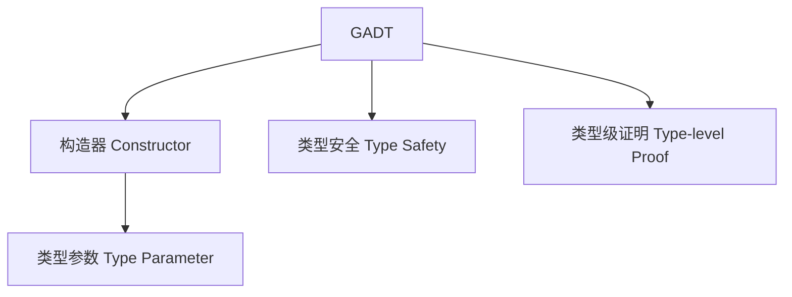

# 广义代数数据类型（GADT）在Haskell中的理论与实践（GADT in Haskell）

## 定义 Definition
- **中文**：广义代数数据类型（GADT）是Haskell对代数数据类型（ADT）的扩展，允许在构造函数中为每个分支指定更精确的返回类型，从而支持更强的类型表达能力。
- **English**: Generalized Algebraic Data Types (GADTs) are an extension of algebraic data types in Haskell, allowing each constructor to specify a more precise return type, thus enabling more expressive type-level programming.

## GADT核心概念 Core Concepts
- **构造器返回类型可变**：每个构造器可指定不同的类型参数。
- **类型级编程**：GADT支持类型级证明、类型安全AST等。
- **与ADT区别**：ADT所有构造器返回同一类型，GADT可区分。

## Haskell实现与现代语言对比 Haskell & Modern Language Comparison
- Haskell：GADT语法、类型安全AST、类型级证明。
- Scala 3：密封类+类型参数化。
- Rust：enum+trait对象（有限支持）。
- OCaml：GADT语法。

### Haskell GADT示例
```haskell
data Expr a where
  LitInt  :: Int -> Expr Int
  LitBool :: Bool -> Expr Bool
  Add     :: Expr Int -> Expr Int -> Expr Int
  If      :: Expr Bool -> Expr a -> Expr a -> Expr a
```

## 结构图 Structure Diagram


## 形式化论证与证明 Formal Reasoning & Proofs
- **类型安全性证明**：GADT可表达更精细的类型约束，防止非法构造。
- **类型级证明**：GADT可用于表达和证明类型等价、不可达分支等。

### 证明示例 Proof Example
- 证明GADT表达式求值时类型安全。
- 证明GADT可实现类型安全的AST。

## 工程应用 Engineering Application
- 类型安全AST、编译器前端、DSL、类型级证明、不可达分支消除。

## 本地跳转 Local References
- [高阶类型 Higher-Kinded Types](../28-Higher-Kinded-Types/01-Higher-Kinded-Types-in-Haskell.md)
- [类型级编程 Type-Level Programming](../30-Type-Level-Programming/01-Type-Level-Programming-in-Haskell.md)
- [类型安全 Type Safety](../14-Type-Safety/01-Type-Safety-in-Haskell.md) 