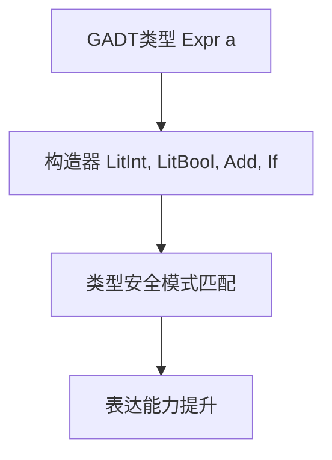

# 01. GADT在Haskell中的理论与实践（GADT in Haskell）

> **中英双语核心定义 | Bilingual Core Definitions**

## 1.1 GADT简介（Introduction to GADT）

- **定义（Definition）**：
  - **中文**：广义代数数据类型（GADT）是Haskell中一种扩展的数据类型声明方式，允许为每个构造器指定更精确的返回类型，从而提升类型表达能力和类型安全。
  - **English**: Generalized Algebraic Data Types (GADT) are an extension of data type declarations in Haskell, allowing each constructor to specify a more precise return type, thus enhancing type expressiveness and safety.

- **Wiki风格国际化解释（Wiki-style Explanation）**：
  - GADT为Haskell类型系统带来了依赖类型的部分能力，广泛用于表达带有类型约束的抽象语法树、解释器等。
  - GADTs bring some dependent type capabilities to Haskell's type system, widely used for expressing abstract syntax trees with type constraints, interpreters, etc.

## 1.2 Haskell中的GADT语法与语义（Syntax and Semantics of GADT in Haskell）

- **GADT声明语法（GADT Declaration Syntax）**

```haskell
{-# LANGUAGE GADTs #-}

data Expr a where
  LitInt  :: Int  -> Expr Int
  LitBool :: Bool -> Expr Bool
  Add     :: Expr Int -> Expr Int -> Expr Int
  If      :: Expr Bool -> Expr a -> Expr a -> Expr a
```

- **GADT的类型安全与表达能力**
  - 每个构造器可返回不同的类型参数，提升类型安全。
  - 支持更精细的类型检查和推断。

### 1.2.1 模式匹配与索引精化（Pattern Matching and Index Refinement）

- 对 `Expr a` 模式匹配时，构造器会精化 `a` 的具体形态（如 `LitInt` 精化为 `Int`）
- 编译器在每个分支内使用精化后的索引进行类型检查，确保分支类型安全

### 1.2.2 存在类型与带证据的数据（Existentials and Evidence Carrying Data）

- 可通过 GADT 在构造器中隐藏类型参数，形成存在量化；并携带证明/约束（如 `Show a => Pack a`）
- 常用于“以数据承载不变量”与“以构造器捆绑证据”

### 1.2.3 对推断的影响（Impact on Inference）

- GADT 引入局部等式与索引精化，可能需要显式签名帮助推断
- 与 `TypeFamilies/FunctionalDependencies/RankNTypes` 协作时，更需要明确的类型边界

- **GADT模式匹配（Pattern Matching with GADT）**

```haskell
eval :: Expr a -> a
eval (LitInt n)    = n
eval (LitBool b)   = b
eval (Add e1 e2)   = eval e1 + eval e2
eval (If c t f)    = if eval c then eval t else eval f
```

## 1.3 范畴论建模与结构映射（Category-Theoretic Modeling and Mapping）

- **GADT与依赖类型/范畴的关系**
  - GADT可视为类型依赖于值的特殊函子。

| 概念 | Haskell实现 | 代码示例 | 中文解释 |
|------|-------------|----------|----------|
| GADT | 精细类型数据 | `data Expr a where ...` | 精确类型表达 |
| 构造器 | 精确类型返回 | `LitInt :: Int -> Expr Int` | 构造器类型化 |
| 模式匹配 | 类型安全分支 | `eval :: Expr a -> a` | 类型安全解释 |

## 1.4 形式化证明与论证（Formal Proofs & Reasoning）

- **GADT类型安全性证明**
  - **中文**：证明GADT模式匹配下的每个分支都类型安全。
  - **English**: Prove that each branch in GADT pattern matching is type safe.

- **表达能力证明**
  - **中文**：证明GADT可表达依赖类型和更复杂的类型关系。
  - **English**: Prove that GADTs can express dependent types and more complex type relations.

### 1.4.1 证明模式（Proof Patterns）

- 以构造器分解进行结构归纳；在每个分支使用索引精化的归纳假设
- 携带等式/约束的构造器（evidence carrying）用于在类型层改写（rewrite）

## 1.5 多表征与本地跳转（Multi-representation & Local Reference）

- **GADT结构图（GADT Structure Diagram）**



- **相关主题跳转**：
  - [高阶类型 Higher-Kinded Types](./01-Higher-Kinded-Types.md)
  - [类型推断与多态 Type Inference and Polymorphism](./01-Type-Inference-and-Polymorphism.md)
  - [类型级编程 Type-Level Programming](./01-Type-Level-Programming.md)
  - [类型安全 Type Safety](./01-Type-Safety.md)

---

## 1.6 历史与发展 History & Development

- **中文**：GADT（广义代数数据类型）最早由Simon Peyton Jones等人在2000年代提出，作为Haskell类型系统的重要扩展。GADT为Haskell带来了部分依赖类型能力，极大提升了类型表达力和类型安全。GHC自6.6版本起正式支持GADT，并不断扩展相关特性。
- **English**: GADTs (Generalized Algebraic Data Types) were first proposed by Simon Peyton Jones et al. in the 2000s as a major extension to the Haskell type system. GADTs bring some dependent type capabilities to Haskell, greatly enhancing type expressiveness and safety. GHC has officially supported GADTs since version 6.6 and has continuously extended related features.

## 1.7 Haskell 相关特性 Haskell Features

### 经典特性 Classic Features

- 精确类型约束、类型安全表达式、模式匹配增强、类型推断改进。
- Precise type constraints, type-safe expressions, enhanced pattern matching, improved type inference.

### 最新特性 Latest Features

- **Type Families/Type-level Programming**：类型级GADT、类型级归纳。
- **Dependent Types（依赖类型）**：GADT为依赖类型提供基础。
- **QuantifiedConstraints/RankNTypes**：高阶类型与约束。
- **GHC 2021/2022**：标准化更多GADT相关扩展。

- **English**:
  - Type Families/Type-level Programming: Type-level GADTs, type-level induction.
  - Dependent Types: GADTs provide a foundation for dependent types.
  - QuantifiedConstraints/RankNTypes: Higher-order types and constraints.
  - GHC 2021/2022: Standardizes more GADT-related extensions.

## 1.8 应用 Applications

- **中文**：类型安全AST、解释器、编译器、DSL、形式化验证、不可变数据结构等。
- **English**: Type-safe ASTs, interpreters, compilers, DSLs, formal verification, immutable data structures, etc.

## 1.9 例子 Examples

```haskell
{-# LANGUAGE GADTs, TypeFamilies #-}
data Value a where
  VInt  :: Int -> Value Int
  VBool :: Bool -> Value Bool

data Expr a where
  Lit    :: Value a -> Expr a
  Add    :: Expr Int -> Expr Int -> Expr Int
  If     :: Expr Bool -> Expr a -> Expr a -> Expr a

eval :: Expr a -> a
eval (Lit (VInt n))  = n
eval (Lit (VBool b)) = b
eval (Add e1 e2)     = eval e1 + eval e2
eval (If c t f)      = if eval c then eval t else eval f

-- 存在类型封装与证据示例
data Some where
  Some :: Show a => a -> Some

printSome :: Some -> String
printSome (Some x) = show x
```

## 1.10 相关理论 Related Theories

- 依赖类型理论（Dependent Type Theory）
- 类型级编程（Type-level Programming）
- 代数数据类型（Algebraic Data Types）
- 形式化验证（Formal Verification）

## 1.11 参考文献 References

- [Wikipedia: Generalized Algebraic Data Type](https://en.wikipedia.org/wiki/Generalized_algebraic_data_type)
- [GHC User's Guide](https://downloads.haskell.org/ghc/latest/docs/html/users_guide/)
- [Types and Programming Languages, Benjamin C. Pierce]
- [Learn You a Haskell for Great Good!](http://learnyouahaskell.com/)

> 本文档为GADT在Haskell中的中英双语、Haskell语义模型与形式化证明规范化输出，适合学术研究与工程实践参考。
