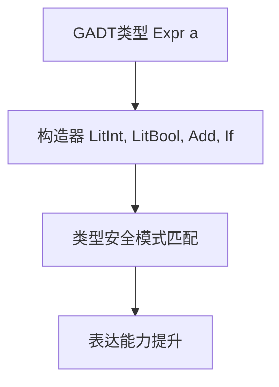

# 01. GADT在Haskell中的理论与实践（GADT in Haskell）

> **中英双语核心定义 | Bilingual Core Definitions**

## 1.1 GADT简介（Introduction to GADT）

- **定义（Definition）**：
  - **中文**：广义代数数据类型（GADT）是Haskell中一种扩展的数据类型声明方式，允许为每个构造器指定更精确的返回类型，从而提升类型表达能力和类型安全。
  - **English**: Generalized Algebraic Data Types (GADT) are an extension of data type declarations in Haskell, allowing each constructor to specify a more precise return type, thus enhancing type expressiveness and safety.

- **Wiki风格国际化解释（Wiki-style Explanation）**：
  - GADT为Haskell类型系统带来了依赖类型的部分能力，广泛用于表达带有类型约束的抽象语法树、解释器等。
  - GADTs bring some dependent type capabilities to Haskell's type system, widely used for expressing abstract syntax trees with type constraints, interpreters, etc.

## 1.2 Haskell中的GADT语法与语义（Syntax and Semantics of GADT in Haskell）

- **GADT声明语法（GADT Declaration Syntax）**

```haskell
{-# LANGUAGE GADTs #-}

data Expr a where
  LitInt  :: Int  -> Expr Int
  LitBool :: Bool -> Expr Bool
  Add     :: Expr Int -> Expr Int -> Expr Int
  If      :: Expr Bool -> Expr a -> Expr a -> Expr a
```

- **GADT的类型安全与表达能力**
  - 每个构造器可返回不同的类型参数，提升类型安全。
  - 支持更精细的类型检查和推断。

- **GADT模式匹配（Pattern Matching with GADT）**

```haskell
eval :: Expr a -> a
eval (LitInt n)    = n
eval (LitBool b)   = b
eval (Add e1 e2)   = eval e1 + eval e2
eval (If c t f)    = if eval c then eval t else eval f
```

## 1.3 范畴论建模与结构映射（Category-Theoretic Modeling and Mapping）

- **GADT与依赖类型/范畴的关系**
  - GADT可视为类型依赖于值的特殊函子。

| 概念 | Haskell实现 | 代码示例 | 中文解释 |
|------|-------------|----------|----------|
| GADT | 精细类型数据 | `data Expr a where ...` | 精确类型表达 |
| 构造器 | 精确类型返回 | `LitInt :: Int -> Expr Int` | 构造器类型化 |
| 模式匹配 | 类型安全分支 | `eval :: Expr a -> a` | 类型安全解释 |

## 1.4 形式化证明与论证（Formal Proofs & Reasoning）

- **GADT类型安全性证明**
  - **中文**：证明GADT模式匹配下的每个分支都类型安全。
  - **English**: Prove that each branch in GADT pattern matching is type safe.

- **表达能力证明**
  - **中文**：证明GADT可表达依赖类型和更复杂的类型关系。
  - **English**: Prove that GADTs can express dependent types and more complex type relations.

## 1.5 多表征与本地跳转（Multi-representation & Local Reference）

- **GADT结构图（GADT Structure Diagram）**



- **相关主题跳转**：
  - [高阶类型 Higher-Kinded Types](./01-Higher-Kinded-Types.md)
  - [类型推断与多态 Type Inference and Polymorphism](./01-Type-Inference-and-Polymorphism.md)
  - [类型级编程 Type-Level Programming](./01-Type-Level-Programming.md)
  - [类型安全 Type Safety](./01-Type-Safety.md)

---

> 本文档为GADT在Haskell中的中英双语、Haskell语义模型与形式化证明规范化输出，适合学术研究与工程实践参考。
