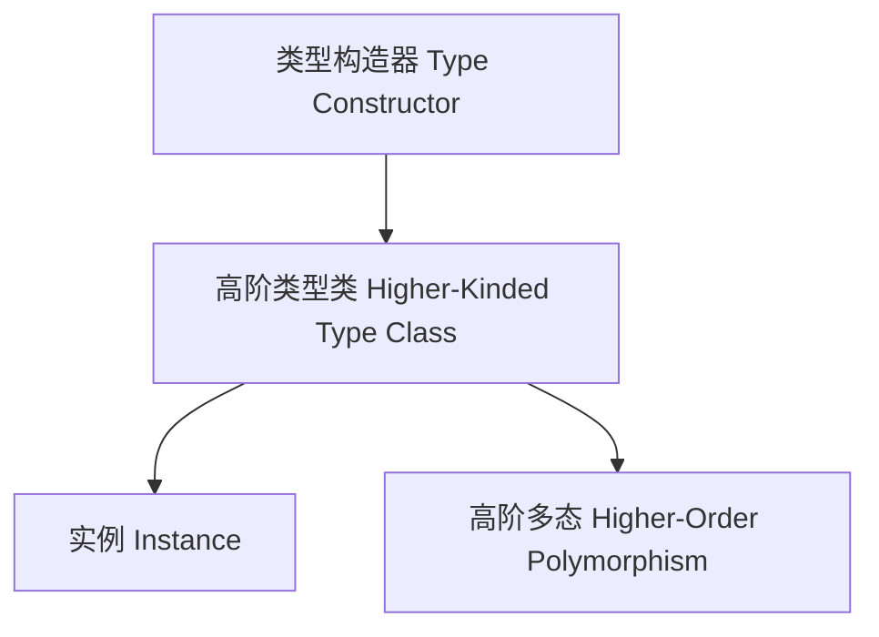

# 高阶类型在Haskell中的理论与实践（Higher-Kinded Types in Haskell）

## 定义 Definition

- **中文**：高阶类型是指以类型构造器为参数或返回值的类型。Haskell支持高阶类型，允许类型类和数据类型抽象于类型构造器。
- **English**: Higher-kinded types are types that take type constructors as parameters or return them. Haskell supports higher-kinded types, allowing type classes and data types to abstract over type constructors.

## 高阶类型核心概念 Core Concepts

- **类型构造器（Type Constructor）**：如`Maybe`、`[]`、`Either`等。
- **高阶类型类（Higher-Kinded Type Class）**：如`Functor`、`Monad`等。
- **高阶多态（Higher-Order Polymorphism）**：类型类约束类型构造器参数。

## Haskell实现与现代语言对比 Haskell & Modern Language Comparison

- Haskell：类型构造器、类型类、GADT、类型族。
- Scala 3：高阶类型、类型构造器、类型类。
- Rust：trait泛型、const generics（有限支持）。
- OCaml/F#：模块functor。
- TypeScript：泛型类型参数。

### Haskell 高阶类型示例

```haskell
class Functor f where
  fmap :: (a -> b) -> f a -> f b

instance Functor Maybe where
  fmap _ Nothing  = Nothing
  fmap f (Just x) = Just (f x)
```

## 结构图 Structure Diagram



## 形式化论证与证明 Formal Reasoning & Proofs

- **高阶类型安全性证明**：高阶类型类约束下的实例满足接口规范。
- **高阶多态性证明**：高阶类型支持更强的抽象和多态能力。

### 证明示例 Proof Example

- 证明Functor实例满足恒等律和组合律。
- 证明高阶类型类支持类型构造器参数化。

## 工程应用 Engineering Application

- 泛型编程、抽象数据类型、高阶多态、DSL、类型安全API。

## 本地跳转 Local References

- [类型类 Type Class](../27-Type-Class/01-Type-Class-in-Haskell.md)
- [类型推断与多态 Type Inference and Polymorphism](../26-Type-Inference-and-Polymorphism/01-Type-Inference-and-Polymorphism-in-Haskell.md)
- [类型安全 Type Safety](../14-Type-Safety/01-Type-Safety-in-Haskell.md)
