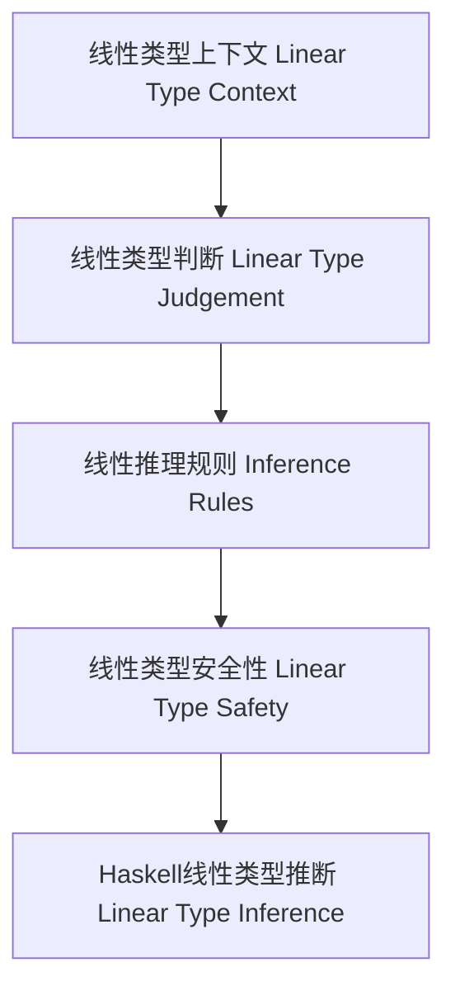

# 线性类型理论与Haskell实现（Linear Type Theory in Haskell）

## 定义 Definition

- **中文**：线性类型理论是一种类型系统，要求每个变量（资源）在作用域内恰好使用一次，广泛用于资源管理、并发和内存安全。Haskell通过LinearTypes扩展支持线性类型。
- **English**: Linear type theory is a type system that requires each variable (resource) to be used exactly once in its scope. Haskell supports linear types via the LinearTypes extension, widely used for resource management, concurrency, and memory safety.

## 线性类型系统核心概念 Core Concepts

- **线性类型上下文（Linear Type Context）**：变量唯一使用。
- **线性类型构造（Linear Type Constructors）**：线性函数类型（`a %1 -> b`）、张量积类型、可重复使用类型等。
- **线性推理规则（Inference Rules）**：变量、线性抽象、线性应用。

## Haskell实现与现代语言对比 Haskell & Modern Language Comparison

- Haskell：`LinearTypes` 扩展，`a %1 -> b`，资源唯一性保证。
- Rust：所有权与借用系统，强制资源唯一性。
- OCaml/F#：无原生线性类型，但可通过模块系统模拟。

### Haskell 线性类型示例

```haskell
{-# LANGUAGE LinearTypes #-}

f :: a %1 -> (a, a)
f x = (x, x)  -- 错误：x 被用两次，违反线性约束
```

## 结构图 Structure Diagram



## 形式化论证与证明 Formal Reasoning & Proofs

- **线性类型保持性（Preservation）**：归约后线性类型不变。
- **进展性（Progress）**：类型正确的表达式要么是值，要么可归约。
- **资源唯一性证明**：每个线性变量在作用域内恰好用一次。

### 证明示例 Proof Example

- 对每个推理规则，证明线性类型在归约后保持不变。
- 对每个语法构造，证明要么是值，要么可以继续归约。

## 工程应用 Engineering Application

- 资源安全API、并发编程、内存安全、文件/句柄管理、跨语言资源模型。

## 本地跳转 Local References

- [类型理论基础 Type Theory Foundation](../01-Type-Theory/01-Type-Theory-Foundation.md)
- [仿射类型理论 Affine Type Theory](../03-Affine-Type-Theory/01-Affine-Type-Theory-Foundation.md)
- [时序类型理论 Temporal Type Theory](../04-Temporal-Type-Theory/01-Temporal-Type-Theory-Foundation.md)
- [类型安全 Type Safety](../14-Type-Safety/01-Type-Safety-in-Haskell.md)
