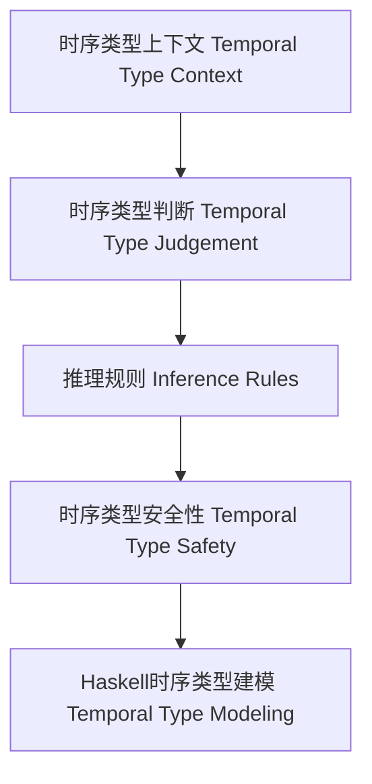

# 时序类型理论与Haskell实现（Temporal Type Theory in Haskell）

## 定义 Definition

- **中文**：时序类型理论是一种将时间维度引入类型系统的理论，能够描述和验证程序在不同时间点的行为和属性，广泛用于实时系统、嵌入式系统和时序逻辑建模。Haskell可通过类型标记、GADT等方式表达时序约束。
- **English**: Temporal type theory is a type system that incorporates the time dimension, enabling the description and verification of program behaviors and properties at different time points. Haskell can express temporal constraints via type tags, GADTs, etc.

## 时序类型系统核心概念 Core Concepts

- **时序类型上下文（Temporal Type Context）**：变量带有类型和时间信息。
- **时序类型构造（Temporal Type Constructors）**：可能性类型（eventually）、必然性类型（always）、直到类型（until）等。
- **时序推理规则（Inference Rules）**：变量、时序抽象、时序应用、可能性/必然性引入。

## Haskell实现与现代语言对比 Haskell & Modern Language Comparison

- Haskell：GADT、类型标记、类型级时间建模。
- TLA+、Coq、Idris：原生支持时序逻辑或依赖类型。
- Rust/Scala/OCaml：无原生时序类型，但可通过类型系统扩展模拟。

### Haskell 时序类型示例

```haskell
data Time = T0 | T1 | T2 deriving (Eq, Ord, Show)

data Temporal a = At Time a | Always a | Eventually a

atT1 :: Temporal Int -> Maybe Int
atT1 (At T1 x) = Just x
atT1 _ = Nothing
```

## 结构图 Structure Diagram



## 形式化论证与证明 Formal Reasoning & Proofs

- **时序类型保持性（Preservation）**：归约后时序类型不变。
- **进展性（Progress）**：类型正确的表达式要么是值，要么可归约。
- **时序约束证明**：操作在指定时间点或区间内执行。

### 证明示例 Proof Example

- 对每个推理规则，证明时序类型在归约后保持不变。
- 对每个语法构造，证明要么是值，要么可以继续归约。

## 工程应用 Engineering Application

- 实时系统、嵌入式系统、时序逻辑建模、编译期时序约束验证。

## 本地跳转 Local References

- [类型理论基础 Type Theory Foundation](../01-Type-Theory/01-Type-Theory-Foundation.md)
- [线性类型理论 Linear Type Theory](../02-Linear-Type-Theory/01-Linear-Type-Theory-Foundation.md)
- [仿射类型理论 Affine Type Theory](../03-Affine-Type-Theory/01-Affine-Type-Theory-Foundation.md)
- [类型安全 Type Safety](../14-Type-Safety/01-Type-Safety-in-Haskell.md)
