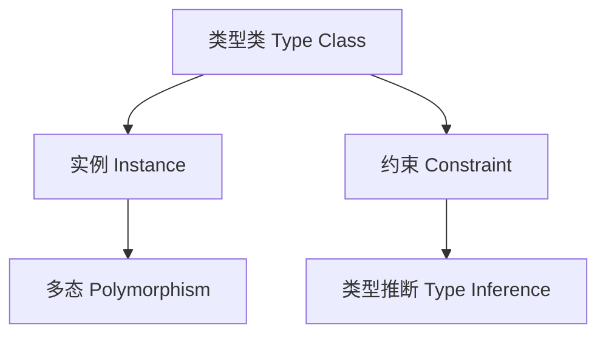

# 类型类在Haskell中的理论与实践（Type Class in Haskell）

## 定义 Definition

- **中文**：类型类是Haskell中用于实现受约束多态的机制，定义了一组操作的接口，并允许为不同类型提供具体实现。
- **English**: A type class in Haskell is a mechanism for constrained polymorphism, defining an interface of operations and allowing different types to provide concrete implementations.

## 类型类核心概念 Core Concepts

- **类型类（Type Class）**：接口/约束，定义操作集合。
- **实例（Instance）**：为具体类型实现类型类接口。
- **类型类约束（Type Class Constraint）**：受限多态。
- **派生（Deriving）**：自动实现类型类。

## Haskell实现与现代语言对比 Haskell & Modern Language Comparison

- Haskell：类型类、实例、约束、自动派生。
- Rust：trait、impl、trait bound。
- Scala 3：类型类、given/using、implicit。
- OCaml/F#：模块类型、functor。
- TypeScript：接口、泛型约束。

### Haskell 类型类示例

```haskell
class Eq a where
  (==) :: a -> a -> Bool
  (/=) :: a -> a -> Bool
  x /= y = not (x == y)

instance Eq Int where
  x == y = x `primIntEq` y
```

## 结构图 Structure Diagram



## 形式化论证与证明 Formal Reasoning & Proofs

- **类型类约束的正确性证明**：多态函数在所有实例上都满足接口规范。
- **实例一致性证明**：所有实例实现满足类型类公理（如等价关系）。

### 证明示例 Proof Example

- 证明类型类约束下的多态函数类型安全。
- 证明Eq实例满足等价关系（自反、对称、传递）。

## 工程应用 Engineering Application

- 泛型编程、接口约束、高阶多态、自动推导、DSL。

## 本地跳转 Local References

- [类型推断与多态 Type Inference and Polymorphism](../26-Type-Inference-and-Polymorphism/01-Type-Inference-and-Polymorphism-in-Haskell.md)
- [高阶类型 Higher-Kinded Types](../08-Higher-Kinded-Types/01-Higher-Kinded-Types-in-Haskell.md)
- [类型安全 Type Safety](../14-Type-Safety/01-Type-Safety-in-Haskell.md)
