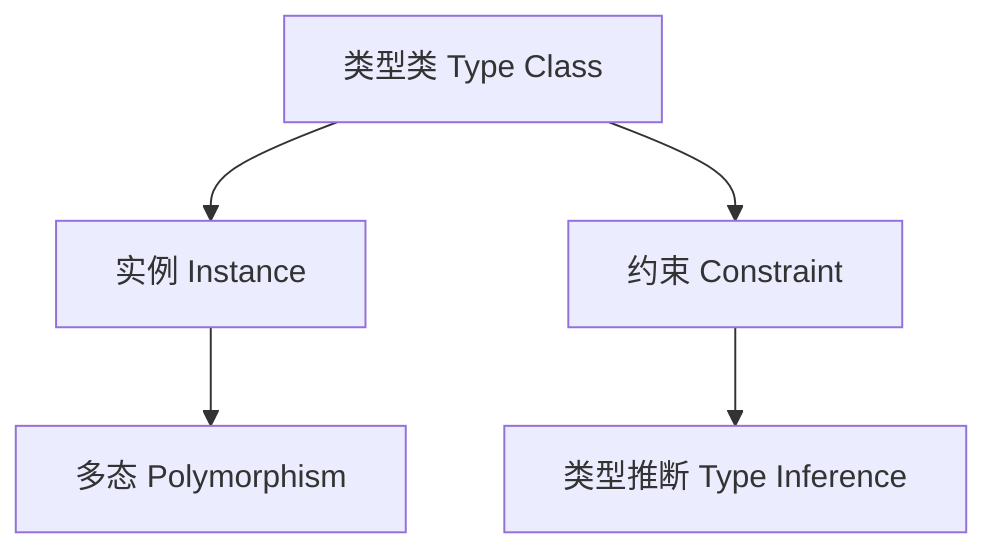

# 01. 类型类在Haskell中的理论与实践（Type Class in Haskell）

> **中英双语核心定义 | Bilingual Core Definitions**

## 1.1 类型类简介（Introduction to Type Class）

- **定义（Definition）**：
  - **中文**：类型类是Haskell中用于实现受约束多态的机制，定义了一组操作的接口，并允许为不同类型提供具体实现。
  - **English**: A type class in Haskell is a mechanism for constrained polymorphism, defining an interface of operations and allowing different types to provide concrete implementations.

- **Wiki风格国际化解释（Wiki-style Explanation）**：
  - 类型类是Haskell类型系统的核心抽象，支持泛型编程、接口约束和高阶多态。
  - Type class is a core abstraction in Haskell's type system, supporting generic programming, interface constraints, and higher-order polymorphism.

## 1.2 Haskell中的类型类语法与语义（Syntax and Semantics of Type Class in Haskell）

- **类型类定义（Type Class Definition）**

```haskell
class Eq a where
  (==) :: a -> a -> Bool
  (/=) :: a -> a -> Bool
  x /= y = not (x == y)
```

- **实例定义（Instance Definition）**

```haskell
instance Eq Int where
  x == y = x `primIntEq` y
```

- **类型类约束（Type Class Constraint）**

```haskell
elem :: Eq a => a -> [a] -> Bool
elem _ [] = False
elem x (y:ys) = x == y || elem x ys
```

- **多态与类型推断**
  - 类型类约束实现受限多态，类型推断自动传播约束。

### 1.2.1 字典传递语义（Dictionary-passing Semantics）

- 编译器将 `Eq a => ...` 转换为“字典参数”传递；实例解析对应字典构造与选取
- 直观语义：类型类是接口，实例是字典；约束是形参需要的字典类型

### 1.2.2 法则与公理（Laws & Axioms）

- Eq：自反性、对称性、传递性；与 `(/=)` 一致
- Ord：全序；与 Eq 一致；`compare`/`(<)`/`(<=)` 等一致
- Semigroup/Monoid：结合律；单位律
- Functor：恒等、合成；Applicative/Monad 相容律
- Foldable/Traversable：自然性、融合律

### 1.2.3 实例选择与一致性（Instance Resolution & Coherence）

- 实例选择：基于类型头最匹配与约束可解
- 一致性/相合性：一个类型在单一模块集中应有唯一一致实例（避免全局歧义）
- 孤儿实例（Orphan）：实例声明不在类型或类所属模块，可能破坏一致性，应避免

### 1.2.4 重叠/不一致实例（Overlapping/Incoherent Instances）

- Overlapping/Overlappable/OverlappingInstances：允许选择更具体实例；易导致不可预测解析
- IncoherentInstances：禁用一致性保证；仅在受控边界使用

### 1.2.5 派生与新类型派生（Deriving Strategies & Newtype Deriving）

- deriving stock/newtype/anyclass/via：选择派生策略，控制语义来源
- Newtype deriving：零成本复用底层实例；配合 DerivingVia 精准重用

### 1.2.6 多参数/函数依赖/关联类型（MPTCs/FDs/ATs）

- MPTCs：`class C a b where ...`
- FunctionalDependencies：`class C a b | a -> b` 改善推断与等式信息
- Associated Type Families：在类内声明类型族，作为等式约束的替代/补充

## 1.3 范畴论建模与结构映射（Category-Theoretic Modeling and Mapping）

- **类型类与函子/范畴的关系**
  - 类型类可视为带约束的函子，实例为具体对象。

| 概念 | Haskell实现 | 代码示例 | 中文解释 |
|------|-------------|----------|----------|
| 类型类 | 接口/约束 | `class Eq a where ...` | 操作接口 |
| 实例   | 实现      | `instance Eq Int ...` | 类型实现 |
| 约束   | 多态限制  | `Eq a => ...` | 受限多态 |
| 派生   | 自动实现  | `deriving (Eq, Show)` | 自动派生 |

## 1.4 形式化证明与论证（Formal Proofs & Reasoning）

- **类型类约束的正确性证明**
  - **中文**：证明类型类约束下的多态函数在所有实例上都满足接口规范。
  - **English**: Prove that polymorphic functions with type class constraints satisfy the interface specification for all instances.

- **实例一致性证明**
  - **中文**：证明同一类型的所有实例实现满足类型类公理（如等价关系）。
  - **English**: Prove that all instance implementations for a type satisfy the type class axioms (e.g., equivalence for Eq).

### 1.4.1 证明模式（Proof Patterns）

- 定律测试（law-checking）与 QuickCheck/inspection-testing 验证语义一致
- 相合性（coherence）分析与重叠边界证明实例选择的确定性
- 与类型等价/类型族配合，证明约束解的唯一化

## 1.5 多表征与本地跳转（Multi-representation & Local Reference）

- **类型类结构图（Type Class Structure Diagram）**



- **相关主题跳转**：
  - [类型推断与多态 Type Inference and Polymorphism](./01-Type-Inference-and-Polymorphism.md)
  - [范畴论与Haskell类型系统 Category Theory and Haskell Type System](./01-Category-Theory-and-Haskell.md)
  - [高阶类型 Higher-Kinded Types](./01-Higher-Kinded-Types.md)
  - [类型安全 Type Safety](./01-Type-Safety.md)

---

## 1.6 历史与发展 History & Development

- **中文**：类型类由Philip Wadler等人在1988年提出，是Haskell类型系统的核心创新之一。类型类机制极大推动了泛型编程、接口约束和高阶多态的发展。GHC不断扩展类型类相关特性，如多参数类型类、函数依赖、关联类型族等。
- **English**: Type classes were introduced by Philip Wadler et al. in 1988 as a core innovation of the Haskell type system. The mechanism greatly advanced generic programming, interface constraints, and higher-order polymorphism. GHC has continuously extended type class features, such as multi-parameter type classes, functional dependencies, and associated type families.

## 1.7 Haskell 相关特性 Haskell Features

### 经典特性 Classic Features

- 单参数类型类、实例推导、类型约束、多态函数。
- Single-parameter type classes, instance derivation, type constraints, polymorphic functions.

### 最新特性 Latest Features

- **多参数类型类（Multi-parameter Type Classes）**
- **函数依赖（Functional Dependencies）**
- **关联类型族（Associated Type Families）**
- **FlexibleInstances/UndecidableInstances/OverlappingInstances**
- **QuantifiedConstraints/RankNTypes**
- **GHC 2021/2022**：标准化更多类型类相关扩展。

- **English**:
  - Multi-parameter type classes
  - Functional dependencies
  - Associated type families
  - FlexibleInstances/UndecidableInstances/OverlappingInstances
  - QuantifiedConstraints/RankNTypes
  - GHC 2021/2022: Standardizes more type class extensions

## 1.8 应用 Applications

- **中文**：泛型编程、接口抽象、类型安全API、DSL、自动推导、依赖注入等。
- **English**: Generic programming, interface abstraction, type-safe APIs, DSLs, automatic derivation, dependency injection, etc.

## 1.9 例子 Examples

```haskell
{-# LANGUAGE MultiParamTypeClasses, FunctionalDependencies, TypeFamilies #-}
class Convertible a b where
  convert :: a -> b

instance Convertible Int String where
  convert = show

class Collection c where
  type Elem c
  insert :: Elem c -> c -> c

-- DerivingVia / Newtype deriving 示例（示意）
{-# LANGUAGE DerivingVia, GeneralizedNewtypeDeriving #-}
newtype SumInt = SumInt Int
  deriving (Eq, Ord, Show)
  deriving (Semigroup, Monoid) via Data.Monoid.Sum Int
```

## 1.10 相关理论 Related Theories

- 范畴论（Category Theory）
- 多态类型系统（Polymorphic Type Systems）
- 代数数据类型（Algebraic Data Types）
- 类型推断与约束（Type Inference and Constraints）

## 1.11 参考文献 References

- [Wikipedia: Type Class](https://en.wikipedia.org/wiki/Type_class)
- [GHC User's Guide](https://downloads.haskell.org/ghc/latest/docs/html/users_guide/)
- [Types and Programming Languages, Benjamin C. Pierce]
- [Learn You a Haskell for Great Good!](http://learnyouahaskell.com/)

## 1.12 工程实践要点（Engineering Pitfalls & Tips）

- 避免孤儿与不必要重叠；将实例集中在类型或类的主模块暴露
- 为“定律”编写属性测试；为复杂实例添加文档化不变量
- 使用 DerivingStrategies/DerivingVia 明确派生来源；避免语义歧义
- 当推断困难时，添加显式签名或使用 FunctionalDependencies/ATs 提升可解性
