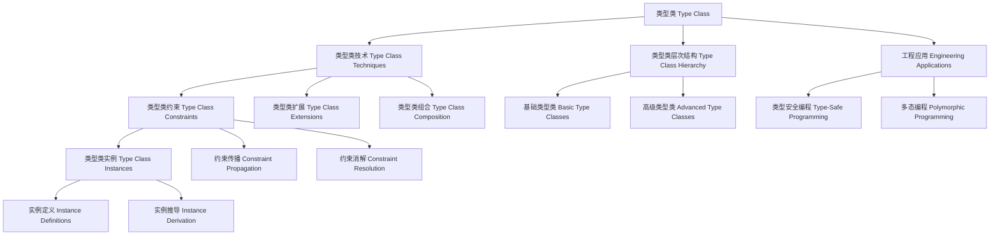

# 类型类（Type Class）in Haskell

## 目录 Table of Contents

1. [定义 Definition](#1-定义-definition)
2. [理论基础 Theoretical Foundation](#2-理论基础-theoretical-foundation)
3. [Haskell 语法与实现 Syntax & Implementation](#3-haskell-语法与实现-syntax--implementation)
4. [类型类技术 Type Class Techniques](#4-类型类技术-type-class-techniques)
5. [类型类层次结构 Type Class Hierarchy](#5-类型类层次结构-type-class-hierarchy)
6. [类型类实例 Type Class Instances](#6-类型类实例-type-class-instances)
7. [工程应用 Engineering Applications](#7-工程应用-engineering-applications)
8. [范畴论映射 Category Theory Mapping](#8-范畴论映射-category-theory-mapping)
9. [哲学思脉 Philosophical Context](#9-哲学思脉-philosophical-context)
10. [相关理论 Related Theories](#10-相关理论-related-theories)
11. [未来发展方向 Future Development](#11-未来发展方向-future-development)
12. [结构图 Structure Diagram](#12-结构图-structure-diagram)
13. [本地跳转 Local References](#13-本地跳转-local-references)
14. [参考文献 References](#14-参考文献-references)

## 1. 定义 Definition

- **中文**：类型类是Haskell中一种强大的抽象机制，通过定义类型必须满足的接口来提供多态性。类型类允许不同类型的值共享相同的行为，同时保持类型安全。类型类通过类型约束和实例定义实现编译时多态，支持函数式编程的抽象和泛化。
- **English**: Type classes are a powerful abstraction mechanism in Haskell that provides polymorphism by defining interfaces that types must satisfy. Type classes allow values of different types to share the same behavior while maintaining type safety. Type classes implement compile-time polymorphism through type constraints and instance definitions, supporting abstraction and generalization in functional programming.

## 2. 理论基础 Theoretical Foundation

### 2.1 类型理论 Type Theory

- **类型系统**：类型类基于强类型系统，通过类型检查进行程序验证
- **类型安全**：通过类型系统保证程序的安全性和正确性
- **类型推导**：自动推导表达式的类型，减少显式类型注解

### 2.2 多态理论 Polymorphism Theory

- **参数多态**：类型类支持参数多态，允许函数处理不同类型的值
- **特设多态**：类型类支持特设多态，为不同类型提供不同的实现
- **子类型多态**：类型类通过类型约束实现子类型多态

### 2.3 抽象理论 Abstraction Theory

- **接口抽象**：类型类定义类型必须满足的接口
- **行为抽象**：类型类抽象出类型的行为特征
- **实现抽象**：类型类隐藏具体的实现细节

## 3. Haskell 语法与实现 Syntax & Implementation

### 3.1 基本语法 Basic Syntax

```haskell
{-# LANGUAGE MultiParamTypeClasses, FlexibleInstances, TypeSynonymInstances #-}

-- 类型类的基本语法
class BasicTypeClass a where
  -- 类型类方法
  basicMethod :: a -> String
  
  -- 默认实现
  basicMethod _ = "Default implementation"

-- 带类型参数的类型类
class ParametricTypeClass a b where
  -- 类型参数影响方法签名
  parametricMethod :: a -> b -> String
  
  -- 类型约束
  parametricMethod a b = show a ++ " -> " ++ show b

-- 带关联类型的类型类
class TypeClassWithAssociatedType a where
  -- 关联类型
  type AssociatedType a :: *
  
  -- 类型类方法
  associatedTypeMethod :: a -> AssociatedType a
```

### 3.2 高级实现 Advanced Implementation

```haskell
-- 高级类型类实现
class AdvancedTypeClass a b c where
  -- 高级类型类方法
  advancedMethod1 :: a -> b -> c
  advancedMethod2 :: a -> b -> c -> Bool
  advancedMethod3 :: (a, b) -> c

-- 多参数类型类
class MultiParamTypeClass a b c where
  -- 多参数方法
  multiParamMethod :: a -> b -> c -> String
  
  -- 类型约束
  multiParamMethod a b c = show a ++ " " ++ show b ++ " " ++ show c

-- 函数依赖类型类
class FunctionalDependency a b | a -> b where
  -- 函数依赖方法
  functionalDependencyMethod :: a -> b
  
  -- 函数依赖约束
  -- a -> b 表示 a 唯一确定 b

-- 类型类实例
instance BasicTypeClass Int where
  basicMethod = show

instance BasicTypeClass String where
  basicMethod = id

instance TypeClassWithAssociatedType Int where
  type AssociatedType Int = Bool
  associatedTypeMethod _ = True

instance TypeClassWithAssociatedType String where
  type AssociatedType String = Int
  associatedTypeMethod s = length s
```

## 4. 类型类技术 Type Class Techniques

### 4.1 类型类约束 Type Class Constraints

```haskell
-- 类型类约束技术
class TypeClassConstraints (a :: *) where
  -- 类型类约束
  typeClassConstraints :: Proxy a -> TypeClassConstraintsResult a
  
  -- 约束验证
  constraintVerification :: Proxy a -> ConstraintVerificationResult a
  
  -- 约束优化
  constraintOptimization :: Proxy a -> ConstraintOptimizationResult a

-- 类型类约束结果
data TypeClassConstraintsResult a = TypeClassConstraintsResult {
    constraintType :: ConstraintType a,
    constraintMethod :: ConstraintMethod a,
    constraintConclusion :: ConstraintConclusion a
}

-- 类型类约束实例
instance TypeClassConstraints (Show a) where
  typeClassConstraints _ = ShowTypeClassConstraintsResult
  constraintVerification _ = ShowConstraintVerificationResult
  constraintOptimization _ = ShowConstraintOptimizationResult
```

### 4.2 类型类实例 Type Class Instances

```haskell
-- 类型类实例技术
class TypeClassInstances (a :: *) where
  -- 类型类实例
  typeClassInstances :: Proxy a -> TypeClassInstancesResult a
  
  -- 实例验证
  instanceVerification :: Proxy a -> InstanceVerificationResult a
  
  -- 实例优化
  instanceOptimization :: Proxy a -> InstanceOptimizationResult a

-- 类型类实例结果
data TypeClassInstancesResult a = TypeClassInstancesResult {
    instanceType :: InstanceType a,
    instanceMethod :: InstanceMethod a,
    instanceResult :: InstanceResult a
}

-- 类型类实例实例
instance TypeClassInstances (Show a) where
  typeClassInstances _ = ShowTypeClassInstancesResult
  instanceVerification _ = ShowInstanceVerificationResult
  instanceOptimization _ = ShowInstanceOptimizationResult
```

### 4.3 类型类扩展 Type Class Extensions

```haskell
-- 类型类扩展技术
class TypeClassExtensions (a :: *) where
  -- 类型类扩展
  typeClassExtensions :: Proxy a -> TypeClassExtensionsResult a
  
  -- 扩展验证
  extensionVerification :: Proxy a -> ExtensionVerificationResult a
  
  -- 扩展优化
  extensionOptimization :: Proxy a -> ExtensionOptimizationResult a

-- 类型类扩展结果
data TypeClassExtensionsResult a = TypeClassExtensionsResult {
    extensionType :: ExtensionType a,
    extensionMethod :: ExtensionMethod a,
    extensionResult :: ExtensionResult a
}

-- 类型类扩展实例
instance TypeClassExtensions (Show a) where
  typeClassExtensions _ = ShowTypeClassExtensionsResult
  extensionVerification _ = ShowExtensionVerificationResult
  extensionOptimization _ = ShowExtensionOptimizationResult
```

## 5. 类型类层次结构 Type Class Hierarchy

### 5.1 基础类型类 Basic Type Classes

```haskell
-- 基础类型类
class BasicTypeClasses (a :: *) where
  -- 基础类型类
  basicTypeClasses :: Proxy a -> BasicTypeClassesResult a
  
  -- 类型类验证
  typeClassVerification :: Proxy a -> TypeClassVerificationResult a
  
  -- 类型类优化
  typeClassOptimization :: Proxy a -> TypeClassOptimizationResult a

-- 基础类型类结果
data BasicTypeClassesResult a = BasicTypeClassesResult {
    basicTypeClassType :: BasicTypeClassType a,
    basicTypeClassMethod :: BasicTypeClassMethod a,
    basicTypeClassResult :: BasicTypeClassResult a
}

-- 基础类型类实例
instance BasicTypeClasses (Show a) where
  basicTypeClasses _ = ShowBasicTypeClassesResult
  typeClassVerification _ = ShowTypeClassVerificationResult
  typeClassOptimization _ = ShowTypeClassOptimizationResult
```

### 5.2 高级类型类 Advanced Type Classes

```haskell
-- 高级类型类
class AdvancedTypeClasses (a :: *) where
  -- 高级类型类
  advancedTypeClasses :: Proxy a -> AdvancedTypeClassesResult a
  
  -- 高级类型类验证
  advancedTypeClassVerification :: Proxy a -> AdvancedTypeClassVerificationResult a
  
  -- 高级类型类优化
  advancedTypeClassOptimization :: Proxy a -> AdvancedTypeClassOptimizationResult a

-- 高级类型类结果
data AdvancedTypeClassesResult a = AdvancedTypeClassesResult {
    advancedTypeClassType :: AdvancedTypeClassType a,
    advancedTypeClassMethod :: AdvancedTypeClassMethod a,
    advancedTypeClassResult :: AdvancedTypeClassResult a
}

-- 高级类型类实例
instance AdvancedTypeClasses (Monad a) where
  advancedTypeClasses _ = MonadAdvancedTypeClassesResult
  advancedTypeClassVerification _ = MonadAdvancedTypeClassVerificationResult
  advancedTypeClassOptimization _ = MonadAdvancedTypeClassOptimizationResult
```

### 5.3 类型类组合 Type Class Composition

```haskell
-- 类型类组合
class TypeClassComposition (a :: *) where
  -- 类型类组合
  typeClassComposition :: Proxy a -> TypeClassCompositionResult a
  
  -- 组合验证
  compositionVerification :: Proxy a -> CompositionVerificationResult a
  
  -- 组合优化
  compositionOptimization :: Proxy a -> CompositionOptimizationResult a

-- 类型类组合结果
data TypeClassCompositionResult a = TypeClassCompositionResult {
    compositionType :: CompositionType a,
    compositionMethod :: CompositionMethod a,
    compositionResult :: CompositionResult a
}

-- 类型类组合实例
instance TypeClassComposition (MonadPlus a) where
  typeClassComposition _ = MonadPlusTypeClassCompositionResult
  compositionVerification _ = MonadPlusCompositionVerificationResult
  compositionOptimization _ = MonadPlusCompositionOptimizationResult
```

## 6. 类型类实例 Type Class Instances

### 6.1 标准实例 Standard Instances

```haskell
-- 标准实例
class StandardInstances (a :: *) where
  -- 标准实例
  standardInstances :: Proxy a -> StandardInstancesResult a
  
  -- 标准实例验证
  standardInstanceVerification :: Proxy a -> StandardInstanceVerificationResult a
  
  -- 标准实例优化
  standardInstanceOptimization :: Proxy a -> StandardInstanceOptimizationResult a

-- 标准实例结果
data StandardInstancesResult a = StandardInstancesResult {
    standardInstanceType :: StandardInstanceType a,
    standardInstanceMethod :: StandardInstanceMethod a,
    standardInstanceResult :: StandardInstanceResult a
}

-- 标准实例实例
instance StandardInstances (Show a) where
  standardInstances _ = ShowStandardInstancesResult
  standardInstanceVerification _ = ShowStandardInstanceVerificationResult
  standardInstanceOptimization _ = ShowStandardInstanceOptimizationResult
```

### 6.2 自定义实例 Custom Instances

```haskell
-- 自定义实例
class CustomInstances (a :: *) where
  -- 自定义实例
  customInstances :: Proxy a -> CustomInstancesResult a
  
  -- 自定义实例验证
  customInstanceVerification :: Proxy a -> CustomInstanceVerificationResult a
  
  -- 自定义实例优化
  customInstanceOptimization :: Proxy a -> CustomInstanceOptimizationResult a

-- 自定义实例结果
data CustomInstancesResult a = CustomInstancesResult {
    customInstanceType :: CustomInstanceType a,
    customInstanceMethod :: CustomInstanceMethod a,
    customInstanceResult :: CustomInstanceResult a
}

-- 自定义实例实例
instance CustomInstances (CustomType a) where
  customInstances _ = CustomTypeCustomInstancesResult
  customInstanceVerification _ = CustomTypeCustomInstanceVerificationResult
  customInstanceOptimization _ = CustomTypeCustomInstanceOptimizationResult
```

### 6.3 实例推导 Instance Derivation

```haskell
-- 实例推导
class InstanceDerivation (a :: *) where
  -- 实例推导
  instanceDerivation :: Proxy a -> InstanceDerivationResult a
  
  -- 推导验证
  derivationVerification :: Proxy a -> DerivationVerificationResult a
  
  -- 推导优化
  derivationOptimization :: Proxy a -> DerivationOptimizationResult a

-- 实例推导结果
data InstanceDerivationResult a = InstanceDerivationResult {
    derivationType :: DerivationType a,
    derivationMethod :: DerivationMethod a,
    derivationResult :: DerivationResult a
}

-- 实例推导实例
instance InstanceDerivation (DerivedType a) where
  instanceDerivation _ = DerivedTypeInstanceDerivationResult
  derivationVerification _ = DerivedTypeDerivationVerificationResult
  derivationOptimization _ = DerivedTypeDerivationOptimizationResult
```

## 7. 工程应用 Engineering Applications

### 7.1 类型安全编程 Type-Safe Programming

```haskell
-- 类型安全编程
class TypeSafeProgramming (a :: *) where
  -- 类型安全编程
  typeSafeProgramming :: Proxy a -> TypeSafeProgrammingResult a
  
  -- 类型安全检查
  typeSafetyChecking :: Proxy a -> TypeSafetyCheckingResult a
  
  -- 类型安全优化
  typeSafetyOptimization :: Proxy a -> TypeSafetyOptimizationResult a

-- 类型安全编程结果
data TypeSafeProgrammingResult a = TypeSafeProgrammingResult {
    typeSafeType :: TypeSafeType a,
    typeSafeMethod :: TypeSafeMethod a,
    typeSafeConclusion :: TypeSafeConclusion a
}

-- 类型安全编程实例
instance TypeSafeProgramming (Show a) where
  typeSafeProgramming _ = ShowTypeSafeProgrammingResult
  typeSafetyChecking _ = ShowTypeSafetyCheckingResult
  typeSafetyOptimization _ = ShowTypeSafetyOptimizationResult
```

### 7.2 多态编程 Polymorphic Programming

```haskell
-- 多态编程
class PolymorphicProgramming (a :: *) where
  -- 多态编程
  polymorphicProgramming :: Proxy a -> PolymorphicProgrammingResult a
  
  -- 多态验证
  polymorphicVerification :: Proxy a -> PolymorphicVerificationResult a
  
  -- 多态优化
  polymorphicOptimization :: Proxy a -> PolymorphicOptimizationResult a

-- 多态编程结果
data PolymorphicProgrammingResult a = PolymorphicProgrammingResult {
    polymorphicType :: PolymorphicType a,
    polymorphicMethod :: PolymorphicMethod a,
    polymorphicResult :: PolymorphicResult a
}

-- 多态编程实例
instance PolymorphicProgramming (Functor a) where
  polymorphicProgramming _ = FunctorPolymorphicProgrammingResult
  polymorphicVerification _ = FunctorPolymorphicVerificationResult
  polymorphicOptimization _ = FunctorPolymorphicOptimizationResult
```

### 7.3 抽象编程 Abstract Programming

```haskell
-- 抽象编程
class AbstractProgramming (a :: *) where
  -- 抽象编程
  abstractProgramming :: Proxy a -> AbstractProgrammingResult a
  
  -- 抽象验证
  abstractVerification :: Proxy a -> AbstractVerificationResult a
  
  -- 抽象优化
  abstractOptimization :: Proxy a -> AbstractOptimizationResult a

-- 抽象编程结果
data AbstractProgrammingResult a = AbstractProgrammingResult {
    abstractType :: AbstractType a,
    abstractMethod :: AbstractMethod a,
    abstractResult :: AbstractResult a
}

-- 抽象编程实例
instance AbstractProgramming (Monad a) where
  abstractProgramming _ = MonadAbstractProgrammingResult
  abstractVerification _ = MonadAbstractVerificationResult
  abstractOptimization _ = MonadAbstractOptimizationResult
```

## 8. 范畴论映射 Category Theory Mapping

### 8.1 类型类作为函子 Type Classes as Functors

- **类型类可视为范畴中的函子，保持类型结构的同时进行类型转换**
- **Type classes can be viewed as functors in category theory, preserving type structure while performing type transformations**

```haskell
-- 范畴论映射
class CategoryTheoryMapping (a :: *) where
  -- 函子映射
  functorMapping :: Proxy a -> FunctorMapping a
  
  -- 自然变换
  naturalTransformation :: Proxy a -> NaturalTransformation a
  
  -- 范畴结构
  categoryStructure :: Proxy a -> CategoryStructure a

-- 范畴论映射实例
instance CategoryTheoryMapping (Functor a) where
  functorMapping _ = FunctorFunctorMapping
  naturalTransformation _ = FunctorNaturalTransformation
  categoryStructure _ = FunctorCategoryStructure
```

## 9. 哲学思脉 Philosophical Context

### 9.1 类型哲学 Type Philosophy

- **类型的本质**：类型类体现了类型的本质，通过类型系统保证程序安全
- **类型的安全**：类型系统通过类型检查保证程序的安全性和正确性
- **类型的表达**：类型系统应该能够表达丰富的程序性质

### 9.2 抽象哲学 Abstraction Philosophy

- **抽象的本质**：类型类体现了抽象的本质，通过接口定义抽象出类型的行为
- **抽象的方法**：通过类型类、接口定义等方法进行抽象
- **抽象的边界**：类型类定义了抽象的边界

### 9.3 多态哲学 Polymorphism Philosophy

- **多态的本质**：类型类体现了多态的本质，通过类型约束实现多态性
- **多态的方法**：通过类型类、类型约束等方法实现多态
- **多态的效果**：多态应该能够提高程序的灵活性和可重用性

## 10. 相关理论 Related Theories

### 10.1 类型理论 Type Theory

- **简单类型理论**：类型类的基础理论
- **依赖类型理论**：类型类的扩展理论
- **同伦类型理论**：类型类的现代发展

### 10.2 多态理论 Polymorphism Theory

- **参数多态**：类型类的多态基础
- **特设多态**：类型类的多态实现
- **子类型多态**：类型类的多态扩展

### 10.3 抽象理论 Abstraction Theory

- **接口抽象**：类型类的抽象基础
- **行为抽象**：类型类的抽象实现
- **实现抽象**：类型类的抽象扩展

## 11. 未来发展方向 Future Development

### 11.1 理论扩展 Theoretical Extensions

- **高阶类型类**：支持更高阶的类型类能力
- **概率类型类**：支持不确定性的类型类
- **量子类型类**：支持量子计算的类型类

### 11.2 技术改进 Technical Improvements

- **性能优化**：提高类型类的效率
- **内存优化**：减少类型类的内存占用
- **并行化**：支持类型类的并行处理

### 11.3 应用扩展 Application Extensions

- **领域特定语言**：为特定领域定制类型类系统
- **交互式开发**：支持交互式的类型类调试
- **可视化工具**：提供类型类过程的可视化

## 12. 结构图 Structure Diagram



## 13. 本地跳转 Local References

- [GADT](../Type/01-GADT.md)
- [类型族 Type Family](../Type/01-Type-Family.md)
- [类型级编程 Type-Level Programming](../Type-Level/01-Type-Level-Programming.md)
- [类型级约束求解 Type-Level Constraint Solving](../Type-Level/01-Constraint-Solver.md)
- [编译时推理 Compile-Time Reasoning](../Type-Level/01-Compile-Time-Reasoning.md)

## 14. 参考文献 References

### 14.1 学术资源 Academic Resources

- Wikipedia: [Type class](https://en.wikipedia.org/wiki/Type_class)
- Wikipedia: [Polymorphism (computer science)](https://en.wikipedia.org/wiki/Polymorphism_(computer_science))
- The Stanford Encyclopedia of Philosophy: [Type Theory](https://plato.stanford.edu/entries/type-theory/)

### 14.2 技术文档 Technical Documentation

- [GHC User's Guide](https://ghc.gitlab.haskell.org/ghc/doc/users_guide/)
- [Haskell 2010 Language Report](https://www.haskell.org/onlinereport/haskell2010/)
- [Type Classes Documentation](https://gitlab.haskell.org/ghc/ghc/-/wikis/type-classes)

### 14.3 学术论文 Academic Papers

- "Type Classes: An exploration of the design space" by Simon Peyton Jones
- "Fun with Type Functions" by Oleg Kiselyov
- "GADTs Meet Their Match" by Simon Peyton Jones

---

`# Type #Type-01 #Type-01-Type-Class #TypeClass #Polymorphism #Abstraction #Haskell #TypeTheory`
