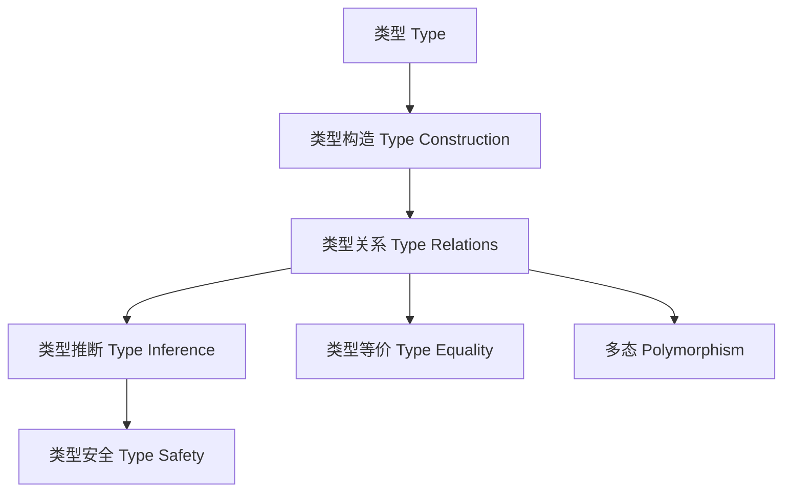

# 类型理论与类型系统核心概念及关联性（Type Concepts and Relations in Haskell）

## 定义 Definition

- **中文**：类型理论与类型系统核心概念包括类型、类型构造、类型关系、类型推断、类型安全、类型等价、类型多态等，是现代编程语言设计与形式化验证的基础。
- **English**: Core concepts of type theory and type systems include types, type construction, type relations, type inference, type safety, type equality, and polymorphism, forming the foundation of modern programming language design and formal verification.

## 类型系统核心概念 Core Concepts

- **类型（Type）**：值的分类，决定可用操作和语义。
- **类型构造（Type Construction）**：如函数类型、代数数据类型、GADT、高阶类型等。
- **类型关系（Type Relations）**：子类型、等价、同构、约束、多态等。
- **类型推断（Type Inference）**：自动推导表达式类型。
- **类型安全（Type Safety）**：保证程序不会发生类型错误。
- **类型等价（Type Equality）**：判断两个类型是否可视为相同。
- **多态（Polymorphism）**：参数多态、类型类多态、高阶多态。

## Haskell实现与现代语言对比 Haskell & Modern Language Comparison

- Haskell：Hindley-Milner类型推断、类型类、GADT、类型族、DataKinds、依赖类型（部分）、线性/仿射/时序类型扩展。
- Rust：所有权与生命周期、trait、泛型、const generics。
- Scala 3：类型类、依赖类型、隐式、union/intersection types。
- OCaml/F#: ML家族类型推断、模块系统、GADT。
- TypeScript：结构化类型系统、泛型、类型推断、类型保护。

## 类型关系与结构 Type Relations & Structure

- 子类型关系（Subtyping）、等价关系（Equality）、同构（Isomorphism）、约束（Constraint）、多态（Polymorphism）、类型提升（Promotion）、类型反射（Reflection）。
- 结构图：

## 形式化论证与证明 Formal Reasoning & Proofs

- **类型保持性（Preservation）**：类型推理规则下，归约不改变类型。
- **进展性（Progress）**：类型正确的表达式要么是值，要么可归约。
- **多态性证明**：参数多态、类型类多态的表达能力与安全性。
- **等价性证明**：类型等价关系的自反、对称、传递性。

### 证明示例 Proof Example

- 对于类型推断与多态，归纳证明类型推断算法产生的类型是表达式的最泛类型。
- 对于类型等价，证明类型等价约束下的类型转换在编译期是安全的。

## 工程应用 Engineering Application

- 类型安全API设计、泛型库、DSL、自动化推理与验证、跨语言类型系统设计。

## 本地跳转 Local References

- [类型理论基础 Type Theory Foundation](./01-Type-Theory.md)
- [类型推断与多态 Type Inference and Polymorphism](./01-Type-Inference-and-Polymorphism.md)
- [类型安全 Type Safety](./01-Type-Safety.md)
- [类型等价 Type Equality](./01-Type-Equality.md)
- [GADT in Haskell](./01-GADT.md)
