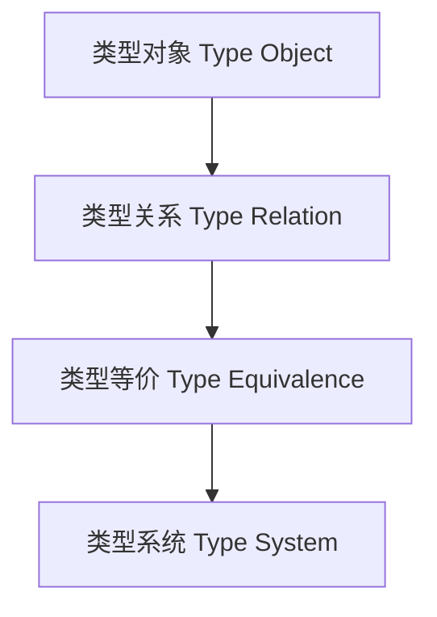

# 01. 类型概念与关系（Type Concepts and Relations in Haskell）

> **中英双语核心定义 | Bilingual Core Definitions**

## 1.1 类型概念简介（Introduction to Type Concepts）

- **定义（Definition）**：
  - **中文**：类型是对数据结构、操作和约束的抽象描述。类型系统用于保证程序的正确性和安全性。Haskell以强类型和类型推导著称。
  - **English**: A type is an abstract description of data structures, operations, and constraints. The type system ensures program correctness and safety. Haskell is known for its strong typing and type inference.

- **Wiki风格国际化解释（Wiki-style Explanation）**：
  - 类型概念是编程语言理论、范畴论和形式化方法的基础。
  - Type concepts are the foundation of programming language theory, category theory, and formal methods.

## 1.2 Haskell中的类型关系与结构（Type Relations and Structures in Haskell）

- **类型关系示例**

```haskell
-- 子类型关系
class Subtype a b where
  cast :: a -> b

-- 类型等价
class TypeEq a b where
  typeEq :: a -> b -> Bool
```

- **类型结构示例**

```haskell
-- 代数数据类型
 data Maybe a = Nothing | Just a

-- 泛型类型
 data Pair a b = Pair a b
```

## 1.3 范畴论建模与结构映射（Category-Theoretic Modeling and Mapping）

- **类型与范畴论关系**
  - 类型可视为范畴中的对象，类型关系为态射。

| 概念 | Haskell实现 | 代码示例 | 中文解释 |
|------|-------------|----------|----------|
| 类型 | 数据类型 | `Maybe a` | 类型对象 |
| 类型关系 | 类型类 | `Subtype a b` | 类型关系 |
| 类型等价 | 类型类 | `TypeEq a b` | 类型等价 |

## 1.4 形式化证明与论证（Formal Proofs & Reasoning）

- **类型关系一致性证明**
  - **中文**：证明类型关系满足一致性和传递性。
  - **English**: Prove that type relations satisfy consistency and transitivity.

- **类型等价性证明**
  - **中文**：证明类型等价关系的对称性和自反性。
  - **English**: Prove the symmetry and reflexivity of type equivalence relations.

## 1.5 多表征与本地跳转（Multi-representation & Local Reference）

- **类型关系结构图（Type Relation Structure Diagram）**



- **相关主题跳转**：
  - [类型级编程 Type-Level Programming](./01-Type-Level-Programming.md)
  - [类型安全 Type Safety](./01-Type-Safety.md)
  - [类型级归纳 Type-Level Induction](./01-Type-Level-Induction.md)
