# 01. 类型理论核心概念与关系（Core Concepts and Relations in Type Theory）

> **中英双语核心定义 | Bilingual Core Definitions**

## 1.1 类型理论基础概念（Basic Concepts in Type Theory）

- **类型（Type）**：
  - **中文**：类型是对值的分类，规定了值的结构、行为和可用操作。
  - **English**: A type is a classification of values, specifying their structure, behavior, and available operations.

- **类型系统（Type System）**：
  - **中文**：类型系统是一组规则，用于在编译期或运行期对程序中的表达式进行类型检查，保证程序的正确性和安全性。
  - **English**: A type system is a set of rules for checking the types of expressions in a program at compile time or runtime, ensuring correctness and safety.

- **类型推断（Type Inference）**、**多态（Polymorphism）**、**类型类（Type Class）**、**高阶类型（Higher-Kinded Types）**、**GADT**、**依赖类型（Dependent Types）**、**类型族（Type Family）**、**类型级编程（Type-Level Programming）**、**类型等价（Type Equality）**、**类型安全（Type Safety）**、**类型反射（Type Reflection）**、**类型提升（Type Promotion）**、**类型级证明（Type-Level Proof）**、**类型元编程（Type Metaprogramming）**、**类型驱动DSL**、**归纳与递归（Induction & Recursion）**、**自动化与验证（Automation & Verification）**、**泛型与工程（Generic & Engineering）**、**未来趋势（Future Trends）** 等。

## 1.2 类型理论核心关系图（Core Relations Diagram in Type Theory）

```mermaid
graph TD
  A[类型系统 Type System] --> B[类型推断 Type Inference]
  A --> C[多态 Polymorphism]
  A --> D[类型类 Type Class]
  A --> E[高阶类型 Higher-Kinded Types]
  A --> F[GADT]
  A --> G[依赖类型 Dependent Types]
  A --> H[类型族 Type Family]
  A --> I[类型级编程 Type-Level Programming]
  A --> J[类型等价 Type Equality]
  A --> K[类型安全 Type Safety]
  A --> L[类型反射 Type Reflection]
  A --> M[类型提升 Type Promotion]
  A --> N[类型级证明 Type-Level Proof]
  A --> O[类型元编程 Type Metaprogramming]
  A --> P[类型驱动DSL Type-Driven DSL]
  A --> Q[归纳与递归 Induction & Recursion]
  A --> R[自动化与验证 Automation & Verification]
  A --> S[泛型与工程 Generic & Engineering]
  A --> T[未来趋势 Future Trends]
```

## 1.3 多表征与本地跳转（Multi-representation & Local Reference）

- **相关主题跳转**：
  - [类型推断与多态 Type Inference and Polymorphism](./01-Type-Inference-and-Polymorphism.md)
  - [类型类 Type Class](./01-Type-Class.md)
  - [高阶类型 Higher-Kinded Types](./01-Higher-Kinded-Types.md)
  - [GADT](./01-GADT.md)
  - [依赖类型 Dependent Type](./01-Dependent-Type.md)
  - [类型族 Type Family](./01-Type-Family.md)
  - [类型级编程 Type-Level Programming](./01-Type-Level-Programming.md)
  - [类型等价 Type Equality](./01-Type-Equality.md)
  - [类型安全 Type Safety](./01-Type-Safety.md)
  - [类型反射 Type Reflection](./01-Type-Reflection.md)
  - [类型提升 Type Promotion and DataKinds](./01-Type-Promotion-and-DataKinds.md)
  - [类型级证明 Type-Level Proof](./01-Type-Level-Proof.md)
  - [类型元编程 Type Metaprogramming](./01-Type-Metaprogramming.md)
  - [类型驱动DSL Type-Driven DSL](./01-Type-Driven-DSL.md)
  - [归纳与递归 Induction & Recursion](./01-Type-Level-Induction.md)
  - [自动化与验证 Automation & Verification](./01-Type-Level-Automation.md)
  - [泛型与工程 Generic & Engineering](./01-Type-Level-Generic.md)
  - [未来趋势 Future Trends](./01-Type-Level-Future.md)
