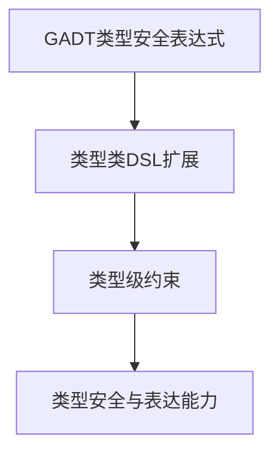

# 01. 类型驱动DSL在Haskell中的理论与实践（Type-Driven DSL in Haskell）

> **中英双语核心定义 | Bilingual Core Definitions**

## 1.1 类型驱动DSL简介（Introduction to Type-Driven DSL）

- **定义（Definition）**：
  - **中文**：类型驱动DSL是指利用类型系统进行语法、语义和约束建模的领域特定语言。Haskell通过GADT、类型类、类型级编程等机制支持类型安全的DSL设计。
  - **English**: Type-driven DSL refers to domain-specific languages whose syntax, semantics, and constraints are modeled by the type system. Haskell supports type-safe DSL design via GADTs, type classes, type-level programming, etc.

- **Wiki风格国际化解释（Wiki-style Explanation）**：
  - 类型驱动DSL极大提升了Haskell在嵌入式语言、配置、验证等领域的表达力和安全性。
  - Type-driven DSLs greatly enhance Haskell's expressiveness and safety in embedded languages, configuration, verification, and more.

## 1.2 Haskell中的类型驱动DSL语法与语义（Syntax and Semantics of Type-Driven DSL in Haskell）

- **GADT定义类型安全DSL**

```haskell
{-# LANGUAGE GADTs #-}

data Expr a where
  LitInt  :: Int  -> Expr Int
  LitBool :: Bool -> Expr Bool
  Add     :: Expr Int -> Expr Int -> Expr Int
  If      :: Expr Bool -> Expr a -> Expr a -> Expr a

-- 类型安全的DSL解释器
eval :: Expr a -> a
eval (LitInt n)    = n
eval (LitBool b)   = b
eval (Add e1 e2)   = eval e1 + eval e2
eval (If c t f)    = if eval c then eval t else eval f
```

- **类型类与DSL扩展**

```haskell
class DSLExpr e where
  litInt  :: Int -> e Int
  litBool :: Bool -> e Bool
  add     :: e Int -> e Int -> e Int
  if_     :: e Bool -> e a -> e a -> e a
```

- **类型级约束与DSL安全性**

```haskell
safeHead :: (n ~ 'S m) => Vec a n -> a
safeHead (VCons x _) = x
```

## 1.3 范畴论建模与结构映射（Category-Theoretic Modeling and Mapping）

- **类型驱动DSL与范畴论关系**
  - 类型驱动DSL可视为范畴中的对象（类型）与态射（操作）组合的DSL范畴。

| 概念 | Haskell实现 | 代码示例 | 中文解释 |
|------|-------------|----------|----------|
| 类型安全DSL | GADT | `data Expr a where ...` | 类型安全表达式 |
| DSL扩展 | 类型类 | `class DSLExpr e where ...` | 可扩展接口 |
| 类型级约束 | 类型安全 | `(n ~ 'S m) => ...` | 静态约束 |

## 1.4 形式化证明与论证（Formal Proofs & Reasoning）

- **DSL类型安全性证明**
  - **中文**：证明类型驱动DSL下的所有表达式和操作在类型系统下是安全的。
  - **English**: Prove that all expressions and operations in type-driven DSLs are safe under the type system.

- **DSL表达能力证明**
  - **中文**：证明类型驱动DSL可表达复杂的领域约束和语义。
  - **English**: Prove that type-driven DSLs can express complex domain constraints and semantics.

## 1.5 多表征与本地跳转（Multi-representation & Local Reference）

- **类型驱动DSL结构图（Type-Driven DSL Structure Diagram）**



- **相关主题跳转**：
  - [类型级编程 Type-Level Programming](./01-Type-Level-Programming.md)
  - [GADT in Haskell](./01-GADT.md)
  - [类型安全 Type Safety](./01-Type-Safety.md)

---

> 本文档为类型驱动DSL在Haskell中的中英双语、Haskell语义模型与形式化证明规范化输出，适合学术研究与工程实践参考。
