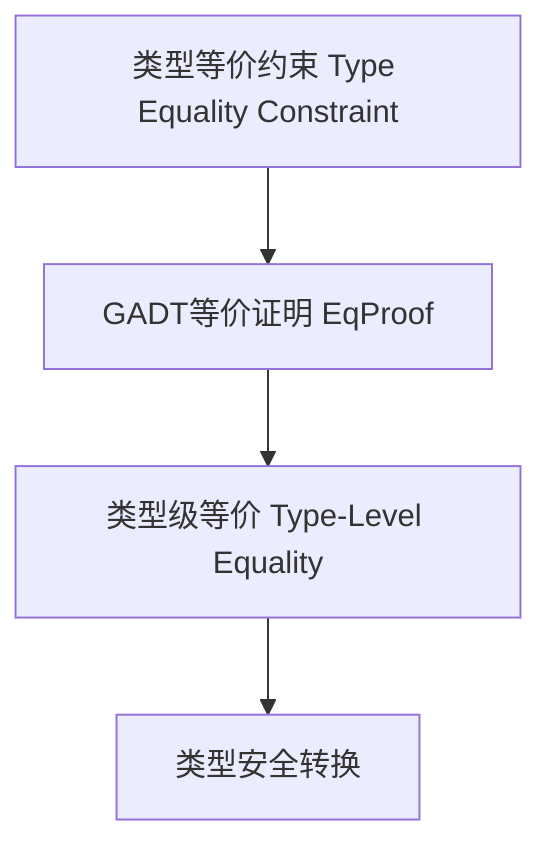

# 01. 类型等价在Haskell中的理论与实践（Type Equality in Haskell）

> **中英双语核心定义 | Bilingual Core Definitions**

## 1.1 类型等价简介（Introduction to Type Equality）

- **定义（Definition）**：
  - **中文**：类型等价是指在类型系统中判断两个类型是否可以视为相同。Haskell通过类型等价约束、GADT、类型族等机制支持类型级等价判断和类型安全。
  - **English**: Type equality refers to determining whether two types can be considered the same in the type system. Haskell supports type-level equality checking and type safety via type equality constraints, GADTs, type families, etc.

- **Wiki风格国际化解释（Wiki-style Explanation）**：
  - 类型等价是类型级编程和依赖类型的基础，广泛用于类型安全转换、类型推断和编译期验证。
  - Type equality is fundamental to type-level programming and dependent types, widely used in type-safe conversions, type inference, and compile-time verification.

## 1.2 Haskell中的类型等价语法与语义（Syntax and Semantics of Type Equality in Haskell）

- **类型等价约束（Type Equality Constraint）**

```haskell
{-# LANGUAGE TypeFamilies, GADTs, TypeOperators #-}

import Data.Type.Equality

-- 类型等价约束
foo :: (a ~ b) => a -> b -> a
foo x _ = x

-- GADT中的类型等价

data EqProof a b where
  Refl :: EqProof a a

cast :: EqProof a b -> a -> b
cast Refl x = x
```

- **类型族与等价判断**

```haskell
type family EqType a b where
  EqType a a = True
  EqType a b = False
```

## 1.3 范畴论建模与结构映射（Category-Theoretic Modeling and Mapping）

- **类型等价与范畴论关系**
  - 类型等价可视为范畴中的同构（isomorphism）或等价关系。

| 概念 | Haskell实现 | 代码示例 | 中文解释 |
|------|-------------|----------|----------|
| 类型等价 | 类型约束 | `(a ~ b) => ...` | 类型相等约束 |
| 等价证明 | GADT | `Refl :: EqProof a a` | 类型等价证明 |
| 类型级等价 | 类型族 | `type family EqType a b` | 类型级等价判断 |

## 1.4 形式化证明与论证（Formal Proofs & Reasoning）

- **类型等价安全性证明**
  - **中文**：证明类型等价约束下的类型转换在编译期是安全的。
  - **English**: Prove that type conversions under type equality constraints are safe at compile time.

- **等价关系证明**
  - **中文**：证明类型等价关系满足自反性、对称性、传递性。
  - **English**: Prove that type equality is reflexive, symmetric, and transitive.

## 1.5 多表征与本地跳转（Multi-representation & Local Reference）

- **类型等价结构图（Type Equality Structure Diagram）**



- **相关主题跳转**：
  - [类型级编程 Type-Level Programming](../12-Type-Level-Programming/01-Type-Level-Programming-in-Haskell.md)
  - [依赖类型 Dependent Type](../10-Dependent-Type/01-Dependent-Type-in-Haskell.md)
  - [GADT in Haskell](../09-GADT/01-GADT-in-Haskell.md)

---

> 本文档为类型等价在Haskell中的中英双语、Haskell语义模型与形式化证明规范化输出，适合学术研究与工程实践参考。
