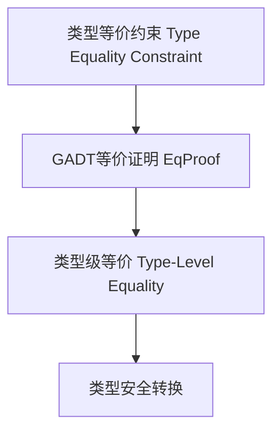

# 01. 类型等价在Haskell中的理论与实践（Type Equality in Haskell）

> **中英双语核心定义 | Bilingual Core Definitions**

## 1.1 类型等价简介（Introduction to Type Equality）

- **定义（Definition）**：
  - **中文**：类型等价是指在类型系统中判断两个类型是否可以视为相同。Haskell通过类型等价约束、GADT、类型族等机制支持类型级等价判断和类型安全。
  - **English**: Type equality refers to determining whether two types can be considered the same in the type system. Haskell supports type-level equality checking and type safety via type equality constraints, GADTs, type families, etc.

- **Wiki风格国际化解释（Wiki-style Explanation）**：
  - 类型等价是类型级编程和依赖类型的基础，广泛用于类型安全转换、类型推断和编译期验证。
  - Type equality is fundamental to type-level programming and dependent types, widely used in type-safe conversions, type inference, and compile-time verification.

## 1.2 Haskell中的类型等价语法与语义（Syntax and Semantics of Type Equality in Haskell）

- **类型等价约束（Type Equality Constraint）**

```haskell
{-# LANGUAGE TypeFamilies, GADTs, TypeOperators #-}

import Data.Type.Equality

-- 类型等价约束
foo :: (a ~ b) => a -> b -> a
foo x _ = x

-- GADT中的类型等价

data EqProof a b where
  Refl :: EqProof a a

cast :: EqProof a b -> a -> b
cast Refl x = x
```

- **类型族与等价判断**

```haskell
type family EqType a b where
  EqType a a = True
  EqType a b = False
```

## 1.3 范畴论建模与结构映射（Category-Theoretic Modeling and Mapping）

- **类型等价与范畴论关系**
  - 类型等价可视为范畴中的同构（isomorphism）或等价关系。

| 概念 | Haskell实现 | 代码示例 | 中文解释 |
|------|-------------|----------|----------|
| 类型等价 | 类型约束 | `(a ~ b) => ...` | 类型相等约束 |
| 等价证明 | GADT | `Refl :: EqProof a a` | 类型等价证明 |
| 类型级等价 | 类型族 | `type family EqType a b` | 类型级等价判断 |

## 1.4 形式化证明与论证（Formal Proofs & Reasoning）

- **类型等价安全性证明**
  - **中文**：证明类型等价约束下的类型转换在编译期是安全的。
  - **English**: Prove that type conversions under type equality constraints are safe at compile time.

- **等价关系证明**
  - **中文**：证明类型等价关系满足自反性、对称性、传递性。
  - **English**: Prove that type equality is reflexive, symmetric, and transitive.

## 1.5 多表征与本地跳转（Multi-representation & Local Reference）

- **类型等价结构图（Type Equality Structure Diagram）**



- **相关主题跳转**：
  - [类型级编程 Type-Level Programming](./01-Type-Level-Programming.md)
  - [依赖类型 Dependent Type](./01-Dependent-Type.md)
  - [GADT in Haskell](./01-GADT.md)

---

## 1.6 历史与发展 History & Development

- **中文**：类型等价理论起源于类型系统和逻辑学。Haskell自GADT、Type Families、TypeOperators等特性引入后，类型等价约束和类型级等价成为类型安全和依赖类型的基础。GHC不断扩展类型等价相关特性，如Data.Type.Equality、TypeInType、QuantifiedConstraints等。
- **English**: Type equality theory originates from type systems and logic. With the introduction of GADTs, Type Families, and TypeOperators, type equality constraints and type-level equality have become the foundation of type safety and dependent types in Haskell. GHC has continuously extended type equality features, such as Data.Type.Equality, TypeInType, and QuantifiedConstraints.

## 1.7 Haskell 相关特性 Haskell Features

### 经典特性 Classic Features

- 类型等价约束、GADT等价证明、类型级等价、类型安全转换。
- Type equality constraints, GADT equality proofs, type-level equality, type-safe conversions.

### 最新特性 Latest Features

- **Data.Type.Equality**：类型级等价运算符(:~:)和等价证明。
- **TypeInType**：类型与种类的等价。
- **QuantifiedConstraints/RankNTypes**：高阶等价约束。
- **Dependent Types（依赖类型）**：GHC 9.x实验性支持。
- **GHC 2021/2022**：标准化更多类型等价相关扩展。

- **English**:
  - Data.Type.Equality: Type-level equality operator (:~:) and equality proofs.
  - TypeInType: Equality of types and kinds.
  - QuantifiedConstraints/RankNTypes: Higher-order equality constraints.
  - Dependent Types: Experimental in GHC 9.x.
  - GHC 2021/2022: Standardizes more type equality extensions.

## 1.8 应用 Applications

- **中文**：类型安全转换、依赖类型、类型级推断、泛型编程、编译期验证、不可变数据结构等。
- **English**: Type-safe conversions, dependent types, type-level inference, generic programming, compile-time verification, immutable data structures, etc.

## 1.9 例子 Examples

```haskell
{-# LANGUAGE GADTs, TypeFamilies, TypeOperators, DataKinds #-}
import Data.Type.Equality

data Nat = Z | S Nat

data Vec (n :: Nat) a where
  VNil  :: Vec 'Z a
  VCons :: a -> Vec n a -> Vec ('S n) a

-- 类型等价证明与安全转换
safeCast :: (a :~: b) -> a -> b
safeCast Refl x = x

-- 类型级等价判断
 type family EqType a b where
   EqType a a = True
   EqType a b = False
```

## 1.10 相关理论 Related Theories

- 类型级编程（Type-level Programming）
- 依赖类型理论（Dependent Type Theory）
- 代数数据类型（Algebraic Data Types）
- 形式化验证（Formal Verification）
- 类型系统理论（Type System Theory）

## 1.11 参考文献 References

- [Wikipedia: Type equality](https://en.wikipedia.org/wiki/Type_equality)
- [GHC User's Guide](https://downloads.haskell.org/ghc/latest/docs/html/users_guide/)
- [Types and Programming Languages, Benjamin C. Pierce]
- [Learn You a Haskell for Great Good!](http://learnyouahaskell.com/)

> 本文档为类型等价在Haskell中的中英双语、Haskell语义模型与形式化证明规范化输出，适合学术研究与工程实践参考。
