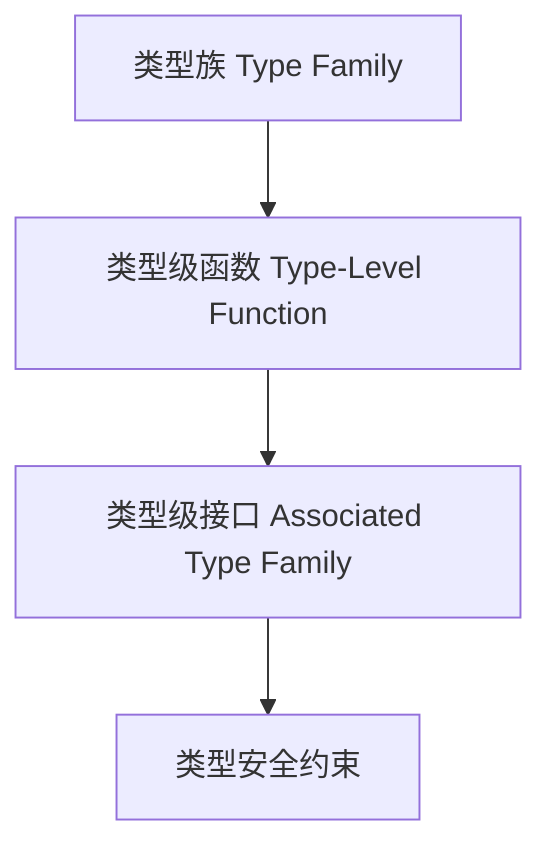

# 01. 类型族在Haskell中的理论与实践（Type Family in Haskell）

> **中英双语核心定义 | Bilingual Core Definitions**

## 1.1 类型族简介（Introduction to Type Family）

- **定义（Definition）**：
  - **中文**：类型族是Haskell中类型级函数的机制，允许在类型层面进行模式匹配和运算，支持类型级编程和依赖类型。
  - **English**: Type families are Haskell's mechanism for type-level functions, allowing pattern matching and computation at the type level, supporting type-level programming and dependent types.

- **Wiki风格国际化解释（Wiki-style Explanation）**：
  - 类型族极大增强了Haskell类型系统的表达能力，广泛用于类型级数据结构、类型安全API和泛型编程。
  - Type families greatly enhance the expressiveness of Haskell's type system, widely used in type-level data structures, type-safe APIs, and generic programming.

## 1.2 Haskell中的类型族语法与语义（Syntax and Semantics of Type Family in Haskell）

- **类型族声明（Type Family Declaration）**

```haskell
{-# LANGUAGE TypeFamilies #-}

type family Elem c :: *

type instance Elem [a] = a
type instance Elem (Maybe a) = a
```

- **关联类型族（Associated Type Family）**

```haskell
class Collection c where
  type Elem c :: *
  insert :: Elem c -> c -> c
```

- **类型级编程（Type-Level Programming）**
  - 类型族可实现类型级映射、约束、运算等。

## 1.3 范畴论建模与结构映射（Category-Theoretic Modeling and Mapping）

- **类型族与范畴论关系**
  - 类型族可视为类型级的函子或自然变换。

| 概念 | Haskell实现 | 代码示例 | 中文解释 |
|------|-------------|----------|----------|
| 类型族 | 类型级函数 | `type family Elem c` | 类型级运算 |
| 关联类型族 | 类型类内类型族 | `type Elem c` | 类型级接口 |
| 类型安全 | 静态约束 | `insert :: Elem c -> c -> c` | 编译期保证 |

## 1.4 形式化证明与论证（Formal Proofs & Reasoning）

- **类型族一致性与安全性证明**
  - **中文**：证明类型族定义和实例满足类型一致性和类型安全。
  - **English**: Prove that type family definitions and instances satisfy type consistency and safety.

- **类型级编程能力证明**
  - **中文**：证明类型族可实现类型级映射、约束和复杂类型关系。
  - **English**: Prove that type families can implement type-level mapping, constraints, and complex type relations.

## 1.5 多表征与本地跳转（Multi-representation & Local Reference）

- **类型族结构图（Type Family Structure Diagram）**



- **相关主题跳转**：
  - [依赖类型 Dependent Type](./01-Dependent-Type.md)
  - [GADT in Haskell](./01-GADT.md)

---

> 本文档为类型族在Haskell中的中英双语、Haskell语义模型与形式化证明规范化输出，适合学术研究与工程实践参考。
