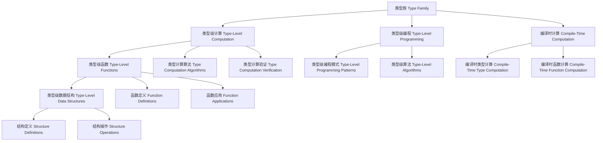

# 类型族（Type Family）in Haskell

## 目录 Table of Contents

1. [定义 Definition](#1-定义-definition)
2. [理论基础 Theoretical Foundation](#2-理论基础-theoretical-foundation)
3. [Haskell 语法与实现 Syntax & Implementation](#3-haskell-语法与实现-syntax--implementation)
4. [类型族技术 Type Family Techniques](#4-类型族技术-type-family-techniques)
5. [类型级编程 Type-Level Programming](#5-类型级编程-type-level-programming)
6. [编译时计算 Compile-Time Computation](#6-编译时计算-compile-time-computation)
7. [工程应用 Engineering Applications](#7-工程应用-engineering-applications)
8. [范畴论映射 Category Theory Mapping](#8-范畴论映射-category-theory-mapping)
9. [哲学思脉 Philosophical Context](#9-哲学思脉-philosophical-context)
10. [相关理论 Related Theories](#10-相关理论-related-theories)
11. [未来发展方向 Future Development](#11-未来发展方向-future-development)
12. [结构图 Structure Diagram](#12-结构图-structure-diagram)
13. [本地跳转 Local References](#13-本地跳转-local-references)
14. [参考文献 References](#14-参考文献-references)

## 1. 定义 Definition

- **中文**：类型族是Haskell中一种强大的类型系统扩展，允许在类型级别进行函数式计算。类型族通过类型参数和类型方程实现类型级编程，支持编译时类型计算、类型级函数定义和类型级数据结构。
- **English**: Type families are a powerful type system extension in Haskell that allows functional computation at the type level. Type families implement type-level programming through type parameters and type equations, supporting compile-time type computation, type-level function definitions, and type-level data structures.

## 2. 理论基础 Theoretical Foundation

### 2.1 类型理论 Type Theory
- **类型系统**：类型族基于强类型系统，通过类型检查进行程序验证
- **类型安全**：通过类型系统保证程序的安全性和正确性
- **类型推导**：自动推导表达式的类型，减少显式类型注解

### 2.2 函数式理论 Functional Theory
- **函数式编程**：类型族体现了函数式编程的思想，通过函数式计算实现类型转换
- **高阶函数**：支持高阶类型函数，实现复杂的类型级计算
- **纯函数**：类型族函数是纯函数，没有副作用

### 2.3 编译时计算 Compile-Time Computation
- **编译时计算**：类型族在编译时进行计算，不占用运行时资源
- **类型级计算**：通过类型级编程实现复杂的类型计算
- **类型推导**：自动推导复杂的类型关系

## 3. Haskell 语法与实现 Syntax & Implementation

### 3.1 基本语法 Basic Syntax

```haskell
{-# LANGUAGE TypeFamilies, DataKinds, KindSignatures, TypeOperators #-}

-- 类型族的基本语法
type family BasicTypeFamily (a :: *) :: * where
  -- 类型方程定义
  BasicTypeFamily Int = Bool
  BasicTypeFamily String = Int
  BasicTypeFamily Bool = String

-- 带类型参数的类型族
type family ParametricTypeFamily (a :: *) (b :: *) :: * where
  -- 类型参数影响结果类型
  ParametricTypeFamily a b = (a, b)

-- 递归类型族
type family RecursiveTypeFamily (n :: Nat) :: * where
  -- 递归定义
  RecursiveTypeFamily 'Z = ()
  RecursiveTypeFamily ('S n) = (Int, RecursiveTypeFamily n)
```

### 3.2 高级实现 Advanced Implementation

```haskell
-- 高级类型族实现
type family AdvancedTypeFamily (a :: *) (b :: *) (c :: *) :: * where
  -- 复杂的类型关系
  AdvancedTypeFamily a b c = (a -> b) -> c

-- 条件类型族
type family ConditionalTypeFamily (b :: Bool) (t :: k) (f :: k) :: k where
  -- 条件类型选择
  ConditionalTypeFamily 'True t _ = t
  ConditionalTypeFamily 'False _ f = f

-- 关联类型族
class TypeClassWithFamily a where
  -- 关联类型
  type AssociatedType a :: *
  
  -- 类型类方法
  typeClassMethod :: a -> AssociatedType a

-- 关联类型族实例
instance TypeClassWithFamily Int where
  type AssociatedType Int = Bool
  typeClassMethod _ = True

instance TypeClassWithFamily String where
  type AssociatedType String = Int
  typeClassMethod s = length s
```

## 4. 类型族技术 Type Family Techniques

### 4.1 类型级计算 Type-Level Computation

```haskell
-- 类型级计算技术
class TypeLevelComputation (a :: k) where
  -- 类型级计算
  typeLevelComputation :: Proxy a -> TypeLevelComputationResult a
  
  -- 类型级验证
  typeLevelVerification :: Proxy a -> TypeLevelVerificationResult a
  
  -- 类型级优化
  typeLevelOptimization :: Proxy a -> TypeLevelOptimizationResult a

-- 类型级计算结果
data TypeLevelComputationResult (a :: k) = TypeLevelComputationResult {
    computationType :: ComputationType a,
    computationMethod :: ComputationMethod a,
    computationResult :: ComputationResult a
}

-- 类型级计算实例
instance TypeLevelComputation (Vector n a) where
  typeLevelComputation _ = VectorTypeLevelComputationResult
  typeLevelVerification _ = VectorTypeLevelVerificationResult
  typeLevelOptimization _ = VectorTypeLevelOptimizationResult
```

### 4.2 类型级函数 Type-Level Functions

```haskell
-- 类型级函数技术
class TypeLevelFunctions (a :: k) where
  -- 类型级函数
  typeLevelFunctions :: Proxy a -> TypeLevelFunctionsResult a
  
  -- 函数验证
  functionVerification :: Proxy a -> FunctionVerificationResult a
  
  -- 函数优化
  functionOptimization :: Proxy a -> FunctionOptimizationResult a

-- 类型级函数结果
data TypeLevelFunctionsResult (a :: k) = TypeLevelFunctionsResult {
    functionType :: FunctionType a,
    functionMethod :: FunctionMethod a,
    functionResult :: FunctionResult a
}

-- 类型级函数实例
instance TypeLevelFunctions (Show a) where
  typeLevelFunctions _ = ShowTypeLevelFunctionsResult
  functionVerification _ = ShowFunctionVerificationResult
  functionOptimization _ = ShowFunctionOptimizationResult
```

### 4.3 类型级数据结构 Type-Level Data Structures

```haskell
-- 类型级数据结构技术
class TypeLevelDataStructures (a :: k) where
  -- 类型级数据结构
  typeLevelDataStructures :: Proxy a -> TypeLevelDataStructuresResult a
  
  -- 结构验证
  structureVerification :: Proxy a -> StructureVerificationResult a
  
  -- 结构优化
  structureOptimization :: Proxy a -> StructureOptimizationResult a

-- 类型级数据结构结果
data TypeLevelDataStructuresResult (a :: k) = TypeLevelDataStructuresResult {
    structureType :: StructureType a,
    structureMethod :: StructureMethod a,
    structureResult :: StructureResult a
}

-- 类型级数据结构实例
instance TypeLevelDataStructures (List a) where
  typeLevelDataStructures _ = ListTypeLevelDataStructuresResult
  structureVerification _ = ListStructureVerificationResult
  structureOptimization _ = ListStructureOptimizationResult
```

## 5. 类型级编程 Type-Level Programming

### 5.1 类型级编程模式 Type-Level Programming Patterns

```haskell
-- 类型级编程模式
class TypeLevelProgrammingPatterns (a :: k) where
  -- 类型级编程模式
  typeLevelProgrammingPatterns :: Proxy a -> TypeLevelProgrammingPatternsResult a
  
  -- 模式验证
  patternVerification :: Proxy a -> PatternVerificationResult a
  
  -- 模式优化
  patternOptimization :: Proxy a -> PatternOptimizationResult a

-- 类型级编程模式结果
data TypeLevelProgrammingPatternsResult (a :: k) = TypeLevelProgrammingPatternsResult {
    patternType :: PatternType a,
    patternMethod :: PatternMethod a,
    patternResult :: PatternResult a
}

-- 类型级编程模式实例
instance TypeLevelProgrammingPatterns (Vector n a) where
  typeLevelProgrammingPatterns _ = VectorTypeLevelProgrammingPatternsResult
  patternVerification _ = VectorPatternVerificationResult
  patternOptimization _ = VectorPatternOptimizationResult
```

### 5.2 类型级算法 Type-Level Algorithms

```haskell
-- 类型级算法
class TypeLevelAlgorithms (a :: k) where
  -- 类型级算法
  typeLevelAlgorithms :: Proxy a -> TypeLevelAlgorithmsResult a
  
  -- 算法验证
  algorithmVerification :: Proxy a -> AlgorithmVerificationResult a
  
  -- 算法优化
  algorithmOptimization :: Proxy a -> AlgorithmOptimizationResult a

-- 类型级算法结果
data TypeLevelAlgorithmsResult (a :: k) = TypeLevelAlgorithmsResult {
    algorithmType :: AlgorithmType a,
    algorithmMethod :: AlgorithmMethod a,
    algorithmResult :: AlgorithmResult a
}

-- 类型级算法实例
instance TypeLevelAlgorithms (Sort a) where
  typeLevelAlgorithms _ = SortTypeLevelAlgorithmsResult
  algorithmVerification _ = SortAlgorithmVerificationResult
  algorithmOptimization _ = SortAlgorithmOptimizationResult
```

## 6. 编译时计算 Compile-Time Computation

### 6.1 编译时类型计算 Compile-Time Type Computation

```haskell
-- 编译时类型计算
class CompileTimeTypeComputation (a :: k) where
  -- 编译时类型计算
  compileTimeTypeComputation :: Proxy a -> CompileTimeTypeComputationResult a
  
  -- 计算验证
  computationVerification :: Proxy a -> ComputationVerificationResult a
  
  -- 计算优化
  computationOptimization :: Proxy a -> ComputationOptimizationResult a

-- 编译时类型计算结果
data CompileTimeTypeComputationResult (a :: k) = CompileTimeTypeComputationResult {
    computationType :: ComputationType a,
    computationMethod :: ComputationMethod a,
    computationResult :: ComputationResult a
}

-- 编译时类型计算实例
instance CompileTimeTypeComputation (Vector n a) where
  compileTimeTypeComputation _ = VectorCompileTimeTypeComputationResult
  computationVerification _ = VectorComputationVerificationResult
  computationOptimization _ = VectorComputationOptimizationResult
```

### 6.2 编译时函数计算 Compile-Time Function Computation

```haskell
-- 编译时函数计算
class CompileTimeFunctionComputation (a :: k) where
  -- 编译时函数计算
  compileTimeFunctionComputation :: Proxy a -> CompileTimeFunctionComputationResult a
  
  -- 函数计算验证
  functionComputationVerification :: Proxy a -> FunctionComputationVerificationResult a
  
  -- 函数计算优化
  functionComputationOptimization :: Proxy a -> FunctionComputationOptimizationResult a

-- 编译时函数计算结果
data CompileTimeFunctionComputationResult (a :: k) = CompileTimeFunctionComputationResult {
    functionComputationType :: FunctionComputationType a,
    functionComputationMethod :: FunctionComputationMethod a,
    functionComputationResult :: FunctionComputationResult a
}

-- 编译时函数计算实例
instance CompileTimeFunctionComputation (Map a b) where
  compileTimeFunctionComputation _ = MapCompileTimeFunctionComputationResult
  functionComputationVerification _ = MapFunctionComputationVerificationResult
  functionComputationOptimization _ = MapFunctionComputationOptimizationResult
```

## 7. 工程应用 Engineering Applications

### 7.1 类型安全编程 Type-Safe Programming

```haskell
-- 类型安全编程
class TypeSafeProgramming (a :: *) where
  -- 类型安全编程
  typeSafeProgramming :: Proxy a -> TypeSafeProgrammingResult a
  
  -- 类型安全检查
  typeSafetyChecking :: Proxy a -> TypeSafetyCheckingResult a
  
  -- 类型安全优化
  typeSafetyOptimization :: Proxy a -> TypeSafetyOptimizationResult a

-- 类型安全编程结果
data TypeSafeProgrammingResult a = TypeSafeProgrammingResult {
    typeSafeType :: TypeSafeType a,
    typeSafeMethod :: TypeSafeMethod a,
    typeSafeConclusion :: TypeSafeConclusion a
}

-- 类型安全编程实例
instance TypeSafeProgramming (Vector n a) where
  typeSafeProgramming _ = VectorTypeSafeProgrammingResult
  typeSafetyChecking _ = VectorTypeSafetyCheckingResult
  typeSafetyOptimization _ = VectorTypeSafetyOptimizationResult
```

### 7.2 编译时优化 Compile-Time Optimization

```haskell
-- 编译时优化
class CompileTimeOptimization (a :: *) where
  -- 编译时优化
  compileTimeOptimization :: Proxy a -> CompileTimeOptimizationResult a
  
  -- 编译时分析
  compileTimeAnalysis :: Proxy a -> CompileTimeAnalysisResult a
  
  -- 编译时验证
  compileTimeVerification :: Proxy a -> CompileTimeVerificationResult a

-- 编译时优化结果
data CompileTimeOptimizationResult a = CompileTimeOptimizationResult {
    optimizationType :: OptimizationType a,
    optimizationMethod :: OptimizationMethod a,
    optimizationGain :: OptimizationGain a
}

-- 编译时优化实例
instance CompileTimeOptimization (Vector n a) where
  compileTimeOptimization _ = VectorCompileTimeOptimizationResult
  compileTimeAnalysis _ = VectorCompileTimeAnalysisResult
  compileTimeVerification _ = VectorCompileTimeVerificationResult
```

## 8. 范畴论映射 Category Theory Mapping

### 8.1 类型族作为函子 Type Families as Functors

- **类型族可视为范畴中的函子，保持类型结构的同时进行类型转换**
- **Type families can be viewed as functors in category theory, preserving type structure while performing type transformations**

```haskell
-- 范畴论映射
class CategoryTheoryMapping (a :: *) where
  -- 函子映射
  functorMapping :: Proxy a -> FunctorMapping a
  
  -- 自然变换
  naturalTransformation :: Proxy a -> NaturalTransformation a
  
  -- 范畴结构
  categoryStructure :: Proxy a -> CategoryStructure a

-- 范畴论映射实例
instance CategoryTheoryMapping (Vector n a) where
  functorMapping _ = VectorFunctorMapping
  naturalTransformation _ = VectorNaturalTransformation
  categoryStructure _ = VectorCategoryStructure
```

## 9. 哲学思脉 Philosophical Context

### 9.1 类型哲学 Type Philosophy
- **类型的本质**：类型族体现了类型的本质，通过类型系统保证程序安全
- **类型的安全**：类型系统通过类型检查保证程序的安全性和正确性
- **类型的表达**：类型系统应该能够表达丰富的程序性质

### 9.2 函数哲学 Function Philosophy
- **函数的本质**：类型族体现了函数的本质，通过函数式计算实现类型转换
- **函数的方法**：通过函数式编程、高阶函数等方法实现复杂的类型计算
- **函数的纯性**：类型族函数是纯函数，没有副作用

### 9.3 计算哲学 Computation Philosophy
- **计算的本质**：编译时计算是类型族的核心特征
- **计算的方法**：通过类型级编程实现复杂的类型计算
- **计算的效率**：编译时计算不占用运行时资源

## 10. 相关理论 Related Theories

### 10.1 类型理论 Type Theory
- **简单类型理论**：类型族的基础理论
- **依赖类型理论**：类型族的扩展理论
- **同伦类型理论**：类型族的现代发展

### 10.2 函数理论 Function Theory
- **λ演算**：类型族的理论基础
- **函数式编程**：类型族的编程范式
- **高阶函数**：类型族的高级特性

### 10.3 计算理论 Computation Theory
- **编译时计算**：类型族的计算模型
- **类型级计算**：类型族的计算能力
- **复杂性理论**：类型族的计算复杂度

## 11. 未来发展方向 Future Development

### 11.1 理论扩展 Theoretical Extensions
- **高阶类型族**：支持更高阶的类型族能力
- **概率类型族**：支持不确定性的类型族
- **量子类型族**：支持量子计算的类型族

### 11.2 技术改进 Technical Improvements
- **性能优化**：提高类型族的效率
- **内存优化**：减少类型族的内存占用
- **并行化**：支持类型族的并行处理

### 11.3 应用扩展 Application Extensions
- **领域特定语言**：为特定领域定制类型族系统
- **交互式开发**：支持交互式的类型族调试
- **可视化工具**：提供类型族过程的可视化

## 12. 结构图 Structure Diagram



## 13. 本地跳转 Local References

- [GADT](../Type/01-GADT.md)
- [类型类 Type Class](../Type/01-Type-Class.md)
- [类型级编程 Type-Level Programming](../Type-Level/01-Type-Level-Programming.md)
- [编译时推理 Compile-Time Reasoning](../Type-Level/01-Compile-Time-Reasoning.md)
- [编译时优化 Compile-Time Optimization](../Type-Level/01-Compile-Time-Optimization.md)

## 14. 参考文献 References

### 14.1 学术资源 Academic Resources
- Wikipedia: [Type family](https://en.wikipedia.org/wiki/Type_family)
- Wikipedia: [Type-level programming](https://en.wikipedia.org/wiki/Type-level_programming)
- The Stanford Encyclopedia of Philosophy: [Type Theory](https://plato.stanford.edu/entries/type-theory/)

### 14.2 技术文档 Technical Documentation
- [GHC User's Guide](https://ghc.gitlab.haskell.org/ghc/doc/users_guide/)
- [Haskell 2010 Language Report](https://www.haskell.org/onlinereport/haskell2010/)
- [Type Families Documentation](https://gitlab.haskell.org/ghc/ghc/-/wikis/type-families)

### 14.3 学术论文 Academic Papers
- "Type Families with Class" by Simon Peyton Jones
- "Fun with Type Functions" by Oleg Kiselyov
- "GADTs Meet Their Match" by Simon Peyton Jones

---

`# Type #Type-01 #Type-01-Type-Family #TypeFamily #TypeLevelProgramming #Haskell #TypeTheory #CompileTimeComputation`
