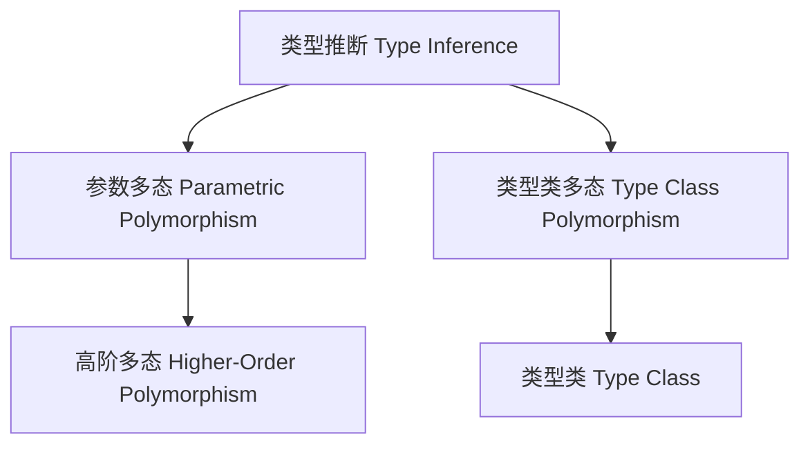

# 类型推断与多态在Haskell中的理论与实践（Type Inference and Polymorphism in Haskell）

## 定义 Definition

- **中文**：类型推断是编程语言自动推导表达式类型的能力。多态性是指程序可以操作多种类型的数据。Haskell采用Hindley-Milner类型系统，支持参数多态和类型类多态。
- **English**: Type inference is the ability of a programming language to automatically deduce the types of expressions. Polymorphism means that programs can operate on data of multiple types. Haskell uses the Hindley-Milner type system, supporting parametric and type class polymorphism.

## 类型推断与多态核心概念 Core Concepts

- **类型推断（Type Inference）**：自动推导表达式类型，Hindley-Milner算法。
- **参数多态（Parametric Polymorphism）**：类型变量实现，函数可作用于任意类型。
- **类型类多态（Type Class Polymorphism）**：类型类约束实现，支持受限多态。
- **高阶多态（Higher-Order Polymorphism）**：类型构造器参数化。

## Haskell实现与现代语言对比 Haskell & Modern Language Comparison

- Haskell：Hindley-Milner类型推断、类型变量、类型类、GADT、类型族。
- Rust：泛型、trait bound、impl trait。
- Scala 3：类型推断、类型类、依赖类型。
- OCaml/F#：ML家族类型推断、模块系统。
- TypeScript：结构化类型推断、泛型、类型保护。

### Haskell 类型推断与多态示例

```haskell
id x = x        -- id :: a -> a
compose f g x = f (g x)  -- compose :: (b -> c) -> (a -> b) -> a -> c

class Eq a where
  (==) :: a -> a -> Bool

length :: [a] -> Int
```

## 结构图 Structure Diagram



## 形式化论证与证明 Formal Reasoning & Proofs

- **类型推断正确性证明**：类型推断算法产生的类型是表达式的最泛类型。
- **多态性证明**：参数多态和类型类多态的表达能力和安全性。

### 证明示例 Proof Example

- 证明类型推断算法W的正确性。
- 证明参数多态和类型类多态下的类型安全。

## 工程应用 Engineering Application

- 类型安全API、泛型库、DSL、自动化推理与验证、跨语言类型系统设计。

## 本地跳转 Local References

- [类型理论基础 Type Theory Foundation](../01-Type-Theory/01-Type-Theory-Foundation.md)
- [类型安全 Type Safety](../14-Type-Safety/01-Type-Safety-in-Haskell.md)
- [类型类 Type Class](../07-Type-Class/01-Type-Class-in-Haskell.md)
- [高阶类型 Higher-Kinded Types](../08-Higher-Kinded-Types/01-Higher-Kinded-Types-in-Haskell.md)
