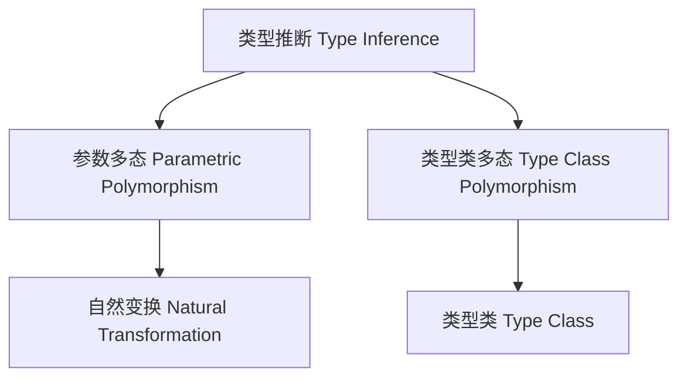

# 01. 类型推断与多态在Haskell中的理论与实践（Type Inference and Polymorphism in Haskell）

> **中英双语核心定义 | Bilingual Core Definitions**

## 1.1 类型推断与多态简介（Introduction to Type Inference and Polymorphism）

- **定义（Definition）**：
  - **中文**：类型推断是编程语言自动推导表达式类型的能力。多态性是指程序可以操作多种类型的数据。Haskell采用Hindley-Milner类型系统，支持参数多态和类型类多态。
  - **English**: Type inference is the ability of a programming language to automatically deduce the types of expressions. Polymorphism means that programs can operate on data of multiple types. Haskell uses the Hindley-Milner type system, supporting parametric and type class polymorphism.

- **Wiki风格国际化解释（Wiki-style Explanation）**：
  - 类型推断和多态是Haskell类型系统的核心，极大提升了代码的抽象性和安全性。
  - Type inference and polymorphism are core to Haskell's type system, greatly enhancing code abstraction and safety.

## 1.2 Haskell中的类型推断（Type Inference in Haskell）

- **Hindley-Milner类型系统（Hindley-Milner Type System）**
  - 支持全局类型推断，无需显式类型注解。
  - 类型变量实现参数多态。

```haskell
-- 类型推断示例
id x = x        -- id :: a -> a
compose f g x = f (g x)  -- compose :: (b -> c) -> (a -> b) -> a -> c
```

- **类型推断算法W（Algorithm W）**

```haskell
unify :: Type -> Type -> Substitution
unify (TVar a) t = if a `elem` ftv t then fail else [(a, t)]
unify t (TVar a) = unify (TVar a) t
unify (TArrow t1 t2) (TArrow t1' t2') = 
  let s1 = unify t1 t1'
      s2 = unify (apply s1 t2) (apply s1 t2')
  in compose s2 s1
unify (TCon a) (TCon b) = if a == b then [] else fail
```

## 1.3 Haskell中的多态（Polymorphism in Haskell）

- **参数多态（Parametric Polymorphism）**
  - 通过类型变量实现，函数可作用于任意类型。

```haskell
length :: [a] -> Int
```

- **类型类多态（Type Class Polymorphism）**
  - 通过类型类约束实现，支持受限多态。

```haskell
class Eq a where
  (==) :: a -> a -> Bool

elem :: Eq a => a -> [a] -> Bool
```

- **范畴论建模（Category-Theoretic Modeling）**
  - 参数多态对应于自然变换
  - 类型类多态对应于带约束的函子

## 1.4 结构与类型系统的映射（Mapping Structure to Type System）

| 概念 | Haskell实现 | 代码示例 | 中文解释 |
|------|-------------|----------|----------|
| 类型推断 | Hindley-Milner | `id x = x` | 自动类型推导 |
| 参数多态 | 类型变量 | `length :: [a] -> Int` | 任意类型参数 |
| 类型类多态 | 类型类约束 | `elem :: Eq a => a -> [a] -> Bool` | 受限多态 |

## 1.5 形式化证明与论证（Formal Proofs & Reasoning）

- **类型推断正确性证明（Proof of Type Inference Soundness）**
  - **中文**：证明类型推断算法产生的类型是表达式的最泛类型。
  - **English**: Prove that the type inferred by the algorithm is the most general type for the expression.

- **多态性证明（Proof of Polymorphism）**
  - **中文**：证明参数多态和类型类多态的表达能力和安全性。
  - **English**: Prove the expressiveness and safety of parametric and type class polymorphism.

## 1.6 多表征与本地跳转（Multi-representation & Local Reference）

- **类型推断与多态结构图（Type Inference and Polymorphism Structure Diagram）**



- **相关主题跳转**：
  - [类型理论基础 Type Theory Foundation](./01-Type-Theory.md)
  - [范畴论与Haskell类型系统 Category Theory and Haskell Type System](./01-Category-Theory-and-Haskell.md)
  - [类型类 Type Class](./01-Type-Class.md)
  - [高阶类型 Higher-Kinded Types](./01-Higher-Kinded-Types.md)
  - [类型安全 Type Safety](./01-Type-Safety.md)

---

## 1.7 历史与发展 History & Development

- **中文**：类型推断理论起源于20世纪60年代，Hindley和Milner提出了著名的Hindley-Milner类型系统。Haskell自诞生以来采用该系统，并不断扩展支持类型类多态、RankNTypes、GADTs等。类型推断和多态极大提升了代码的抽象性和安全性。
- **English**: Type inference theory originated in the 1960s, with the Hindley-Milner type system proposed by Hindley and Milner. Haskell has adopted and extended this system since its inception, supporting type class polymorphism, RankNTypes, GADTs, etc. Type inference and polymorphism greatly enhance code abstraction and safety.

## 1.8 Haskell 相关特性 Haskell Features

### 经典特性 Classic Features

- Hindley-Milner类型推断、参数多态、类型类多态、自动类型推导。
- Hindley-Milner type inference, parametric polymorphism, type class polymorphism, automatic type deduction.

### 最新特性 Latest Features

- **RankNTypes/ExistentialQuantification**：高阶多态与存在类型。
- **GADTs（广义代数数据类型）**：更强的类型表达能力。
- **Type Families/Type-level Programming**：类型级多态与推断。
- **QuantifiedConstraints**：约束多态。
- **GHC 2021/2022**：标准化更多类型推断与多态相关扩展。

- **English**:
  - RankNTypes/ExistentialQuantification: Higher-rank polymorphism and existential types.
  - GADTs: More expressive types.
  - Type Families/Type-level Programming: Type-level polymorphism and inference.
  - QuantifiedConstraints: Constraint polymorphism.
  - GHC 2021/2022: Standardizes more type inference and polymorphism extensions.

## 1.9 应用 Applications

- **中文**：泛型编程、类型安全API、DSL、自动推导、类型级编程、依赖注入等。
- **English**: Generic programming, type-safe APIs, DSLs, automatic deduction, type-level programming, dependency injection, etc.

## 1.10 例子 Examples

```haskell
{-# LANGUAGE RankNTypes, GADTs, TypeFamilies #-}
-- 高阶多态
applyTwice :: (forall a. a -> a) -> (Int, Bool)
applyTwice f = (f 1, f True)

-- GADT与类型推断
 data Expr a where
   LitInt  :: Int -> Expr Int
   LitBool :: Bool -> Expr Bool
   If      :: Expr Bool -> Expr a -> Expr a -> Expr a

-- 类型级多态
 type family F a where
   F Int = Bool
   F Bool = Int
```

## 1.11 相关理论 Related Theories

- Hindley-Milner类型系统（Hindley-Milner Type System）
- 多态类型系统（Polymorphic Type Systems）
- 类型类（Type Classes）
- 类型级编程（Type-level Programming）

## 1.12 参考文献 References

- [Wikipedia: Type Inference](https://en.wikipedia.org/wiki/Type_inference)
- [Wikipedia: Polymorphism (computer science)](https://en.wikipedia.org/wiki/Polymorphism_(computer_science))
- [GHC User's Guide](https://downloads.haskell.org/ghc/latest/docs/html/users_guide/)
- [Types and Programming Languages, Benjamin C. Pierce]
- [Learn You a Haskell for Great Good!](http://learnyouahaskell.com/)

> 本文档为类型推断与多态在Haskell中的中英双语、Haskell语义模型与形式化证明规范化输出，适合学术研究与工程实践参考。
