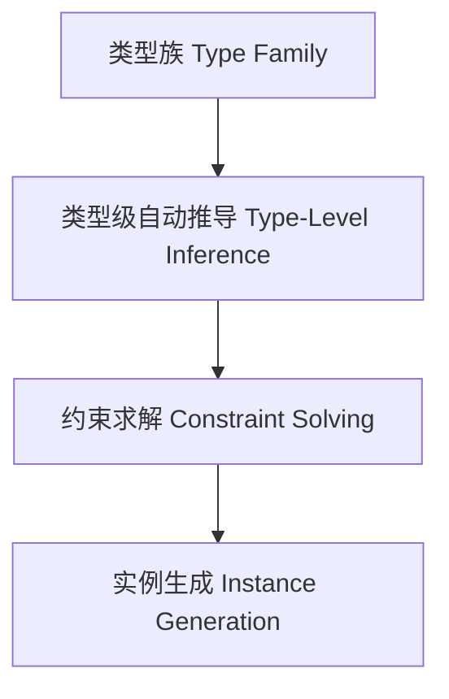

# 01. 类型级自动化在Haskell中的理论与实践（Type-Level Automation in Haskell）

> **中英双语核心定义 | Bilingual Core Definitions**

## 1.1 类型级自动化简介（Introduction to Type-Level Automation）

- **定义（Definition）**：
  - **中文**：类型级自动化是指在类型系统层面自动推导、归约、约束求解和实例生成等机制，提升类型系统的表达力与自动化能力。Haskell通过类型族、类型类、GADT等机制支持类型级自动化。
  - **English**: Type-level automation refers to mechanisms at the type system level for automatic inference, reduction, constraint solving, and instance generation, enhancing the expressiveness and automation of the type system. Haskell supports type-level automation via type families, type classes, GADTs, etc.

- **Wiki风格国际化解释（Wiki-style Explanation）**：
  - 类型级自动化极大提升了Haskell类型系统的泛型能力和工程效率，广泛用于自动推导、类型驱动代码生成和泛型库。
  - Type-level automation greatly enhances the generic capability and engineering efficiency of Haskell's type system, widely used in automatic inference, type-driven code generation, and generic libraries.

## 1.2 Haskell中的类型级自动化语法与语义（Syntax and Semantics of Type-Level Automation in Haskell）

- **类型族与自动推导**

```haskell
{-# LANGUAGE TypeFamilies, MultiParamTypeClasses, FlexibleInstances, UndecidableInstances #-}

class AutoInstance a where
  type Result a
  auto :: a -> Result a

instance AutoInstance Int where
  type Result Int = Bool
  auto n = n > 0

instance AutoInstance Bool where
  type Result Bool = Int
  auto b = if b then 1 else 0
```

- **类型级约束自动传播**

```haskell
{-# LANGUAGE TypeFamilies #-}

type family And (a :: Bool) (b :: Bool) :: Bool where
  And 'True  'True  = 'True
  And _      _      = 'False
```

## 1.3 范畴论建模与结构映射（Category-Theoretic Modeling and Mapping）

- **类型级自动化与范畴论关系**
  - 类型级自动化可视为范畴中的函子自动提升与结构归约。

| 概念 | Haskell实现 | 代码示例 | 中文解释 |
|------|-------------|----------|----------|
| 自动推导 | 类型族/类型类 | `auto :: a -> Result a` | 类型级自动化 |
| 约束求解 | 类型族 | `And a b` | 类型级逻辑 |
| 实例生成 | 类型类 | `instance AutoInstance ...` | 自动实例 |

## 1.4 形式化证明与论证（Formal Proofs & Reasoning）

- **自动化一致性证明**
  - **中文**：证明类型级自动化机制不会破坏类型系统一致性。
  - **English**: Prove that type-level automation mechanisms preserve type system consistency.

- **自动推导能力证明**
  - **中文**：证明类型级自动化可自动推导复杂类型关系和实例。
  - **English**: Prove that type-level automation can automatically infer complex type relations and instances.

## 1.5 多表征与本地跳转（Multi-representation & Local Reference）

- **类型级自动化结构图（Type-Level Automation Structure Diagram）**



- **相关主题跳转**：
  - [类型级编程 Type-Level Programming](../12-Type-Level-Programming/01-Type-Level-Programming-in-Haskell.md)
  - [类型元编程 Type Metaprogramming](../18-Type-Metaprogramming/01-Type-Metaprogramming-in-Haskell.md)
  - [类型安全 Type Safety](../14-Type-Safety/01-Type-Safety-in-Haskell.md)

---

> 本文档为类型级自动化在Haskell中的中英双语、Haskell语义模型与形式化证明规范化输出，适合学术研究与工程实践参考。
