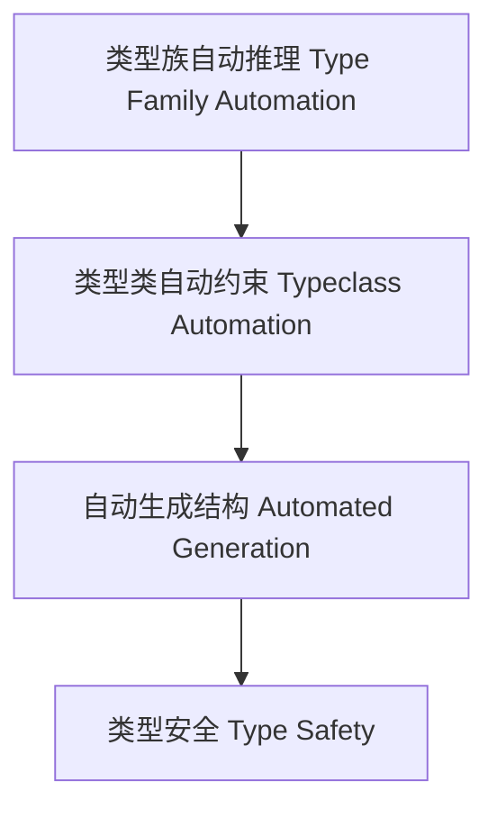

# 01. 类型级自动化在Haskell中的理论与实践（Type-Level Automation in Haskell）

> **中英双语核心定义 | Bilingual Core Definitions**

## 1.1 类型级自动化简介（Introduction to Type-Level Automation）

- **定义（Definition）**：
  - **中文**：类型级自动化是指在类型系统层面自动推导、验证和生成类型属性、约束和结构的机制。Haskell通过类型族、类型类、GADT等机制支持类型级自动化。
  - **English**: Type-level automation refers to mechanisms at the type system level for automatically inferring, verifying, and generating type properties, constraints, and structures. Haskell supports type-level automation via type families, type classes, GADTs, etc.

- **Wiki风格国际化解释（Wiki-style Explanation）**：
  - 类型级自动化极大提升了类型系统的表达力和自动推理能力，广泛用于泛型编程、约束求解和编译期验证。
  - Type-level automation greatly enhances the expressiveness and automated reasoning capabilities of the type system, widely used in generic programming, constraint solving, and compile-time verification.

## 1.2 Haskell中的类型级自动化语法与语义（Syntax and Semantics of Type-Level Automation in Haskell）

- **类型族与自动化推理**

```haskell
{-# LANGUAGE TypeFamilies, DataKinds, TypeOperators #-}

type family And (a :: Bool) (b :: Bool) :: Bool where
  And 'True  'True  = 'True
  And _      _      = 'False
```

- **类型类与自动化约束**

```haskell
class AutoShow a where
  autoShow :: a -> String

instance AutoShow Int where
  autoShow = show
```

## 1.3 范畴论建模与结构映射（Category-Theoretic Modeling and Mapping）

- **类型级自动化与范畴论关系**
  - 类型级自动化可视为范畴中的自动推理与结构生成。

| 概念 | Haskell实现 | 代码示例 | 中文解释 |
|------|-------------|----------|----------|
| 自动推理 | 类型族 | `And a b` | 类型级自动推理 |
| 自动约束 | 类型类 | `AutoShow a` | 类型级自动约束 |
| 自动生成 | 类型族/类型类 | `autoShow` | 类型级自动生成 |

## 1.4 形式化证明与论证（Formal Proofs & Reasoning）

- **自动化推理一致性证明**
  - **中文**：证明类型级自动化推理过程与类型系统一致。
  - **English**: Prove that the type-level automation reasoning process is consistent with the type system.

- **自动化能力证明**
  - **中文**：证明类型级自动化可自动推导和生成复杂类型结构。
  - **English**: Prove that type-level automation can automatically infer and generate complex type structures.

## 1.5 多表征与本地跳转（Multi-representation & Local Reference）

- **类型级自动化结构图（Type-Level Automation Structure Diagram）**



- **相关主题跳转**：
  - [类型级推理 Type-Level Reasoning](./01-Type-Level-Reasoning.md)
  - [类型级验证 Type-Level Verification](./01-Type-Level-Verification.md)
  - [类型安全 Type Safety](./01-Type-Safety.md)

---

> 本文档为类型级自动化在Haskell中的中英双语、Haskell语义模型与形式化证明规范化输出，适合学术研究与工程实践参考。
