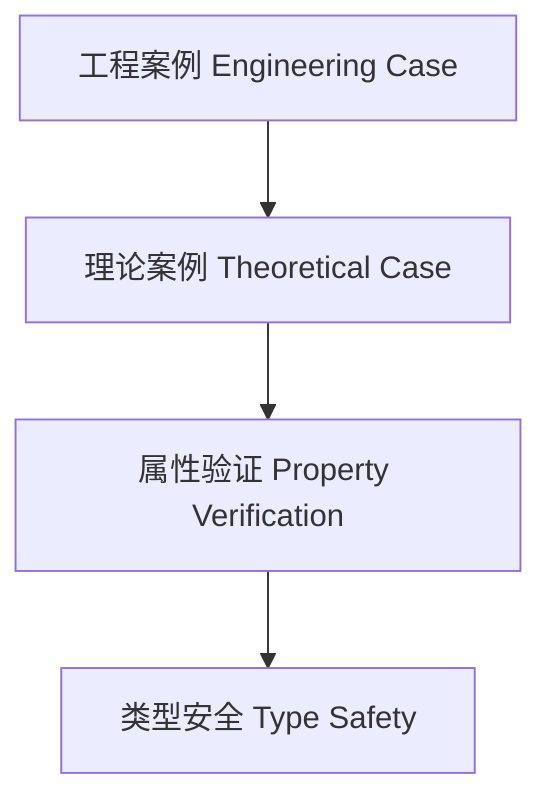

# 01. 类型级案例分析在Haskell中的理论与实践（Type-Level Case Studies in Haskell）

> **中英双语核心定义 | Bilingual Core Definitions**

## 1.1 类型级案例简介（Introduction to Type-Level Case Studies）

- **定义（Definition）**：
  - **中文**：类型级案例分析是指通过具体工程或理论案例，展示Haskell类型级编程、验证、自动化等技术在实际中的应用与效果。
  - **English**: Type-level case studies refer to the demonstration of the application and effects of Haskell type-level programming, verification, automation, etc., in real-world engineering or theoretical cases.

- **Wiki风格国际化解释（Wiki-style Explanation）**：
  - 类型级案例分析有助于理解类型级理论在实际中的价值和工程意义。
  - Type-level case studies help understand the practical value and engineering significance of type-level theory.

## 1.2 Haskell中的类型级案例结构（Structure of Type-Level Case Studies in Haskell）

- **工程案例：类型安全配置系统**

```haskell
{-# LANGUAGE DataKinds, TypeFamilies, GADTs #-}

data ConfigKey = Host | Port

type family ConfigType (k :: ConfigKey) :: * where
  ConfigType 'Host = String
  ConfigType 'Port = Int

data Config (k :: ConfigKey) where
  MkConfig :: ConfigType k -> Config k

getConfig :: Config k -> ConfigType k
getConfig (MkConfig v) = v
```

- **理论案例：类型级自然数运算**

```haskell
data Nat = Z | S Nat

type family Add n m where
  Add 'Z m = m
  Add ('S n) m = 'S (Add n m)
```

## 1.3 范畴论建模与结构映射（Category-Theoretic Modeling and Mapping）

- **类型级案例与范畴论关系**
  - 类型级案例可视为范畴中的结构实例与属性验证。

| 概念 | Haskell实现 | 代码示例 | 中文解释 |
|------|-------------|----------|----------|
| 工程案例 | GADT | `Config k` | 类型安全配置 |
| 理论案例 | 类型族 | `Add n m` | 类型级自然数运算 |
| 案例验证 | 类型约束 | `ConfigType k` | 类型级属性验证 |

## 1.4 形式化证明与论证（Formal Proofs & Reasoning）

- **案例有效性证明**
  - **中文**：证明类型级案例能有效支撑理论与工程需求。
  - **English**: Prove that type-level case studies effectively support theoretical and engineering requirements.

- **属性验证能力证明**
  - **中文**：证明类型级案例能验证关键属性和约束。
  - **English**: Prove that type-level case studies can verify key properties and constraints.

## 1.5 多表征与本地跳转（Multi-representation & Local Reference）

- **类型级案例结构图（Type-Level Case Structure Diagram）**



- **相关主题跳转**：
  - [类型级工程 Type-Level Engineering](./01-Type-Level-Engineering.md)
  - [类型级验证 Type-Level Verification](./01-Type-Level-Verification.md)
  - [类型安全 Type Safety](./01-Type-Safety.md)
