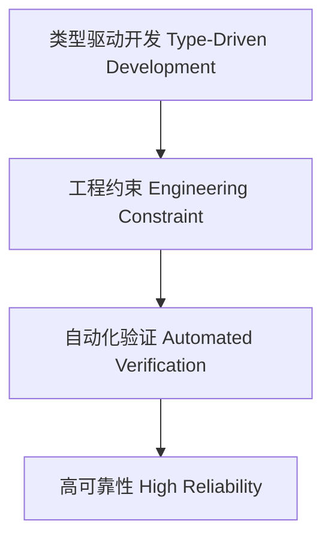

# 01. 类型级工程实践在Haskell中的理论与实践（Type-Level Engineering Practice in Haskell）

> **中英双语核心定义 | Bilingual Core Definitions**

## 1.1 类型级工程简介（Introduction to Type-Level Engineering）

- **定义（Definition）**：
  - **中文**：类型级工程实践是指在Haskell类型系统层面，将类型级编程、验证、自动化等理论应用于实际工程项目，提升代码安全性、可维护性和自动化能力。
  - **English**: Type-level engineering practice refers to applying type-level programming, verification, automation, and related theories in real-world Haskell engineering projects to improve code safety, maintainability, and automation.

- **Wiki风格国际化解释（Wiki-style Explanation）**：
  - 类型级工程实践推动了类型驱动开发、自动化验证和高可靠性系统的落地。
  - Type-level engineering practice drives type-driven development, automated verification, and the implementation of high-reliability systems.

## 1.2 Haskell中的类型级工程语法与语义（Syntax and Semantics of Type-Level Engineering in Haskell）

- **类型驱动开发与工程结构**

```haskell
{-# LANGUAGE DataKinds, TypeFamilies, GADTs #-}

data Role = User | Admin

type family CanEdit (r :: Role) :: Bool where
  CanEdit 'Admin = 'True
  CanEdit 'User  = 'False

editResource :: (CanEdit r ~ 'True) => proxy r -> String -> String
editResource _ content = "Edited: " ++ content
```

- **自动化验证与工程约束**

```haskell
class ValidConfig a where
  validate :: a -> Bool

instance ValidConfig Int where
  validate x = x > 0
```

## 1.3 范畴论建模与结构映射（Category-Theoretic Modeling and Mapping）

- **类型级工程与范畴论关系**
  - 类型级工程可视为范畴中的结构约束与自动化映射。

| 概念 | Haskell实现 | 代码示例 | 中文解释 |
|------|-------------|----------|----------|
| 工程约束 | 类型族 | `CanEdit r` | 工程权限约束 |
| 工程验证 | 类型类 | `ValidConfig a` | 工程配置验证 |
| 工程操作 | 类型安全函数 | `editResource` | 工程安全操作 |

## 1.4 形式化证明与论证（Formal Proofs & Reasoning）

- **工程约束一致性证明**
  - **中文**：证明类型级工程约束与实际工程需求一致。
  - **English**: Prove that type-level engineering constraints are consistent with real-world engineering requirements.

- **自动化验证能力证明**
  - **中文**：证明类型级自动化验证可提升工程安全性和可靠性。
  - **English**: Prove that type-level automated verification can improve engineering safety and reliability.

## 1.5 多表征与本地跳转（Multi-representation & Local Reference）

- **类型级工程结构图（Type-Level Engineering Structure Diagram）**



- **相关主题跳转**：
  - [类型级自动化 Type-Level Automation](./01-Type-Level-Automation.md)
  - [类型级验证 Type-Level Verification](./01-Type-Level-Verification.md)
  - [类型安全 Type Safety](./01-Type-Safety.md) 