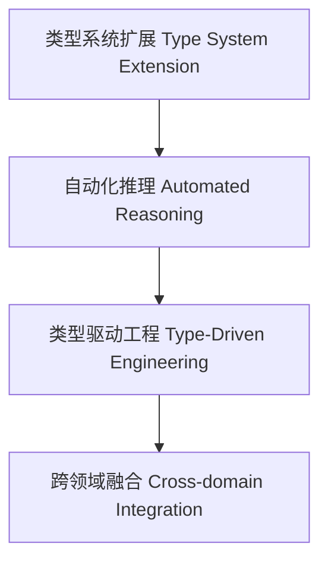

# 01. 类型级未来趋势与展望（Type-Level Future Trends and Prospects in Haskell）

> **中英双语核心定义 | Bilingual Core Definitions**

## 1.1 类型级未来趋势简介（Introduction to Type-Level Future Trends）

- **定义（Definition）**：
  - **中文**：类型级未来趋势关注Haskell类型系统及类型级编程在理论、工具、工程和应用等方面的前沿发展与创新方向。
  - **English**: Type-level future trends focus on the cutting-edge development and innovation directions of Haskell's type system and type-level programming in theory, tooling, engineering, and applications.

- **Wiki风格国际化解释（Wiki-style Explanation）**：
  - 类型级未来趋势涵盖类型系统扩展、自动化推理、形式化验证、类型驱动工程、与AI/大数据/分布式等领域的深度融合。
  - Type-level future trends cover type system extensions, automated reasoning, formal verification, type-driven engineering, and deep integration with AI, big data, distributed systems, etc.

## 1.2 未来趋势与创新方向（Trends and Innovation Directions）

- **类型系统扩展与新特性**
  - 依赖类型、线性类型、可证明类型、类型级反射等。
- **自动化推理与验证工具**
  - SMT集成、自动定理证明、类型级自动化推理。
- **类型驱动工程与应用**
  - 类型安全API、类型驱动DSL、类型级优化。
- **跨领域融合**
  - 与AI、分布式系统、大数据等领域结合。

## 1.3 结构图与前沿展望（Structure Diagram & Prospects）

## 1.4 多表征与本地跳转（Multi-representation & Local Reference）

- **相关主题跳转**：
  - [类型级泛型未来趋势 Type-Level Generic Future Trends](./01-Type-Level-Generic-Future.md)
  - [类型级编程 Type-Level Programming](./01-Type-Level-Programming.md)
  - [类型安全 Type Safety](./01-Type-Safety.md)
